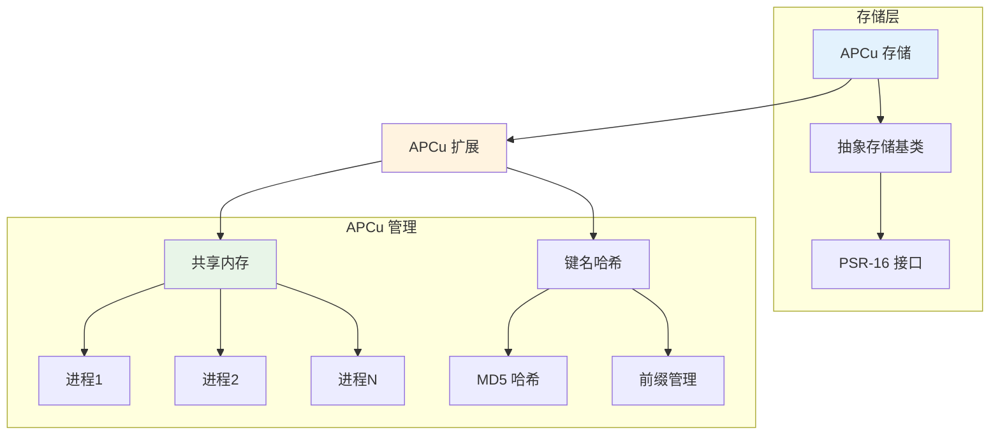

# APCu 缓存

Hi Framework 的 APCu 缓存存储基于 PHP 的 APCu 扩展，提供高性能的进程间共享缓存解决方案。APCu 缓存支持 TTL 管理、前缀隔离和自动过期，适合 PHP 应用缓存和配置缓存场景。

## 核心架构



## 配置说明

### 1. 配置参数说明

| 参数名 | 类型 | 默认值 | 说明 |
|--------|------|--------|------|
| **type** | string | - | 存储类型，必须为 'apcu' |
| **ttl** | int | 3600 | 默认过期时间（秒） |
| **prefix** | string | '' | 缓存键前缀，用于命名空间隔离 |

### 2. 基础配置

```yaml
# application.yaml
cache:
  apcu_cache:
    type: apcu
    ttl: 1800                    # 默认过期时间（秒）
    prefix: 'apcu'               # 缓存键前缀
```

### 2. 多 APCu 缓存配置

```yaml
cache:
  # 应用缓存
  app_cache:
    type: apcu
    ttl: 3600
    prefix: 'app'
  
  # 配置缓存
  config_cache:
    type: apcu
    ttl: 86400
    prefix: 'config'
  
  # 会话缓存
  session_cache:
    type: apcu
    ttl: 7200
    prefix: 'session'
```

## 基础使用

### 1. 获取 APCu 缓存存储

```php
use Hi\Cache\CacheStorageProviderInterface;
use Psr\SimpleCache\CacheInterface;

class APCuCacheExample
{
    public function __construct(
        private readonly CacheStorageProviderInterface $cacheProvider
    ) {}
    
    public function getAPCuCache(): CacheInterface
    {
        return $this->cacheProvider->storage('apcu_cache');
    }
    
    public function getMultipleAPCuCaches(): array
    {
        return [
            'app' => $this->cacheProvider->storage('app_cache'),
            'config' => $this->cacheProvider->storage('config_cache'),
            'session' => $this->cacheProvider->storage('session_cache'),
        ];
    }
}
```

### 2. 基本缓存操作

```php
use Hi\Cache\CacheStorageProviderInterface;

class BasicAPCuOperations
{
    public function __construct(
        private readonly CacheStorageProviderInterface $cacheProvider
    ) {}
    
    public function basicOperations(): void
    {
        $cache = $this->cacheProvider->storage('apcu_cache');
        
        // 设置缓存
        $cache->set('config:app', [
            'name' => 'My Application',
            'version' => '1.0.0',
            'debug' => false
        ], 3600);
        
        // 获取缓存
        $config = $cache->get('config:app');
        
        // 检查键是否存在
        $exists = $cache->has('config:app');
        
        // 删除缓存
        $cache->delete('config:app');
        
        // 清空缓存
        $cache->clear();
    }
}
```

### 3. 进程间共享缓存

```php
use Hi\Cache\CacheStorageProviderInterface;

class SharedCacheExample
{
    public function __construct(
        private readonly CacheStorageProviderInterface $cacheProvider
    ) {}
    
    public function demonstrateSharing(): void
    {
        $cache = $this->cacheProvider->storage('apcu_cache');
        
        // 在进程 A 中设置缓存
        $cache->set('shared:user_count', 1000, 1800);
        $cache->set('shared:last_update', time(), 1800);
        $cache->set('shared:config', [
            'theme' => 'dark',
            'language' => 'zh-CN'
        ], 3600);
        
        // 在进程 B 中可以访问相同的缓存
        $userCount = $cache->get('shared:user_count');
        $lastUpdate = $cache->get('shared:last_update');
        $config = $cache->get('shared:config');
        
        // 所有 PHP 进程都可以访问这些缓存
    }
}
```

## 高级特性

### 1. 键名哈希处理

```php
use Hi\Cache\CacheStorageProviderInterface;

class APCuKeyHashing
{
    public function __construct(
        private readonly CacheStorageProviderInterface $cacheProvider
    ) {}
    
    public function demonstrateKeyHashing(): void
    {
        $cache = $this->cacheProvider->storage('apcu_cache');
        
        // APCu 会自动对键名进行 MD5 哈希处理
        // 原始键名: 'config:app:production:database:connection:pool:max_open'
        // 哈希后: 'apcu:5d41402abc4b2a76b9719d911017c592'
        
        // 设置长键名
        $cache->set('config:app:production:database:connection:pool:max_open', 32, 3600);
        $cache->set('config:app:production:database:connection:pool:max_idle', 8, 3600);
        $cache->set('config:app:production:database:connection:pool:idle_timeout', 30, 3600);
        
        // 获取缓存
        $maxOpen = $cache->get('config:app:production:database:connection:pool:max_open');
        $maxIdle = $cache->get('config:app:production:database:connection:pool:max_idle');
        $idleTimeout = $cache->get('config:app:production:database:connection:pool:idle_timeout');
    }
}
```

### 2. TTL 管理

```php
use Hi\Cache\CacheStorageProviderInterface;
use DateInterval;
use DateTime;

class APCuTTLManagement
{
    public function __construct(
        private readonly CacheStorageProviderInterface $cacheProvider
    ) {}
    
    public function ttlManagement(): void
    {
        $cache = $this->cacheProvider->storage('apcu_cache');
        
        // 使用秒数设置 TTL
        $cache->set('key1', 'value1', 1800);           // 30分钟
        
        // 使用 DateInterval
        $cache->set('key2', 'value2', new DateInterval('PT1H')); // 1小时
        
        // 使用 DateTime
        $expiry = new DateTime('+2 hours');
        $cache->set('key3', 'value3', $expiry);        // 2小时后过期
        
        // 使用 null（使用配置中的默认 TTL）
        $cache->set('key4', 'value4', null);
        
        // 使用 0（永不过期）
        $cache->set('key5', 'value5', 0);
    }
}
```

### 3. 批量操作

```php
use Hi\Cache\CacheStorageProviderInterface;

class APCuBatchOperations
{
    public function __construct(
        private readonly CacheStorageProviderInterface $cacheProvider
    ) {}
    
    public function batchOperations(): void
    {
        $cache = $this->cacheProvider->storage('apcu_cache');
        
        // 批量设置缓存
        $configs = [
            'config:app' => $this->getAppConfig(),
            'config:database' => $this->getDatabaseConfig(),
            'config:redis' => $this->getRedisConfig(),
            'config:mail' => $this->getMailConfig(),
            'config:queue' => $this->getQueueConfig()
        ];
        
        $cache->setMultiple($configs, 3600);
        
        // 批量获取缓存
        $keys = array_keys($configs);
        $cachedConfigs = $cache->getMultiple($keys);
        
        // 批量删除缓存
        $cache->deleteMultiple($keys);
    }
}
```

## 性能优化

### 1. 内存使用优化

```php
use Hi\Cache\CacheStorageProviderInterface;

class APCuOptimization
{
    public function __construct(
        private readonly CacheStorageProviderInterface $cacheProvider
    ) {}
    
    public function optimizeMemory(): void
    {
        $cache = $this->cacheProvider->storage('apcu_cache');
        
        // 使用适当的 TTL 减少内存占用
        $this->optimizeTTL($cache);
        
        // 避免缓存过大的数据
        $this->avoidOversizedData($cache);
        
        // 使用有意义的前缀分组
        $this->useMeaningfulPrefixes($cache);
    }
    
    private function optimizeTTL($cache): void
    {
        // 根据数据重要性设置不同的 TTL
        $cache->set('config:critical', $this->getCriticalConfig(), 86400);    // 24小时
        $cache->set('config:important', $this->getImportantConfig(), 3600);   // 1小时
        $cache->set('config:normal', $this->getNormalConfig(), 1800);         // 30分钟
        $cache->set('data:temporary', $this->getTemporaryData(), 300);        // 5分钟
    }
    
    private function avoidOversizedData($cache): void
    {
        // 避免缓存过大的数据，考虑分片
        $largeData = $this->getLargeData();
        
        if (strlen(serialize($largeData)) > 1024 * 1024) { // 1MB
            // 数据过大，考虑分片
            $this->cacheDataInChunks($cache, $largeData);
        } else {
            $cache->set('data:large', $largeData, 3600);
        }
    }
    
    private function cacheDataInChunks($cache, array $largeData): void
    {
        // 将大数据分片缓存
        $chunks = array_chunk($largeData, 1000);
        
        foreach ($chunks as $index => $chunk) {
            $cache->set("data:large:chunk:{$index}", $chunk, 3600);
        }
        
        // 缓存分片信息
        $cache->set('data:large:meta', [
            'total_chunks' => count($chunks),
            'chunk_size' => 1000,
            'created_at' => time()
        ], 3600);
    }
    
    private function useMeaningfulPrefixes($cache): void
    {
        // 使用有意义的前缀进行分组
        $cache->set('user:1:profile', $this->getUserProfile(1), 3600);
        $cache->set('user:1:orders', $this->getUserOrders(1), 1800);
        $cache->set('user:1:preferences', $this->getUserPreferences(1), 7200);
        
        $cache->set('config:app:production', $this->getProductionConfig(), 86400);
        $cache->set('config:app:development', $this->getDevelopmentConfig(), 3600);
    }
}
```

### 2. 缓存预热

```php
use Hi\Cache\CacheStorageProviderInterface;

class APCuCacheWarmup
{
    public function __construct(
        private readonly CacheStorageProviderInterface $cacheProvider
    ) {}
    
    public function warmUpCache(): void
    {
        $cache = $this->cacheProvider->storage('apcu_cache');
        
        // 预热常用配置
        $this->warmUpConfigs($cache);
        
        // 预热用户数据
        $this->warmUpUserData($cache);
        
        // 预热菜单数据
        $this->warmUpMenuData($cache);
    }
    
    private function warmUpConfigs($cache): void
    {
        $configs = [
            'config:app' => $this->getAppConfig(),
            'config:database' => $this->getDatabaseConfig(),
            'config:redis' => $this->getRedisConfig(),
            'config:mail' => $this->getMailConfig()
        ];
        
        $cache->setMultiple($configs, 86400);
    }
    
    private function warmUpUserData($cache): void
    {
        // 预热活跃用户数据
        $activeUsers = $this->getActiveUsers();
        
        foreach ($activeUsers as $user) {
            $cache->set("user:{$user['id']}:profile", $user, 3600);
        }
    }
    
    private function warmUpMenuData($cache): void
    {
        $menus = [
            'menu:main' => $this->getMainMenu(),
            'menu:sidebar' => $this->getSidebarMenu(),
            'menu:footer' => $this->getFooterMenu()
        ];
        
        $cache->setMultiple($menus, 7200);
    }
}
```

## 最佳实践

### 1. 键名设计

```php
use Hi\Cache\CacheStorageProviderInterface;

class APCuKeyDesign
{
    public function __construct(
        private readonly CacheStorageProviderInterface $cacheProvider
    ) {}
    
    public function demonstrateKeyDesign(): void
    {
        $cache = $this->cacheProvider->storage('apcu_cache');
        
        // 使用有意义的键名结构
        $cache->set('config:app:production:database', $this->getDatabaseConfig(), 86400);
        $cache->set('config:app:production:redis', $this->getRedisConfig(), 86400);
        $cache->set('config:app:production:mail', $this->getMailConfig(), 86400);
        
        // 使用时间相关的键名
        $cache->set('stats:hourly:' . date('Y-m-d-H'), $this->getHourlyStats(), 3600);
        $cache->set('stats:daily:' . date('Y-m-d'), $this->getDailyStats(), 86400);
        
        // 使用版本号
        $cache->set('api:v1:endpoints', $this->getApiEndpointsV1(), 3600);
        $cache->set('api:v2:endpoints', $this->getApiEndpointsV2(), 3600);
    }
}
```

### 2. 错误处理

```php
use Hi\Cache\CacheStorageProviderInterface;
use Hi\Cache\Exception\StorageException;
use Hi\Cache\Exception\CacheException;

class APCuErrorHandling
{
    public function __construct(
        private readonly CacheStorageProviderInterface $cacheProvider
    ) {}
    
    public function handleErrors(): void
    {
        try {
            $cache = $this->cacheProvider->storage('apcu_cache');
            
            $cache->set('test:key', 'test:value', 60);
            $value = $cache->get('test:key');
            
        } catch (CacheException $e) {
            // APCu 扩展未加载或未启用
            $this->logCacheException($e);
            $this->fallbackToAlternativeStorage();
            
        } catch (StorageException $e) {
            $this->logStorageError($e);
            $this->fallbackToAlternativeStorage();
            
        } catch (\Exception $e) {
            $this->logGeneralError($e);
            $this->handleUnexpectedError();
        }
    }
    
    private function logCacheException(CacheException $e): void
    {
        error_log("APCu cache exception: " . $e->getMessage());
    }
    
    private function logStorageError(StorageException $e): void
    {
        error_log("APCu storage error: " . $e->getMessage());
    }
    
    private function logGeneralError(\Exception $e): void
    {
        error_log("APCu general error: " . $e->getMessage());
    }
    
    private function fallbackToAlternativeStorage(): void
    {
        // 实现回退逻辑，例如使用文件缓存或内存缓存
    }
    
    private function handleUnexpectedError(): void
    {
        // 处理意外错误
    }
}
```

### 3. 监控和调试

```php
use Hi\Cache\CacheStorageProviderInterface;

class APCuCacheMonitoring
{
    public function __construct(
        private readonly CacheStorageProviderInterface $cacheProvider
    ) {}
    
    public function monitorCache(): array
    {
        $cache = $this->cacheProvider->storage('apcu_cache');
        
        // 获取 APCu 统计信息
        return [
            'apcu_info' => $this->getAPCuInfo(),
            'cache_stats' => $this->getCacheStats($cache),
            'memory_usage' => $this->getMemoryUsage(),
            'key_stats' => $this->getKeyStats($cache)
        ];
    }
    
    private function getAPCuInfo(): array
    {
        if (!extension_loaded('apcu') || !apcu_enabled()) {
            return ['error' => 'APCu extension not available'];
        }
        
        return [
            'enabled' => apcu_enabled(),
            'sma_info' => apcu_sma_info(),
            'cache_info' => apcu_cache_info(),
            'version' => phpversion('apcu')
        ];
    }
    
    private function getCacheStats($cache): array
    {
        // 通过反射获取缓存统计信息
        $reflection = new \ReflectionClass($cache);
        $prefixProperty = $reflection->getProperty('prefix');
        $prefixProperty->setAccessible(true);
        
        $prefix = $prefixProperty->getValue($cache);
        
        return [
            'prefix' => $prefix,
            'total_keys' => $this->countKeysByPrefix($prefix),
            'memory_usage' => $this->getMemoryUsageByPrefix($prefix)
        ];
    }
    
    private function getMemoryUsage(): array
    {
        if (!extension_loaded('apcu') || !apcu_enabled()) {
            return ['error' => 'APCu extension not available'];
        }
        
        $smaInfo = apcu_sma_info();
        
        return [
            'total_memory' => $smaInfo['num_seg'] * $smaInfo['seg_size'],
            'available_memory' => $smaInfo['avail_mem'],
            'used_memory' => ($smaInfo['num_seg'] * $smaInfo['seg_size']) - $smaInfo['avail_mem'],
            'memory_fragmentation' => $smaInfo['fragmentation']
        ];
    }
    
    private function getKeyStats($cache): array
    {
        $reflection = new \ReflectionClass($cache);
        $prefixProperty = $reflection->getProperty('prefix');
        $prefixProperty->setAccessible(true);
        
        $prefix = $prefixProperty->getValue($cache);
        
        if (empty($prefix)) {
            return ['error' => 'No prefix configured'];
        }
        
        $iterator = new \APCUIterator('/^' . preg_quote($prefix, '/') . '/');
        $keyStats = [];
        
        foreach ($iterator as $item) {
            $keyPrefix = explode(':', $item['key'])[0];
            if (!isset($keyStats[$keyPrefix])) {
                $keyStats[$keyPrefix] = [
                    'count' => 0,
                    'size' => 0,
                    'ttl' => 0
                ];
            }
            
            $keyStats[$keyPrefix]['count']++;
            $keyStats[$keyPrefix]['size'] += $item['mem_size'];
            $keyStats[$keyPrefix]['ttl'] = max($keyStats[$keyPrefix]['ttl'], $item['ttl']);
        }
        
        return $keyStats;
    }
    
    private function countKeysByPrefix(string $prefix): int
    {
        if (empty($prefix)) {
            return 0;
        }
        
        $iterator = new \APCUIterator('/^' . preg_quote($prefix, '/') . '/');
        $count = 0;
        
        foreach ($iterator as $item) {
            $count++;
        }
        
        return $count;
    }
    
    private function getMemoryUsageByPrefix(string $prefix): int
    {
        if (empty($prefix)) {
            return 0;
        }
        
        $iterator = new \APCUIterator('/^' . preg_quote($prefix, '/') . '/');
        $totalSize = 0;
        
        foreach ($iterator as $item) {
            $totalSize += $item['mem_size'];
        }
        
        return $totalSize;
    }
}
```

## 使用场景

### 1. 应用配置缓存

```php
use Hi\Cache\CacheStorageProviderInterface;

class AppConfigCacheExample
{
    public function __construct(
        private readonly CacheStorageProviderInterface $cacheProvider
    ) {}
    
    public function cacheAppConfigs(): void
    {
        $cache = $this->cacheProvider->storage('app_cache');
        
        // 缓存应用配置
        $cache->set('config:app', [
            'name' => 'My Application',
            'version' => '1.0.0',
            'debug' => false,
            'timezone' => 'UTC',
            'locale' => 'zh-CN'
        ], 86400);
        
        // 缓存数据库配置
        $cache->set('config:database', [
            'host' => 'localhost',
            'port' => 3306,
            'database' => 'myapp',
            'charset' => 'utf8mb4',
            'options' => [
                PDO::ATTR_ERRMODE => PDO::ERRMODE_EXCEPTION,
                PDO::ATTR_DEFAULT_FETCH_MODE => PDO::FETCH_ASSOC
            ]
        ], 86400);
        
        // 缓存功能开关
        $cache->set('config:features', [
            'feature1' => true,
            'feature2' => false,
            'feature3' => true,
            'beta_features' => false
        ], 3600);
    }
}
```

### 2. 会话数据缓存

```php
use Hi\Cache\CacheStorageProviderInterface;

class SessionCacheExample
{
    public function __construct(
        private readonly CacheStorageProviderInterface $cacheProvider
    ) {}
    
    public function cacheSessionData(): void
    {
        $cache = $this->cacheProvider->storage('session_cache');
        
        // 缓存用户会话数据
        $cache->set('session:user:123', [
            'user_id' => 123,
            'username' => 'john_doe',
            'email' => 'john@example.com',
            'permissions' => ['read', 'write', 'admin'],
            'last_activity' => time(),
            'ip_address' => '192.168.1.100'
        ], 7200);
        
        // 缓存用户偏好设置
        $cache->set('session:preferences:123', [
            'theme' => 'dark',
            'language' => 'zh-CN',
            'timezone' => 'Asia/Shanghai',
            'notifications' => [
                'email' => true,
                'sms' => false,
                'push' => true
            ]
        ], 86400);
        
        // 缓存购物车数据
        $cache->set('session:cart:123', [
            'items' => [
                ['product_id' => 1, 'quantity' => 2, 'price' => 99.99],
                ['product_id' => 3, 'quantity' => 1, 'price' => 149.99]
            ],
            'total' => 349.97,
            'updated_at' => time()
        ], 3600);
    }
}
```

## 总结

Hi Framework 的 APCu 缓存存储提供了高性能的进程间共享缓存功能：

1. **进程间共享**：多个 PHP 进程可以共享缓存数据
2. **PSR-16 兼容**：完全兼容 PSR-16 Simple Cache 标准
3. **自动过期管理**：支持 TTL 和自动过期清理
4. **键名哈希**：自动对键名进行 MD5 哈希处理
5. **高性能**：基于共享内存，访问速度极快
6. **内存优化**：自动管理内存使用和清理过期数据
7. **批量操作**：支持批量设置、获取和删除操作

通过合理使用这些功能，可以构建高效、可靠的 APCu 缓存应用，特别适合需要进程间共享数据的场景，如应用配置缓存、会话数据缓存等。
