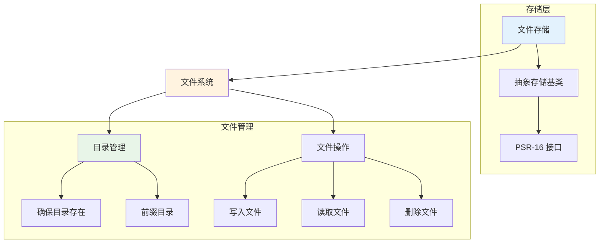

# 文件缓存

Hi Framework 的文件缓存存储基于本地文件系统，提供持久化、无需额外服务的缓存解决方案。文件缓存支持大文件存储、目录结构优化和自动过期管理，适合本地应用和静态资源缓存。

## 核心架构



## 配置说明

### 1. 配置参数说明

| 参数名 | 类型 | 默认值 | 说明 |
|--------|------|--------|------|
| **type** | string | - | 存储类型，必须为 'file' |
| **ttl** | int | 3600 | 默认过期时间（秒） |
| **prefix** | string | '' | 缓存键前缀，用于命名空间隔离 |
| **path** | string | '/tmp/cache' | 缓存文件存储路径 |

### 2. 基础配置

```yaml
# application.yaml
cache:
  file_cache:
    type: file
    ttl: 7200                    # 默认过期时间（秒）
    prefix: 'app_cache'          # 缓存键前缀
    path: '/tmp/app/cache'       # 缓存文件路径
```

### 2. 多文件缓存配置

```yaml
cache:
  # 应用缓存
  app_cache:
    type: file
    ttl: 3600
    prefix: 'app'
    path: '/tmp/app/cache'
  
  # 配置缓存
  config_cache:
    type: file
    ttl: 86400
    prefix: 'config'
    path: '/tmp/app/config_cache'
  
  # 静态资源缓存
  static_cache:
    type: file
    ttl: 2592000
    prefix: 'static'
    path: '/tmp/app/static_cache'
```