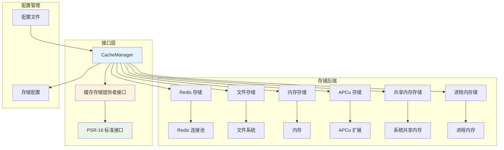

# 缓存系统概述

Hi Framework 提供了完整的缓存系统，支持多种存储后端，包括 Redis、文件、内存和 APCu。缓存系统基于 PSR-16 标准，提供统一的接口和灵活的配置，是构建高性能应用的重要组件。

> **重要设计原则**：
> 1. **PSR-16 兼容**：完全兼容 PSR-16 Simple Cache 标准
> 2. **多存储后端**：支持 Redis、文件、内存、APCu 等多种存储方式
> 3. **统一接口**：所有存储后端提供一致的 API 接口
> 4. **命名空间隔离**：支持前缀隔离，避免键名冲突
> 5. **自动过期**：支持 TTL 和自动过期管理

## 核心架构



## 核心组件

### 1. CacheManager

`CacheManager` 是缓存系统的核心管理器，负责：

- 管理多个命名缓存存储实例
- 根据配置自动初始化存储后端
- 提供统一的存储访问接口
- 处理存储配置和验证

### 2. CacheStorageProviderInterface

`CacheStorageProviderInterface` 定义了缓存存储提供者的标准接口：

```php
interface CacheStorageProviderInterface
{
    /**
     * 根据名称获取缓存存储实例
     */
    public function storage(string $name): CacheInterface;
}
```

### 3. AbstractStorage

`AbstractStorage` 是所有存储后端的抽象基类，提供：

- PSR-16 标准接口实现
- 键名验证和前缀管理
- TTL 时间处理
- 批量操作支持

### 4. Cache 注解

Hi Framework 提供了 `#[Cache]` 注解，用于自动缓存方法执行结果：

```php
use Hi\Attributes\Database\Cache;

class UserService
{
    /**
     * 自动缓存用户信息，TTL 为 1 小时
     */
    #[Cache(ttl: 3600, connection: 'redis_cache')]
    public function getUser(int $userId): ?array
    {
        // 方法执行结果会自动缓存
        return $this->getUserFromDatabase($userId);
    }
    
    /**
     * 使用自定义缓存键
     */
    #[Cache(ttl: 1800, connection: 'apcu_cache', key: 'user_profile')]
    public function getUserProfile(int $userId): ?array
    {
        // 使用指定的缓存键 'user_profile'
        return $this->getUserProfileFromDatabase($userId);
    }
    
    /**
     * 使用默认缓存配置
     */
    #[Cache]
    public function getAppConfig(): array
    {
        // 使用默认 TTL (600秒) 和默认连接
        return $this->loadAppConfig();
    }
}
```

#### Cache 注解参数

- **`ttl`**：缓存过期时间（秒），默认 600 秒
- **`connection`**：缓存连接名称，默认 'default'
- **`key`**：自定义缓存键名，默认使用方法签名生成

#### 注解使用场景

- **数据库查询结果缓存**：减少重复查询
- **配置信息缓存**：提高配置访问速度
- **计算结果缓存**：避免重复计算
- **API 响应缓存**：减少外部服务调用

## 支持的存储后端

### 1. Redis 存储

- **特点**：高性能、持久化、支持复杂数据结构
- **适用场景**：分布式缓存、会话存储、队列
- **配置**：支持连接池和引用配置

### 2. 文件存储

- **特点**：本地存储、无需额外服务、支持大文件
- **适用场景**：本地缓存、静态资源缓存
- **配置**：支持路径配置和目录结构优化

### 3. 内存存储

- **特点**：最快访问速度、进程内共享
- **适用场景**：临时缓存、配置缓存
- **配置**：支持 TTL 和前缀配置

### 4. APCu 存储

- **特点**：PHP 内置、进程间共享、高性能
- **适用场景**：PHP 应用缓存、配置缓存
- **配置**：支持 TTL 和前缀配置

### 5. 共享内存存储

- **特点**：系统级共享内存、进程间通信、极高性能
- **适用场景**：高性能进程间通信、实时数据缓存
- **配置**：支持内存段大小和最大段数配置

### 6. 进程内存储

- **特点**：PHP 进程内存、最快访问速度、自动过期
- **适用场景**：临时数据缓存、配置缓存、快速访问
- **配置**：支持最大项目数和清理间隔配置

## 配置结构

### 1. 基础配置

```yaml
# application.yaml
cache:
  # 默认缓存
  default:
    type: redis
    ttl: 3600
    prefix: 'app_cache'
    reference: 'redis.default'
  
  # 会话缓存
  session:
    type: redis
    ttl: 86400
    prefix: 'session'
    reference: 'redis.session'
  
  # 配置缓存
  config:
    type: file
    ttl: 7200
    prefix: 'config'
    path: '/tmp/app/config_cache'
  
  # 临时缓存
  temp:
    type: array
    ttl: 300
    prefix: 'temp'
```

### 2. 存储类型配置

#### Redis 配置

```yaml
cache:
  redis_cache:
    type: redis
    ttl: 3600
    prefix: 'app_cache'
    reference: 'redis.default'  # 引用 Redis 连接池
    
    # 或者直接配置 Redis 连接
    # host: 127.0.0.1
    # port: 6379
    # password: null
    # database: 0
```

#### 文件配置

```yaml
cache:
  file_cache:
    type: file
    ttl: 7200
    prefix: 'app_cache'
    path: '/tmp/app/cache'  # 缓存文件路径
```

#### 内存配置

```yaml
cache:
  memory_cache:
    type: array
    ttl: 300
    prefix: 'memory'
```

#### APCu 配置

```yaml
cache:
  apcu_cache:
    type: apcu
    ttl: 1800
    prefix: 'apcu'
```

## 服务绑定

### 1. 在 database.php 中绑定

```php
<?php

use Hi\Cache\CacheManager;
use Hi\Cache\CacheStorageProviderInterface;
use Hi\Kernel\ConfigInterface;
use Spiral\Core\Container;

/**
 * 缓存配置及绑定
 *
 * @var Container $di
 */
$di->bindSingleton(
    CacheStorageProviderInterface::class,
    static fn (ConfigInterface $config): CacheManager => $di->make(CacheManager::class, [
        'configs' => $config->get('cache'),
    ]),
);
```

## 基础使用

### 1. 获取缓存存储

```php
use Hi\Cache\CacheStorageProviderInterface;

class CacheExample
{
    public function __construct(
        private readonly CacheStorageProviderInterface $cacheProvider
    ) {}
    
    /**
     * 获取不同的缓存存储
     */
    public function getCacheStorages(): array
    {
        return [
            'default' => $this->cacheProvider->storage('default'),
            'session' => $this->cacheProvider->storage('session'),
            'config' => $this->cacheProvider->storage('config'),
            'temp' => $this->cacheProvider->storage('temp'),
        ];
    }
}
```

### 2. 基本缓存操作

```php
use Hi\Cache\CacheStorageProviderInterface;
use Psr\SimpleCache\CacheInterface;

class BasicCacheOperations
{
    public function __construct(
        private readonly CacheStorageProviderInterface $cacheProvider
    ) {}
    
    /**
     * 基本缓存操作示例
     */
    public function basicOperations(): void
    {
        $cache = $this->cacheProvider->storage('default');
        
        // 设置缓存
        $cache->set('key1', 'value1', 3600);           // 缓存1小时
        $cache->set('key2', ['data' => 'value2'], 1800); // 缓存30分钟
        
        // 获取缓存
        $value1 = $cache->get('key1');                 // 获取值
        $value2 = $cache->get('key2', 'default');      // 获取值，如果不存在返回默认值
        $value3 = $cache->get('key3', 'not_found');    // 不存在的键返回默认值
        
        // 检查键是否存在
        $hasKey1 = $cache->has('key1');                // true
        $hasKey3 = $cache->has('key3');                // false
        
        // 删除缓存
        $cache->delete('key1');                        // 删除单个键
        
        // 批量操作
        $cache->setMultiple([
            'batch1' => 'value1',
            'batch2' => 'value2',
            'batch3' => 'value3'
        ], 7200);                                      // 批量设置，缓存2小时
        
        $values = $cache->getMultiple(['batch1', 'batch2', 'batch3']);
        
        $cache->deleteMultiple(['batch1', 'batch2']);  // 批量删除
        
        // 清空缓存
        $cache->clear();                               // 清空所有缓存
    }
}
```

## 高级特性

### 1. Cache 注解高级用法

```php
use Hi\Attributes\Database\Cache;
use Hi\Cache\CacheStorageProviderInterface;

class AdvancedCacheAnnotation
{
    public function __construct(
        private readonly CacheStorageProviderInterface $cacheProvider
    ) {}
    
    /**
     * 条件缓存 - 根据参数动态决定是否缓存
     */
    #[Cache(ttl: 3600, connection: 'redis_cache')]
    public function getUserData(int $userId, bool $forceRefresh = false)
    {
        if ($forceRefresh) {
            // 强制刷新时，清除缓存
            $cache = $this->cacheProvider->storage('redis_cache');
            $cache->delete("user_data:{$userId}");
        }
        
        return $this->fetchUserData($userId);
    }
    
    /**
     * 分层缓存 - 使用不同的缓存策略
     */
    #[Cache(ttl: 1800, connection: 'apcu_cache')]
    public function getAppConfig(): array
    {
        // 应用配置使用 APCu 缓存，TTL 30分钟
        return $this->loadAppConfig();
    }
    
    #[Cache(ttl: 86400, connection: 'file_cache')]
    public function getStaticData(): array
    {
        // 静态数据使用文件缓存，TTL 24小时
        return $this->loadStaticData();
    }
    
    /**
     * 智能缓存键生成
     */
    #[Cache(ttl: 7200, connection: 'redis_cache', key: 'user_permissions')]
    public function getUserPermissions(int $userId, array $context = []): array
    {
        // 使用自定义缓存键，结合上下文信息
        $cacheKey = "user_permissions:{$userId}:" . md5(serialize($context));
        return $this->fetchUserPermissions($userId, $context);
    }
}
```

### 2. 缓存注解与手动缓存结合

```php
use Hi\Attributes\Database\Cache;
use Hi\Cache\CacheStorageProviderInterface;

class HybridCacheStrategy
{
    public function __construct(
        private readonly CacheStorageProviderInterface $cacheProvider
    ) {}
    
    /**
     * 注解缓存 + 手动缓存更新
     */
    #[Cache(ttl: 3600, connection: 'redis_cache')]
    public function getUserProfile(int $userId): array
    {
        return $this->fetchUserProfile($userId);
    }
    
    /**
     * 手动更新缓存
     */
    public function updateUserProfile(int $userId, array $data): bool
    {
        $cache = $this->cacheProvider->storage('redis_cache');
        
        // 先更新数据库
        $success = $this->updateUserProfileInDatabase($userId, $data);
        if ($success) {
            // 手动清除注解缓存，下次调用时重新缓存
            $cache->delete("user_profile:{$userId}");
            
            // 或者直接更新缓存
            $updatedProfile = $this->fetchUserProfile($userId);
            $cache->set("user_profile:{$userId}", $updatedProfile, 3600);
        }
        
        return $success;
    }
    
    /**
     * 批量缓存操作
     */
    public function warmUpUserCache(array $userIds): void
    {
        $cache = $this->cacheProvider->storage('redis_cache');
        
        foreach ($userIds as $userId) {
            // 预热用户缓存
            $this->getUserProfile($userId);
        }
    }
}
```

### 3. 命名空间隔离
```php
    /**
     * 使用不同前缀的缓存存储
     */
    public function demonstrateIsolation(): void
    {
        $userCache = $this->cacheProvider->storage('user_cache');    // 前缀: user
        $orderCache = $this->cacheProvider->storage('order_cache');  // 前缀: order
        $configCache = $this->cacheProvider->storage('config_cache'); // 前缀: config
        
        // 这些缓存键不会冲突，因为有不同的前缀
        $userCache->set('profile', ['name' => 'John'], 3600);
        $orderCache->set('profile', ['order_id' => 123], 1800);
        $configCache->set('profile', ['theme' => 'dark'], 7200);
        
        // 获取时使用相同的键名
        $userProfile = $userCache->get('profile');      // 用户资料
        $orderProfile = $orderCache->get('profile');    // 订单资料
        $configProfile = $configCache->get('profile');  // 配置资料
    }
}
```

### 2. TTL 管理

```php
use Hi\Cache\CacheStorageProviderInterface;
use DateInterval;
use DateTime;

class TTLManagement
{
    public function __construct(
        private readonly CacheStorageProviderInterface $cacheProvider
    ) {}
    
    /**
     * 不同的 TTL 设置方式
     */
    public function demonstrateTTL(): void
    {
        $cache = $this->cacheProvider->storage('default');
        
        // 使用秒数
        $cache->set('key1', 'value1', 3600);           // 1小时
        
        // 使用 DateInterval
        $cache->set('key2', 'value2', new DateInterval('PT30M')); // 30分钟
        
        // 使用 DateTime
        $expiry = new DateTime('+2 hours');
        $cache->set('key3', 'value3', $expiry);        // 2小时后过期
        
        // 使用 null（使用默认 TTL）
        $cache->set('key4', 'value4', null);           // 使用配置中的默认 TTL
        
        // 使用 0（永不过期）
        $cache->set('key5', 'value5', 0);              // 永不过期
    }
}
```

## 性能优化

### 1. 批量操作

```php
use Hi\Cache\CacheStorageProviderInterface;

class PerformanceOptimization
{
    public function __construct(
        private readonly CacheStorageProviderInterface $cacheProvider
    ) {}
    
    /**
     * 使用批量操作提高性能
     */
    public function batchOperations(): void
    {
        $cache = $this->cacheProvider->storage('default');
        
        // 批量设置 - 比循环设置单个键效率更高
        $data = [];
        for ($i = 1; $i <= 1000; $i++) {
            $data["user:{$i}"] = [
                'id' => $i,
                'name' => "User {$i}",
                'email' => "user{$i}@example.com"
            ];
        }
        
        $cache->setMultiple($data, 3600);
        
        // 批量获取 - 减少网络往返
        $keys = array_keys($data);
        $cachedData = $cache->getMultiple($keys);
        
        // 批量删除
        $cache->deleteMultiple($keys);
    }
}
```

### 2. Cache 注解最佳实践

```php
use Hi\Attributes\Database\Cache;
use Hi\Cache\CacheStorageProviderInterface;

class CacheAnnotationBestPractices
{
    public function __construct(
        private readonly CacheStorageProviderInterface $cacheProvider
    ) {}
    
    /**
     * 合理设置 TTL - 根据数据变化频率
     */
    #[Cache(ttl: 86400, connection: 'redis_cache')] // 24小时 - 静态数据
    public function getStaticData(): array
    {
        return $this->loadStaticData();
    }
    
    #[Cache(ttl: 3600, connection: 'apcu_cache')] // 1小时 - 配置数据
    public function getAppConfig(): array
    {
        return $this->loadAppConfig();
    }
    
    #[Cache(ttl: 300, connection: 'process_memory_cache')] // 5分钟 - 临时数据
    public function getTemporaryData(): array
    {
        return $this->generateTemporaryData();
    }
    
    /**
     * 选择合适的缓存后端
     */
    #[Cache(ttl: 7200, connection: 'redis_cache')] // Redis - 分布式访问
    public function getUserData(int $userId): array
    {
        return $this->fetchUserData($userId);
    }
    
    #[Cache(ttl: 1800, connection: 'apcu_cache')] // APCu - 进程间共享
    public function getSharedConfig(): array
    {
        return $this->loadSharedConfig();
    }
    
    #[Cache(ttl: 600, connection: 'process_memory_cache')] // 进程内 - 最快访问
    public function getFastData(): array
    {
        return $this->generateFastData();
    }
    
    /**
     * 缓存键设计 - 避免冲突
     */
    #[Cache(ttl: 3600, connection: 'redis_cache', key: 'user_profile')]
    public function getUserProfile(int $userId): array
    {
        return $this->fetchUserProfile($userId);
    }
    
    #[Cache(ttl: 1800, connection: 'redis_cache', key: 'user_permissions')]
    public function getUserPermissions(int $userId): array
    {
        return $this->fetchUserPermissions($userId);
    }
}
```

## 总结

Hi Framework 的缓存系统提供了强大而灵活的缓存功能：

1. **PSR-16 兼容**：完全兼容 PSR-16 Simple Cache 标准
2. **多存储后端**：支持 Redis、文件、内存、APCu、共享内存、进程内等多种存储方式
3. **统一接口**：所有存储后端提供一致的 API 接口
4. **命名空间隔离**：支持前缀隔离，避免键名冲突
5. **自动过期**：支持 TTL 和自动过期管理
6. **性能优化**：支持批量操作和缓存策略
7. **监控支持**：提供缓存性能监控和统计
8. **灵活选择**：根据性能需求选择合适的存储后端
9. **注解支持**：提供 `#[Cache]` 注解实现自动缓存

### 存储后端选择指南

- **Redis**：分布式缓存、会话存储、需要持久化
- **文件**：本地缓存、大文件缓存、无需额外服务
- **内存**：临时缓存、配置缓存、进程内共享
- **APCu**：PHP 应用缓存、进程间共享、高性能
- **共享内存**：系统级进程间通信、实时数据、极高性能
- **进程内**：临时数据、配置缓存、最快访问速度

### Cache 注解使用建议

- **`#[Cache]`**：简单方法结果缓存，使用默认配置
- **`#[Cache(ttl: 3600)]`**：指定 TTL 的缓存
- **`#[Cache(connection: 'redis_cache')]`**：指定缓存后端的缓存
- **`#[Cache(key: 'custom_key')]`**：使用自定义缓存键的缓存
- **组合使用**：根据业务需求组合不同的注解参数

通过合理使用这些功能，可以构建高性能、可靠的缓存应用，特别适合需要快速数据访问和高并发场景的应用。
