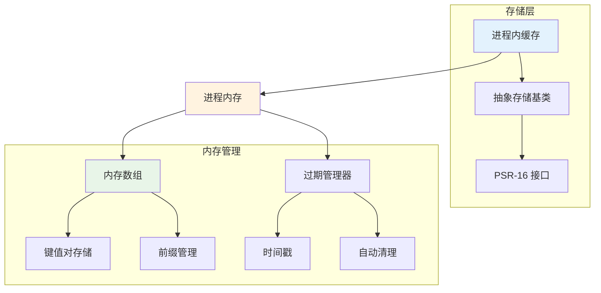

# 进程内缓存

Hi Framework 的进程内缓存存储基于 PHP 进程内存，提供最快访问速度的进程内缓存解决方案。进程内缓存支持 TTL 管理、前缀隔离和自动过期，适合临时数据缓存和配置缓存场景。

## 核心架构



## 配置说明

### 1. 配置参数说明

| 参数名 | 类型 | 默认值 | 说明 |
|--------|------|--------|------|
| **type** | string | - | 存储类型，必须为 'array' |
| **ttl** | int | 3600 | 默认过期时间（秒） |
| **prefix** | string | '' | 缓存键前缀，用于命名空间隔离 |

### 2. 基础配置

```yaml
# application.yaml
cache:
  process_memory_cache:
    type: array
    ttl: 300                    # 默认过期时间（秒）
    prefix: 'process'            # 缓存键前缀
```

### 2. 多进程内缓存配置

```yaml
cache:
  # 临时缓存
  temp_process_cache:
    type: array
    ttl: 300
    prefix: 'temp'
  
  # 配置缓存
  config_process_cache:
    type: array
    ttl: 1800
    prefix: 'config'
  
  # 会话缓存
  session_process_cache:
    type: array
    ttl: 3600
    prefix: 'session'
```
