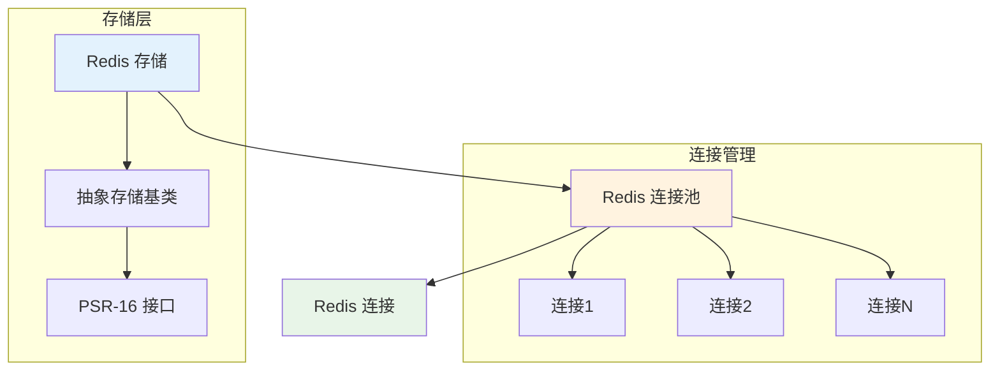

# Redis 缓存

Hi Framework 的 Redis 缓存存储基于 Redis 连接池，提供高性能、分布式的缓存解决方案。Redis 缓存支持复杂数据结构、持久化存储和集群部署。

## 核心架构



## 配置说明

### 1. 配置参数说明

| 参数名 | 类型 | 默认值 | 说明 |
|--------|------|--------|------|
| **type** | string | - | 存储类型，必须为 'redis' |
| **ttl** | int | 3600 | 默认过期时间（秒） |
| **prefix** | string | '' | 缓存键前缀，用于命名空间隔离 |
| **reference** | string | 'default' | 引用现有的 Redis 连接池名称 |

### 2. 基础配置

```yaml
# application.yaml
cache:
  redis_cache:
    type: redis
    ttl: 3600                    # 默认过期时间（秒）
    prefix: 'app_cache'          # 缓存键前缀
    reference: 'default'   # 引用现有的 Redis 连接池

  redis_full:
    type: redis
    host: 127.0.0.1
    port: 6379
    ttl: 3600                    # 默认过期时间（秒）
    prefix: 'full_cache'          # 缓存键前缀
```

### 2. 多 Redis 实例配置

```yaml
cache:
  main_cache:
    type: redis
    ttl: 3600
    prefix: 'main'
    reference: 'main'
  
  session_cache:
    type: redis
    ttl: 86400
    prefix: 'session'
    reference: 'session'
```
