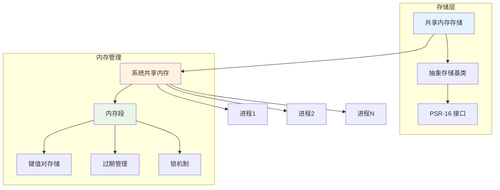

# 共享内存缓存

Hi Framework 的共享内存缓存存储基于系统共享内存机制，提供高性能的进程间共享缓存解决方案。共享内存缓存支持 TTL 管理、前缀隔离和自动过期，适合需要高性能进程间通信的场景。

## 核心架构



## 配置说明

### 1. 配置参数说明

| 参数名 | 类型 | 默认值 | 说明 |
|--------|------|--------|------|
| **type** | string | - | 存储类型，必须为 'shared-memory' |
| **ttl** | int | 3600 | 默认过期时间（秒） |
| **prefix** | string | '' | 缓存键前缀，用于命名空间隔离 |
| **segment_size** | int | 1048576 | 共享内存段大小（字节） |
| **max_segments** | int | 10 | 最大内存段数量 |

### 2. 基础配置

```yaml
# application.yaml
cache:
  shared_memory_cache:
    type: apcu
    ttl: 1800                    # 默认过期时间（秒）
    prefix: 'shared'             # 缓存键前缀
    segment_size: 1048576        # 共享内存段大小（字节）
    max_segments: 10             # 最大内存段数量
```

### 2. 多共享内存缓存配置

```yaml
cache:
  # 应用缓存
  app_shared_cache:
    type: apcu
    ttl: 3600
    prefix: 'app'
    segment_size: 2097152        # 2MB
    max_segments: 5
  
  # 会话缓存
  session_shared_cache:
    type: apcu
    ttl: 7200
    prefix: 'session'
    segment_size: 1048576        # 1MB
    max_segments: 3
  
  # 临时缓存
  temp_shared_cache:
    type: apcu
    ttl: 300
    prefix: 'temp'
    segment_size: 524288         # 512KB
    max_segments: 2
```
