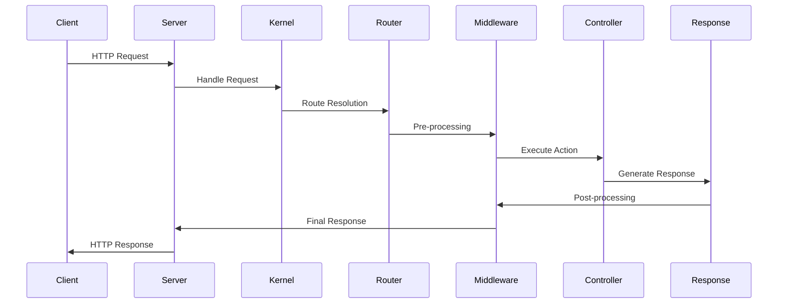

# 生命周期

理解 Hi Framework 的应用生命周期对于构建高效、可维护的应用程序至关重要。本文档详细介绍了框架的生命周期机制。

## 概览

Hi Framework 的生命周期包括以下几个主要阶段：

1. **引导阶段** - 加载配置和基础服务
2. **注册阶段** - 注册服务提供者和组件
3. **启动阶段** - 初始化应用程序
4. **运行阶段** - 处理请求或执行命令
5. **关闭阶段** - 清理资源和保存状态

## 应用引导

### 基本引导流程

```php
<?php

use Hi\Kernel;

// 1. 创建内核实例
$kernel = Kernel::new([
    'config_path' => 'config',
    'cache_path' => 'cache',
    'log_path' => 'logs'
]);

// 2. 引导应用程序
$app = $kernel->bootstrap();

// 3. 运行应用程序
$app->run();
```

### 自定义引导过程

```php
<?php

use Hi\Kernel;
use Hi\Kernel\BootstrapperInterface;

class CustomBootstrapper implements BootstrapperInterface
{
    public function bootstrap(Kernel $kernel): void
    {
        // 自定义引导逻辑
        $kernel->singleton('custom_service', fn() => new CustomService());
        
        // 注册中间件
        $kernel->middleware('auth', AuthMiddleware::class);
        
        // 设置错误处理器
        $kernel->errorHandler(CustomErrorHandler::class);
    }
}

$kernel = Kernel::new()
    ->bootstrapper(CustomBootstrapper::class);
```

## 服务注册

### 服务提供者

服务提供者是注册服务的主要方式：

```php
<?php

use Hi\Kernel\ServiceProvider;

class DatabaseServiceProvider extends ServiceProvider
{
    public function register(): void
    {
        // 注册服务
        $this->app->singleton('database', function ($app) {
            return new DatabaseManager($app['config']['database']);
        });
        
        // 注册别名
        $this->app->alias('database', DatabaseManager::class);
    }

    public function boot(): void
    {
        // 启动时执行的逻辑
        $this->app['database']->connect();
        
        // 注册事件监听器
        $this->app['events']->listen('database.connected', function () {
            // 连接后的处理
        });
    }
}
```

### 自动注册

框架支持自动发现和注册服务：

```php
<?php

// config/app.php
return [
    'providers' => [
        'auto_discover' => true,
        'paths' => [
            'app/Providers',
            'app/Services'
        ]
    ]
];
```

## HTTP 生命周期

### 请求处理流程



### HTTP 中间件栈

```php
<?php

use Hi\Http\Middleware\MiddlewareInterface;

class AuthMiddleware implements MiddlewareInterface
{
    public function handle($request, $next)
    {
        // 前置处理
        if (!$this->isAuthenticated($request)) {
            return response()->json(['error' => 'Unauthorized'], 401);
        }

        // 执行下一个中间件
        $response = $next($request);

        // 后置处理
        $response->header('X-Auth-User', $request->user()->id);

        return $response;
    }
}
```

### 请求生命周期钩子

```php
<?php

use Hi\Http\Events\RequestStarted;
use Hi\Http\Events\RequestCompleted;

// 请求开始时
$kernel->on(RequestStarted::class, function (RequestStarted $event) {
    $request = $event->request;
    
    // 记录请求开始时间
    $request->setAttribute('start_time', microtime(true));
    
    // 日志记录
    logger()->info('Request started', [
        'method' => $request->getMethod(),
        'uri' => $request->getUri(),
        'ip' => $request->getClientIp()
    ]);
});

// 请求完成时
$kernel->on(RequestCompleted::class, function (RequestCompleted $event) {
    $request = $event->request;
    $response = $event->response;
    
    $duration = microtime(true) - $request->getAttribute('start_time');
    
    logger()->info('Request completed', [
        'status' => $response->getStatusCode(),
        'duration' => $duration
    ]);
});
```

## 命令行生命周期

### 命令执行流程

```php
<?php

use Hi\Console\Command;
use Hi\Console\Events\CommandStarted;
use Hi\Console\Events\CommandCompleted;

// 命令开始事件
$kernel->on(CommandStarted::class, function (CommandStarted $event) {
    $command = $event->command;
    
    echo "开始执行命令: {$command->getName()}\n";
    
    // 设置内存限制
    ini_set('memory_limit', '512M');
});

// 命令完成事件
$kernel->on(CommandCompleted::class, function (CommandCompleted $event) {
    $command = $event->command;
    $exitCode = $event->exitCode;
    
    echo "命令执行完成: {$command->getName()}, 退出码: {$exitCode}\n";
    
    // 清理临时文件
    $this->cleanupTempFiles();
});
```

## 异步任务生命周期

### 队列任务处理

```php
<?php

use Hi\Queue\Job;
use Hi\Queue\Events\JobProcessing;
use Hi\Queue\Events\JobProcessed;
use Hi\Queue\Events\JobFailed;

class EmailJob extends Job
{
    public function handle(): void
    {
        // 发送邮件逻辑
        $this->sendEmail();
    }

    public function failed(\Throwable $exception): void
    {
        // 任务失败时的处理
        logger()->error('邮件发送失败', [
            'exception' => $exception->getMessage(),
            'job_id' => $this->getJobId()
        ]);
    }
}

// 队列事件监听
$kernel->on(JobProcessing::class, function (JobProcessing $event) {
    echo "开始处理任务: {$event->job->getJobId()}\n";
});

$kernel->on(JobProcessed::class, function (JobProcessed $event) {
    echo "任务处理完成: {$event->job->getJobId()}\n";
});

$kernel->on(JobFailed::class, function (JobFailed $event) {
    echo "任务处理失败: {$event->job->getJobId()}\n";
    
    // 记录失败信息
    $this->logJobFailure($event->job, $event->exception);
});
```

## 协程生命周期

### 协程管理

```php
<?php

use Hi\Coroutine\CoroutineManager;
use Hi\Coroutine\Events\CoroutineStarted;
use Hi\Coroutine\Events\CoroutineCompleted;

$manager = new CoroutineManager();

// 协程开始
$manager->on(CoroutineStarted::class, function (CoroutineStarted $event) {
    $cid = $event->coroutineId;
    echo "协程启动: {$cid}\n";
    
    // 设置协程上下文
    $event->context->set('start_time', microtime(true));
});

// 协程完成
$manager->on(CoroutineCompleted::class, function (CoroutineCompleted $event) {
    $cid = $event->coroutineId;
    $duration = microtime(true) - $event->context->get('start_time');
    
    echo "协程完成: {$cid}, 耗时: {$duration}s\n";
});

// 创建协程
$manager->create(function () {
    // 协程任务
    $result = yield from $this->fetchDataAsync();
    return $result;
});
```

## 应用关闭

### 优雅关闭

```php
<?php

use Hi\Kernel\ShutdownHandler;

class GracefulShutdownHandler implements ShutdownHandler
{
    public function handle(): void
    {
        echo "应用正在关闭...\n";
        
        // 1. 停止接受新请求
        $this->stopAcceptingRequests();
        
        // 2. 等待现有请求完成
        $this->waitForActiveRequests();
        
        // 3. 关闭数据库连接
        $this->closeDatabaseConnections();
        
        // 4. 清理缓存
        $this->clearCache();
        
        // 5. 保存应用状态
        $this->saveApplicationState();
        
        echo "应用已安全关闭\n";
    }
}

$kernel->shutdownHandler(GracefulShutdownHandler::class);
```

### 信号处理

```php
<?php

use Hi\System\SignalHandler;

$kernel->signalHandler(function (int $signal) {
    switch ($signal) {
        case SIGTERM:
        case SIGINT:
            echo "接收到终止信号，开始优雅关闭...\n";
            $this->gracefulShutdown();
            break;
            
        case SIGUSR1:
            echo "接收到用户信号，重载配置...\n";
            $this->reloadConfiguration();
            break;
            
        case SIGUSR2:
            echo "接收到用户信号，重启工作进程...\n";
            $this->restartWorkers();
            break;
    }
});
```

## 性能监控

### 生命周期指标

```php
<?php

use Hi\Metric\Timer;
use Hi\Metric\Counter;

class LifecycleMetrics
{
    public function __construct(
        private Timer $requestTimer,
        private Counter $requestCounter
    ) {}

    public function onRequestStarted(): void
    {
        $this->requestTimer->start('request.duration');
        $this->requestCounter->increment('requests.total');
    }

    public function onRequestCompleted(): void
    {
        $this->requestTimer->stop('request.duration');
        $this->requestCounter->increment('requests.completed');
    }

    public function onRequestFailed(): void
    {
        $this->requestCounter->increment('requests.failed');
    }
}
```

## 调试和监控

### 生命周期追踪

```php
<?php

use Hi\Debug\Profiler;

class LifecycleProfiler
{
    private array $checkpoints = [];

    public function checkpoint(string $name): void
    {
        $this->checkpoints[$name] = [
            'time' => microtime(true),
            'memory' => memory_get_usage(true)
        ];
    }

    public function getReport(): array
    {
        $report = [];
        $previous = null;

        foreach ($this->checkpoints as $name => $data) {
            $report[$name] = [
                'timestamp' => $data['time'],
                'memory' => $data['memory'],
                'duration' => $previous ? $data['time'] - $previous['time'] : 0,
                'memory_delta' => $previous ? $data['memory'] - $previous['memory'] : 0
            ];
            $previous = $data;
        }

        return $report;
    }
}

// 使用示例
$profiler = new LifecycleProfiler();

$profiler->checkpoint('bootstrap_start');
$kernel->bootstrap();

$profiler->checkpoint('registration_complete');
$kernel->registerServices();

$profiler->checkpoint('application_ready');
$app = $kernel->getApplication();

$profiler->checkpoint('request_handled');
$response = $app->handle($request);

// 生成报告
$report = $profiler->getReport();
```

## 最佳实践

### 1. 资源管理

```php
<?php

// 好的做法：使用依赖注入容器管理资源
class DatabaseService
{
    public function __construct(
        private ConnectionPool $pool
    ) {}

    public function __destruct()
    {
        // 自动释放连接
        $this->pool->releaseAll();
    }
}

// 不好的做法：手动管理资源
class BadDatabaseService
{
    private $connection;

    public function connect()
    {
        $this->connection = new PDO(/* ... */);
    }

    // 忘记释放连接
}
```

### 2. 事件驱动架构

```php
<?php

// 使用事件解耦组件
$kernel->on('user.registered', [
    SendWelcomeEmail::class,
    CreateUserProfile::class,
    LogRegistration::class
]);

// 而不是在注册逻辑中直接调用
class UserRegistration
{
    public function register(array $data): User
    {
        $user = User::create($data);
        
        // 发布事件而不是直接调用
        event('user.registered', $user);
        
        return $user;
    }
}
```

### 3. 异常处理

```php
<?php

// 全局异常处理器
$kernel->exceptionHandler(function (\Throwable $e) {
    // 记录异常
    logger()->error('Uncaught exception', [
        'exception' => $e->getMessage(),
        'file' => $e->getFile(),
        'line' => $e->getLine(),
        'trace' => $e->getTraceAsString()
    ]);

    // 根据环境返回不同响应
    if (app()->isProduction()) {
        return response()->json(['error' => 'Internal Server Error'], 500);
    } else {
        return response()->json([
            'error' => $e->getMessage(),
            'trace' => $e->getTrace()
        ], 500);
    }
});
```

## 总结

理解 Hi Framework 的生命周期有助于：

- **优化性能** - 在合适的阶段进行资源初始化和释放
- **调试问题** - 了解请求处理的每个步骤
- **扩展功能** - 在生命周期的关键点添加自定义逻辑
- **监控应用** - 收集各个阶段的性能指标

通过掌握这些概念，您可以构建更加高效和可维护的应用程序。 