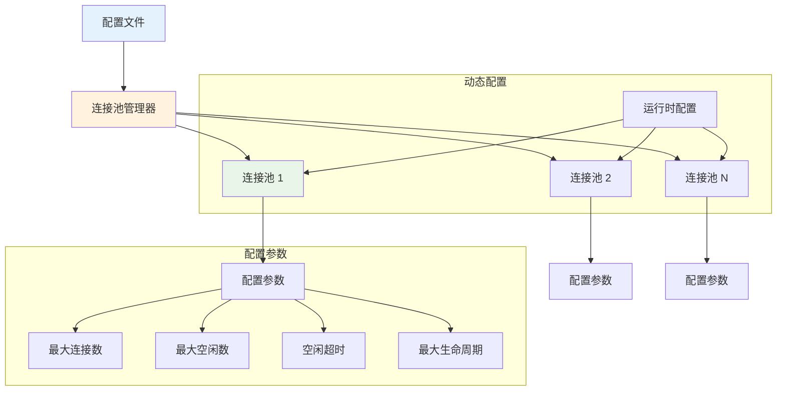

# 连接池配置管理

Hi Framework 的连接池配置管理系统提供了灵活的配置选项和动态配置能力，支持多种配置方式和运行时配置调整。

## 配置架构



## 配置参数详解

### 1. 基础配置参数

| 参数名 | 类型 | 默认值 | 说明 |
|--------|------|--------|------|
| **maxOpen** | int | 4 | 最大连接数，必须大于等于 1 |
| **maxIdle** | int | 1 | 最大空闲连接数 |
| **idleTimeout** | int | 30 | 空闲连接超时时间（秒） |
| **maxLifetime** | int | 300 | 连接最大生命周期（秒） |
| **maxGetRetries** | int | 100 | 获取连接最大重试次数 |
| **disablePredicting** | bool | false | 是否禁用连接预测 |
| **demandHistory** | array | [1,1,1,1,1] | 需求历史数据，用于连接预测 |
| **flushInterval** | int | 60 | 清理间隔时间（秒） |


## 配置方式

### 1. 构造函数配置

```php
use Hi\ConnectionPool\Pool;

class DatabasePool extends Pool
{
    public function __construct()
    {
        parent::__construct(
            maxOpen: 32,           // 最大连接数
            maxIdle: 8,            // 最大空闲连接数
            idleTimeout: 30,       // 空闲超时时间（秒）
            maxLifetime: 300,      // 最大生命周期（秒）
            maxGetRetries: 100,    // 最大重试次数
            disablePredicting: false, // 启用连接预测
            demandHistory: [5, 8, 12, 15, 10], // 需求历史数据
            flushInterval: 60      // 清理间隔（秒）
        );
    }
    
    public function name(): string
    {
        return 'database';
    }
    
    protected function createConnection(int $number): ConnectionInterface
    {
        return new DatabaseConnection($number, $this);
    }
}
```

### 2. 配置文件配置

```yaml
# application.yaml
connection_pool:
  database:
    max_open: 32
    max_idle: 8
    idle_timeout: 30
    max_lifetime: 300
    max_get_retries: 100
    disable_predicting: false
    demand_history: [5, 8, 12, 15, 10]
    flush_interval: 60
  
  redis:
    max_open: 16
    max_idle: 4
    idle_timeout: 60
    max_lifetime: 600
    max_get_retries: 50
    disable_predicting: true
    demand_history: [2, 3, 4, 3, 2]
    flush_interval: 30
  
  http_client:
    max_open: 64
    max_idle: 16
    idle_timeout: 120
    max_lifetime: 1800
    max_get_retries: 200
    disable_predicting: false
    demand_history: [10, 15, 20, 25, 30]
    flush_interval: 45
```

## 配置优化策略

### 1. 高并发场景配置

```php
class HighConcurrencyPool extends Pool
{
    public function __construct()
    {
        parent::__construct(
            maxOpen: 200,          // 高并发需要更多连接
            maxIdle: 50,           // 保持足够的空闲连接
            idleTimeout: 120,      // 延长空闲超时，减少连接创建
            maxLifetime: 3600,     // 延长生命周期，提高连接复用
            maxGetRetries: 200,    // 增加重试次数
            disablePredicting: false, // 启用智能预测
            demandHistory: [50, 80, 120, 150, 180], // 高需求历史
            flushInterval: 30      // 频繁清理，及时释放资源
        );
    }
}
```

### 2. 低延迟场景配置

```php
class LowLatencyPool extends Pool
{
    public function __construct()
    {
        parent::__construct(
            maxOpen: 64,           // 适中的连接数
            maxIdle: 16,           // 保持足够的空闲连接
            idleTimeout: 60,       // 适中的空闲超时
            maxLifetime: 1800,     // 适中的生命周期
            maxGetRetries: 100,    // 标准重试次数
            disablePredicting: false, // 启用预测
            demandHistory: [10, 15, 20, 25, 30], // 中等需求历史
            flushInterval: 45      // 适中的清理间隔
        );
    }
}
```

### 3. 资源受限场景配置

```php
class ResourceConstrainedPool extends Pool
{
    public function __construct()
    {
        parent::__construct(
            maxOpen: 16,           // 限制最大连接数
            maxIdle: 4,            // 限制空闲连接数
            idleTimeout: 30,       // 快速释放空闲连接
            maxLifetime: 600,      // 较短的生命周期
            maxGetRetries: 50,     // 减少重试次数
            disablePredicting: true, // 禁用预测，节省资源
            demandHistory: [2, 3, 4, 3, 2], // 低需求历史
            flushInterval: 60      // 标准清理间隔
        );
    }
}
```

## 总结

Hi Framework 的连接池配置管理系统提供了：

1. **灵活配置方式**：支持构造函数、配置文件、环境变量等多种配置方式
2. **参数验证**：完整的配置参数验证和错误处理
3. **动态配置**：支持运行时配置调整和热重载
4. **优化策略**：针对不同场景的配置优化建议
5. **配置监控**：配置变更监控和性能影响分析
6. **告警机制**：配置变更和性能问题的及时告警

通过合理使用这些功能，可以构建灵活、高效的连接池配置管理系统，满足不同场景下的性能和资源需求。
