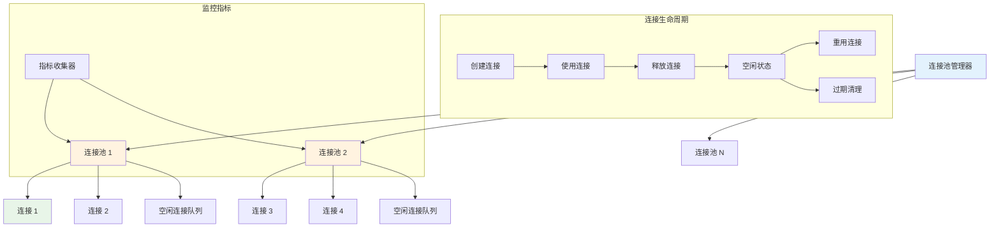

# 连接池概述

Hi Framework 提供了高性能的连接池管理系统，通过 `Manager`、`Pool` 和 `Connection` 等核心组件实现高效的连接复用和管理。本文档基于框架源码分析，详细介绍连接池的架构设计和使用方法。

## 核心架构



## 核心组件

### 1. 连接池管理器

`Manager` 抽象类负责管理多个连接池实例：

```php
use Hi\ConnectionPool\Manager;

abstract class ConnectionManager extends Manager
{
    /**
     * 获取连接池实例
     */
    public function getPool(string $name): PoolInterface
    {
        if (! isset($this->pools[$name])) {
            $this->initialize($name);
        }
        return $this->pools[$name];
    }
    
    /**
     * 获取连接实例
     */
    public function getConnection(string $name): ConnectionInterface
    {
        return $this->getPool($name)->get();
    }
    
    /**
     * 初始化指定名称的连接池
     */
    abstract protected function initialize(string $name): void;
}
```

### 2. 连接池接口

`PoolInterface` 定义了连接池的标准接口：

```php
interface PoolInterface
{
    /**
     * 从连接池获取连接
     */
    public function get(float $timeout = 0): ConnectionInterface;
    
    /**
     * 将连接放回连接池
     */
    public function put(ConnectionInterface $connection): void;
    
    /**
     * 清理过期连接
     */
    public function flush(): void;
    
    /**
     * 获取连接限制数量
     */
    public function getConnectionLimit(): int;
    
    /**
     * 获取当前连接数量
     */
    public function getConnectionCount(): int;
    
    /**
     * 获取空闲连接数量
     */
    public function getIdleCount(): int;
    
    /**
     * 获取空闲连接限制
     */
    public function getIdleLimit(): int;
    
    /**
     * 获取空闲超时时间
     */
    public function getIdleTimeout(): int;
    
    /**
     * 获取最大生命周期
     */
    public function getMaxLifetime(): int;
    
    /**
     * 获取最大重试次数
     */
    public function getMaxGetRetries(): int;
    
    /**
     * 销毁连接池
     */
    public function finalize(): void;
    
    /**
     * 设置指标收集器
     */
    public function setMetricCollector(MetricCollectorInterface $collector): self;
}
```

### 3. 连接接口

`ConnectionInterface` 定义了连接的标准接口：

```php
interface ConnectionInterface
{
    /**
     * 建立连接
     */
    public function connect(): void;
    
    /**
     * 断开连接
     */
    public function disconnect(): void;
    
    /**
     * 检查连接状态
     */
    public function isConnected(): bool;
    
    /**
     * 检查连接是否已关闭
     */
    public function isClosed(): bool;
    
    /**
     * 获取最后使用时间
     */
    public function getLastUseTime(): float;
    
    /**
     * 获取创建时间
     */
    public function getCreatedTime(): int;
    
    /**
     * 获取连接编号
     */
    public function getNumber(): int;
    
    /**
     * 标记连接正在使用
     */
    public function use(): self;
    
    /**
     * 释放连接回连接池
     */
    public function release(): void;
}
```

## 连接池配置

### 1. 配置参数说明

| 参数名 | 类型 | 默认值 | 说明 |
|--------|------|--------|------|
| **maxOpen** | int | 4 | 最大连接数 |
| **maxIdle** | int | 1 | 最大空闲连接数 |
| **idleTimeout** | int | 30 | 空闲连接超时时间（秒） |
| **maxLifetime** | int | 300 | 连接最大生命周期（秒） |
| **maxGetRetries** | int | 100 | 获取连接最大重试次数 |
| **disablePredicting** | bool | false | 是否禁用连接预测 |
| **demandHistory** | array | [1,1,1,1,1] | 需求历史数据 |
| **flushInterval** | int | 60 | 清理间隔时间（秒） |

### 2. 基础配置示例

```php
use Hi\ConnectionPool\Pool;

class DatabasePool extends Pool
{
    public function __construct()
    {
        parent::__construct(
            maxOpen: 32,           // 最大连接数
            maxIdle: 8,            // 最大空闲连接数
            idleTimeout: 30,       // 空闲超时时间
            maxLifetime: 300,      // 最大生命周期
            maxGetRetries: 100,    // 最大重试次数
            disablePredicting: false, // 启用连接预测
            demandHistory: [1, 1, 1, 1, 1], // 需求历史
            flushInterval: 60      // 清理间隔
        );
    }
    
    public function name(): string
    {
        return 'database';
    }
    
    protected function createConnection(int $number): ConnectionInterface
    {
        return new DatabaseConnection($number, $this);
    }
}
```

## 连接生命周期管理

### 1. 连接创建和使用

```php
use Hi\ConnectionPool\Connection;

class DatabaseConnection extends Connection
{
    private \PDO $pdo;
    
    public function __construct(int $number, PoolInterface $pool)
    {
        parent::__construct($number, $pool);
        $this->connect();
    }
    
    public function connect(): void
    {
        try {
            $this->pdo = new \PDO(
                'mysql:host=localhost;dbname=test',
                'username',
                'password'
            );
            $this->connected = true;
            $this->closed = false;
        } catch (\PDOException $e) {
            throw $e;
        }
    }
    
    public function disconnect(): void
    {
        $this->pdo = null;
        $this->connected = false;
        $this->closed = true;
    }
    
    public function query(string $sql): \PDOStatement
    {
        return $this->pdo->query($sql);
    }
}
```

### 2. 连接池使用示例

```php
use Hi\ConnectionPool\PoolInterface;

class DatabaseService
{
    public function __construct(
        private readonly PoolInterface $pool
    ) {}
    
    /**
     * 执行数据库查询
     */
    public function executeQuery(string $sql): array
    {
        $connection = $this->pool->get();
        
        try {
            $result = $connection->query($sql);
            return $result->fetchAll(\PDO::FETCH_ASSOC);
        } finally {
            $connection->release();
        }
    }
    
    /**
     * 获取连接池状态
     */
    public function getPoolStatus(): array
    {
        return [
            'total_connections' => $this->pool->getConnectionCount(),
            'idle_connections' => $this->pool->getIdleCount(),
            'max_connections' => $this->pool->getConnectionLimit(),
            'idle_limit' => $this->pool->getIdleLimit(),
            'idle_timeout' => $this->pool->getIdleTimeout(),
            'max_lifetime' => $this->pool->getMaxLifetime(),
        ];
    }
}
```

## 高级特性

### 1. 连接预测

连接池支持基于需求历史的智能连接预测：

```php
class SmartPool extends Pool
{
    public function __construct()
    {
        parent::__construct(
            maxOpen: 50,
            maxIdle: 10,
            idleTimeout: 60,
            maxLifetime: 600,
            disablePredicting: false, // 启用预测
            demandHistory: [5, 8, 12, 15, 10] // 历史需求数据
        );
    }
    
    /**
     * 自定义连接预测逻辑
     */
    protected function predictingConnections(): int
    {
        if ($this->disablePredicting) {
            return 0;
        }
        
        // 分析需求趋势
        $trend = $this->analyzeDemandTrend();
        
        if ($trend > 0) {
            // 需求上升，预创建连接
            return $this->preCreateConnections($trend);
        } else {
            // 需求下降，释放多余连接
            return $this->releaseExcessConnections(abs($trend));
        }
    }
    
    private function analyzeDemandTrend(): int
    {
        $history = $this->demandHistory;
        $recent = array_slice($history, -3);
        $older = array_slice($history, -6, 3);
        
        $recentAvg = array_sum($recent) / count($recent);
        $olderAvg = array_sum($older) / count($older);
        
        return (int) ($recentAvg - $olderAvg);
    }
}
```

### 2. 指标收集

支持连接池性能指标收集：

```php
use Hi\ConnectionPool\MetricCollectorInterface;

class PoolMetricCollector implements MetricCollectorInterface
{
    public function collect(
        string $poolName,
        int $inUsingCount,
        int $idleCount,
        int $releasedCount
    ): void {
        // 记录连接池指标
        $metrics = [
            'pool_name' => $poolName,
            'in_using_count' => $inUsingCount,
            'idle_count' => $idleCount,
            'released_count' => $releasedCount,
            'total_count' => $inUsingCount + $idleCount,
            'utilization_rate' => $inUsingCount / ($inUsingCount + $idleCount),
            'timestamp' => time(),
        ];
        
        $this->recordMetrics($metrics);
    }
    
    private function recordMetrics(array $metrics): void
    {
        // 记录到监控系统
        // 可以是 Prometheus、InfluxDB 等
    }
}
```

### 3. 自动清理

连接池支持自动清理过期连接：

```php
class AutoCleanPool extends Pool
{
    public function __construct()
    {
        parent::__construct(
            maxOpen: 32,
            maxIdle: 8,
            idleTimeout: 30,    // 30秒空闲超时
            maxLifetime: 300,   // 5分钟生命周期
            flushInterval: 30   // 30秒清理间隔
        );
    }
    
    /**
     * 自定义清理逻辑
     */
    public function flush(): void
    {
        $releaseCount = 0;
        
        // 清理空闲超时连接
        $releaseCount += $this->removeExpiredIdleConnections();
        
        // 清理生命周期过期连接
        $releaseCount += $this->removeExpiredConnections();
        
        // 智能连接预测
        $releaseCount += $this->predictingConnections();
        
        // 记录清理结果
        $this->logger?->info("Pool flush completed", [
            'pool' => $this->name(),
            'released_connections' => $releaseCount,
            'remaining_connections' => $this->connections->count(),
            'idle_connections' => $this->idle->count(),
        ]);
    }
}
```

## 总结

Hi Framework 的连接池系统提供了：

1. **高效连接管理**：自动连接创建、复用和清理
2. **智能预测**：基于需求历史的连接数量预测
3. **生命周期管理**：连接超时和生命周期控制
4. **性能监控**：完整的指标收集和监控支持
5. **自动清理**：定期清理过期和无效连接
6. **高可用性**：连接重试和故障恢复机制

通过合理使用这些功能，可以构建高性能、可靠的连接池应用，特别适合高并发场景下的数据库、Redis、HTTP 客户端等连接管理需求。
