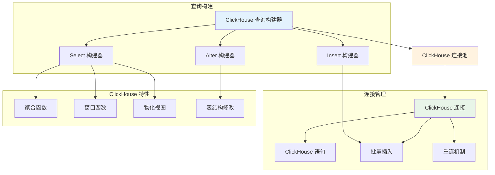

# ClickHouse 支持

Hi Framework 提供了完整的 ClickHouse 数据库支持，基于高性能的列式存储数据库，支持实时分析查询、数据仓库和大数据处理。ClickHouse 支持是构建高性能分析应用和实时数据处理系统的核心组件。

> **重要设计原则**：
> 1. **列式存储优化**：针对分析查询优化的列式存储架构
> 2. **高性能查询**：支持复杂的聚合查询和实时分析
> 3. **批量操作**：优化批量插入和批量查询性能
> 4. **连接池管理**：支持高并发连接复用和自动重连
> 5. **ClickHouse 特性**：充分利用 ClickHouse 特有的功能和优化

## 核心架构



## 连接配置

### 1. 配置参数说明

| 参数名 | 类型 | 默认值 | 说明 |
|--------|------|--------|------|
| **driver** | string | - | 数据库驱动类型，必须为 'clickhouse' |
| **host** | string | 127.0.0.1 | 数据库主机地址 |
| **port** | int | 9000 | 数据库端口 |
| **user** | string | default | 数据库用户名 |
| **password** | string | '' | 数据库密码 |
| **database** | string | - | 数据库名称（必需） |
| **charset** | string | utf8 | 字符集 |
| **options** | array | - | PDO 选项数组 |
| **max_open** | int | 16 | 最大连接数 |
| **max_idle** | int | 4 | 最大空闲连接数 |
| **idle_timeout** | int | 30 | 空闲连接超时时间（秒） |
| **max_lifetime** | int | 300 | 连接最大生命周期（秒） |
| **max_get_retries** | int | 100 | 获取连接最大重试次数 |
| **disable_predicting** | bool | false | 是否禁用连接预测 |
| **demand_history** | array | [1,1,1,1,1] | 需求历史数据 |

### 2. 基础连接参数

```yaml
# application.yaml
database:
  analytics:
    driver: clickhouse
    host: 127.0.0.1
    port: 9000
    user: default
    password: ''
    database: analytics
    charset: utf8
    
    # 连接选项
    options:
      PDO::ATTR_ERRMODE: PDO::ERRMODE_EXCEPTION
      PDO::ATTR_DEFAULT_FETCH_MODE: PDO::FETCH_ASSOC
      PDO::ATTR_EMULATE_PREPARES: false
```

### 3. 连接池配置

```yaml
database:
  analytics:
    # ... 基础连接配置 ...
    
    # 连接池管理配置
    max_open: 16        # 最大连接数
    max_idle: 4         # 最大空闲连接数
    idle_timeout: 30    # 空闲连接超时时间（秒）
    max_lifetime: 300   # 连接最大生命周期（秒）
    max_get_retries: 100 # 获取连接最大重试次数
    disable_predicting: false # 是否禁用连接预测
    demand_history: [1, 1, 1, 1, 1] # 需求历史数据
```

### 4. 集群配置

```yaml
database:
  # 主集群
  analytics:
    driver: clickhouse
    host: clickhouse-master.local
    port: 9000
    user: default
    password: ''
    database: analytics
  
  # 副本集群
  analytics-replica:
    driver: clickhouse
    host: clickhouse-replica.local
    port: 9000
    user: default
    password: ''
    database: analytics
  
  # 分片集群
  analytics-shard1:
    driver: clickhouse
    host: clickhouse-shard1.local
    port: 9000
    user: default
    password: ''
    database: analytics
  
  analytics-shard2:
    driver: clickhouse
    host: clickhouse-shard2.local
    port: 9000
    user: default
    password: ''
    database: analytics
```

## 总结

Hi Framework 的 ClickHouse 支持提供了完整而强大的分析数据库功能：

1. **列式存储优化**：针对分析查询优化的列式存储架构
2. **高性能查询**：支持复杂的聚合查询和实时分析
3. **批量操作**：优化批量插入和批量查询性能
4. **连接池管理**：支持高并发连接复用和自动重连
5. **ClickHouse 特性**：充分利用 ClickHouse 特有的功能和优化
6. **性能优化**：提供查询优化和批量操作优化建议
7. **监控支持**：支持查询性能指标收集和系统监控

通过合理使用这些功能，可以构建高性能、可靠的 ClickHouse 分析应用，特别适合大数据分析、实时数据处理和数据仓库场景。
