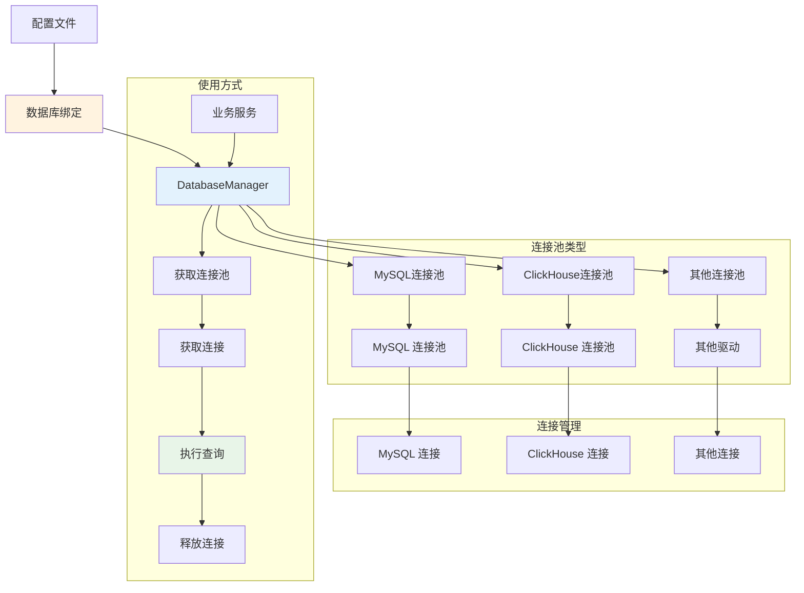

# 连接管理

Hi Framework 提供了强大的数据库连接管理功能，基于连接池架构设计，支持多种数据库驱动和读写分离。数据库系统是构建高性能应用的核心组件，特别适合高并发场景下的数据访问需求。

> **重要设计原则**：
> 1. **连接池架构**：基于连接池管理，支持高并发和连接复用
> 2. **多驱动支持**：支持 MySQL、ClickHouse 等多种数据库驱动
> 3. **读写分离**：支持主从数据库配置，自动路由读写操作
> 4. **统一管理**：通过 `DatabaseManager` 统一管理所有数据库连接
> 5. **配置驱动**：基于配置文件的数据源绑定，支持环境差异化配置

## 核心架构



### 服务绑定配置

在 `database.php` 中，通过 `DatabaseProviderInterface` 绑定服务：

```php
<?php

use Hi\Database\DatabaseManager;
use Hi\Database\DatabaseProviderInterface;
use Hi\Kernel\ConfigInterface;
use Spiral\Core\Container;

/**
 * 数据库配置及绑定
 *
 * @var Container $di
 */
$di->bindSingleton(
    DatabaseProviderInterface::class,
    static fn (ConfigInterface $config): DatabaseManager => $di->make(DatabaseManager::class, [
        'configs' => $config->get('database'),
    ]),
);

// Database autowire
$di->bind(QueryInterface::class, new Inflector(
    static function (QueryInterface $query, DatabaseProviderInterface $databaseProvider, ?MetricCollectorInterface $collector) {
        $query->setDatabaseManager($databaseProvider);
        if ($collector) {
            $query->setMetricCollector($collector);
        }
        return $query;
    },
));
```

## 基础使用

### 1. 通过依赖注入获取数据库连接

```php
use Hi\Database\DatabaseProviderInterface;
use Hi\ConnectionPool\ConnectionInterface;

class UserRepository
{
    public function __construct(
        private readonly DatabaseProviderInterface $databaseProvider
    ) {}
    
    /**
     * 获取用户信息
     */
    public function getUser(int $userId): ?array
    {
        // 获取只读连接
        $connection = $this->databaseProvider->getConnection('readonly');
        
        try {
            $stmt = $connection->prepare('SELECT * FROM users WHERE id = ?');
            $stmt->execute([$userId]);
            
            return $stmt->fetch(PDO::FETCH_ASSOC) ?: null;
            
        } finally {
            // 释放连接回连接池
            $connection->release();
        }
    }
    
    /**
     * 创建用户
     */
    public function createUser(array $userData): int
    {
        // 获取主库连接
        $connection = $this->databaseProvider->getConnection('default');
        
        try {
            $stmt = $connection->prepare('INSERT INTO users (name, email, created_at) VALUES (?, ?, ?)');
            $stmt->execute([
                $userData['name'],
                $userData['email'],
                date('Y-m-d H:i:s')
            ]);
            
            return (int) $connection->lastInsertId();
            
        } finally {
            $connection->release();
        }
    }
}
```

### 2. 直接使用连接池

```php
use Hi\Database\DatabaseProviderInterface;
use Hi\ConnectionPool\PoolInterface;

class DatabaseHealthChecker
{
    public function __construct(
        private readonly DatabaseProviderInterface $databaseProvider
    ) {}
    
    /**
     * 获取连接池进行自定义操作
     */
    public function getConnectionPool(string $name): PoolInterface
    {
        return $this->databaseProvider->getPool($name);
    }
    
    /**
     * 健康检查
     */
    public function healthCheck(string $name): bool
    {
        try {
            $pool = $this->getConnectionPool($name);
            $connection = $pool->get();
            
            $stmt = $connection->query('SELECT 1');
            $result = $stmt->fetch();
            
            $connection->release();
            
            return $result !== false;
            
        } catch (\Exception $e) {
            return false;
        }
    }
    
    /**
     * 获取数据库状态
     */
    public function getDatabaseStatus(): array
    {
        $databases = ['default', 'readonly', 'analytics'];
        $status = [];
        
        foreach ($databases as $name) {
            $status[$name] = [
                'healthy' => $this->healthCheck($name),
                'pool_info' => $this->getPoolInfo($name)
            ];
        }
        
        return $status;
    }
    
    private function getPoolInfo(string $name): array
    {
        $pool = $this->getConnectionPool($name);
        
        return [
            'max_open' => $pool->getMaxOpen(),
            'max_idle' => $pool->getMaxIdle(),
            'current_open' => $pool->getCurrentOpen(),
            'current_idle' => $pool->getCurrentIdle()
        ];
    }
}
```

## 驱动支持

### 1. MySQL 驱动

MySQL 驱动基于 PDO 和连接池，支持读写分离：

```php
use Hi\Database\DatabaseProviderInterface;

class MySQLExample
{
    public function __construct(
        private readonly DatabaseProviderInterface $databaseProvider
    ) {}
    
    /**
     * 使用 MySQL 驱动执行查询
     */
    public function executeQuery(): array
    {
        // 确保配置中 driver 设置为 'mysql'
        $connection = $this->databaseProvider->getConnection('default');
        
        try {
            $stmt = $connection->prepare('SELECT * FROM users WHERE status = ? LIMIT ?');
            $stmt->execute(['active', 10]);
            
            return $stmt->fetchAll(PDO::FETCH_ASSOC);
            
        } finally {
            $connection->release();
        }
    }
}
```

### 2. ClickHouse 驱动

ClickHouse 驱动支持高性能分析查询：

```php
use Hi\Database\DatabaseProviderInterface;

class ClickHouseExample
{
    public function __construct(
        private readonly DatabaseProviderInterface $databaseProvider
    ) {}
    
    /**
     * 使用 ClickHouse 驱动执行分析查询
     */
    public function executeAnalyticsQuery(): array
    {
        // 确保配置中 driver 设置为 'clickhouse'
        $connection = $this->databaseProvider->getConnection('analytics');
        
        try {
            $stmt = $connection->prepare('
                SELECT 
                    date,
                    COUNT(*) as count,
                    AVG(value) as avg_value
                FROM events 
                WHERE date >= ? 
                GROUP BY date 
                ORDER BY date
            ');
            $stmt->execute([date('Y-m-d', strtotime('-7 days'))]);
            
            return $stmt->fetchAll(PDO::FETCH_ASSOC);
            
        } finally {
            $connection->release();
        }
    }
}
```

## 连接池配置

### 1. 配置参数说明

| 参数名 | 类型 | 默认值 | 说明 |
|--------|------|--------|------|
| **driver** | string | mysql | 数据库驱动类型 |
| **host** | string | 127.0.0.1 | 数据库主机地址 |
| **port** | int | 3306 | 数据库端口 |
| **user** | string | root | 数据库用户名 |
| **password** | string | - | 数据库密码 |
| **database** | string | - | 数据库名称（必需） |
| **charset** | string | utf8mb4 | 字符集 |
| **unix_socket** | string | "" | Unix socket 路径 |
| **options** | array | - | PDO 选项数组 |
| **lost_retries** | int | 5 | 连接丢失重试次数 |
| **lost_retry_wait_time** | float | 0.1 | 重连等待时间（秒） |
| **max_open** | int | 32 | 最大连接数 |
| **max_idle** | int | 8 | 最大空闲连接数 |
| **idle_timeout** | int | 30 | 空闲连接超时时间（秒） |
| **max_lifetime** | int | 300 | 连接最大生命周期（秒） |
| **max_get_retries** | int | 100 | 获取连接最大重试次数 |
| **disable_predicting** | bool | false | 是否禁用连接预测 |
| **demand_history** | array | [1,1,1,1,1] | 需求历史数据 |

### 2. 基础连接参数

基于 `PDOConnectionConfig`，每个数据库可以配置以下基础连接参数：

```yaml
database:
  default:
    driver: mysql
    
    # 基础连接配置
    host: 127.0.0.1
    port: 3306
    user: root
    password: password
    database: myapp
    charset: utf8mb4
    unix_socket: ""              # Unix socket 路径
    
    # 连接选项
    options:                      # PDO 选项
      PDO::ATTR_ERRMODE: PDO::ERRMODE_EXCEPTION
      PDO::ATTR_DEFAULT_FETCH_MODE: PDO::FETCH_ASSOC
      PDO::ATTR_EMULATE_PREPARES: false
    
    # 重连配置
    lost_retries: 5              # 连接丢失重试次数
    lost_retry_wait_time: 0.1    # 重连等待时间（秒）
```

### 3. 连接池管理参数

除了基础连接参数，还可以配置连接池管理参数：

```yaml
database:
  default:
    # ... 基础连接配置 ...
    
    # 连接池管理配置
    max_open: 32                 # 最大连接数
    max_idle: 8                  # 最大空闲连接数
    idle_timeout: 30             # 空闲连接超时时间（秒）
    max_lifetime: 300            # 连接最大生命周期（秒）
    max_get_retries: 100         # 获取连接最大重试次数
    disable_predicting: false    # 是否禁用连接预测
    demand_history: [1, 1, 1, 1, 1] # 需求历史数据

## 读写分离

### 1. 配置读写分离

```yaml
database:
  # 主库（写操作）
  default:
    driver: mysql
    host: master.db.local
    port: 3306
    user: write_user
    password: write_pass
    database: myapp
  
  # 从库（读操作）
  readonly:
    driver: mysql
    host: slave.db.local
    port: 3306
    user: read_user
    password: read_pass
    database: myapp
```

### 2. 在查询中使用读写分离

```php
use Hi\Database\Query\MySQL;

class UserService
{
    public function __construct(
        private readonly MySQL $query
    ) {}
    
    /**
     * 读取操作 - 自动使用只读连接
     */
    public function getUsers(): array
    {
        return $this->query
            ->select(['id', 'name', 'email'], 'users', true) // true 表示只读
            ->where('status', 'active')
            ->fetchAll();
    }
    
    /**
     * 写入操作 - 自动使用主库连接
     */
    public function createUser(array $data): int
    {
        return $this->query
            ->insert('users')
            ->cols(['name', 'email', 'created_at'])
            ->values([$data['name'], $data['email'], date('Y-m-d H:i:s')])
            ->execute();
    }
}
```

## 总结

Hi Framework 的数据库连接管理系统提供了强大而灵活的连接池管理功能：

1. **连接池架构**：基于连接池设计，支持高并发和连接复用
2. **多驱动支持**：支持 MySQL 和 ClickHouse 两种驱动
3. **读写分离**：支持主从数据库配置，自动路由读写操作
4. **统一管理**：通过 `DatabaseManager` 统一管理所有数据库连接
5. **配置驱动**：基于配置文件的数据源绑定，支持环境差异化配置
6. **错误处理**：完善的异常处理和重连机制
7. **监控支持**：连接池状态监控和指标收集

通过合理使用这些功能，可以构建高性能、可靠的数据库应用，特别适合高并发场景下的数据访问需求。
