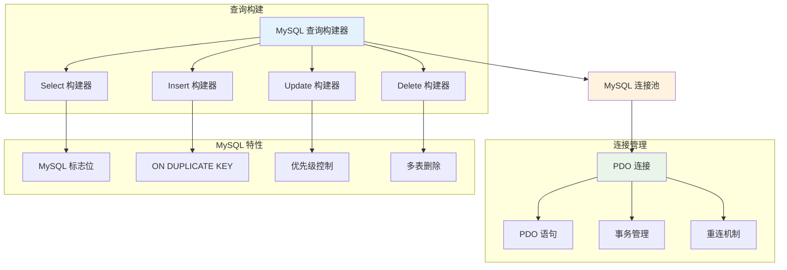

# MySQL 支持

Hi Framework 提供了完整的 MySQL 数据库支持，基于 PDO 和连接池架构，支持读写分离、事务处理、预处理语句等高级功能。MySQL 支持是构建高性能关系型数据库应用的核心组件。

> **重要设计原则**：
> 1. **PDO 兼容**：基于 PDO 扩展，提供标准化的数据库接口
> 2. **连接池管理**：支持高并发连接复用和自动重连
> 3. **读写分离**：自动路由读写操作到主从数据库
> 4. **预处理语句**：支持参数绑定和 SQL 注入防护
> 5. **MySQL 特性**：充分利用 MySQL 特有的功能和优化

## 核心架构



## 连接配置

### 1. 配置参数说明

| 参数名 | 类型 | 默认值 | 说明 |
|--------|------|--------|------|
| **driver** | string | - | 数据库驱动类型，必须为 'mysql' |
| **host** | string | 127.0.0.1 | 数据库主机地址 |
| **port** | int | 3306 | 数据库端口 |
| **user** | string | root | 数据库用户名 |
| **password** | string | - | 数据库密码 |
| **database** | string | - | 数据库名称（必需） |
| **charset** | string | utf8mb4 | 字符集 |
| **unix_socket** | string | "" | Unix socket 路径 |
| **options** | array | - | PDO 选项数组 |
| **max_open** | int | 32 | 最大连接数 |
| **max_idle** | int | 8 | 最大空闲连接数 |
| **idle_timeout** | int | 30 | 空闲连接超时时间（秒） |
| **max_lifetime** | int | 300 | 连接最大生命周期（秒） |
| **max_get_retries** | int | 100 | 获取连接最大重试次数 |
| **disable_predicting** | bool | false | 是否禁用连接预测 |
| **demand_history** | array | [1,1,1,1,1] | 需求历史数据 |

### 2. 基础连接参数

```yaml
# application.yaml
database:
  default:
    driver: mysql
    host: 127.0.0.1
    port: 3306
    user: root
    password: password
    database: myapp
    charset: utf8mb4
    
    # Unix socket 支持
    unix_socket: ""
    
    # 连接选项
    options:
      PDO::ATTR_ERRMODE: PDO::ERRMODE_EXCEPTION
      PDO::ATTR_DEFAULT_FETCH_MODE: PDO::FETCH_ASSOC
      PDO::ATTR_EMULATE_PREPARES: false
      PDO::MYSQL_ATTR_INIT_COMMAND: "SET NAMES utf8mb4"
      PDO::MYSQL_ATTR_USE_BUFFERED_QUERY: true
      PDO::MYSQL_ATTR_LOCAL_INFILE: false
```

### 3. 连接池配置

```yaml
database:
  default:
    # ... 基础连接配置 ...
    
    # 连接池管理配置
    max_open: 32        # 最大连接数
    max_idle: 8         # 最大空闲连接数
    idle_timeout: 30    # 空闲连接超时时间（秒）
    max_lifetime: 300   # 连接最大生命周期（秒）
    max_get_retries: 100 # 获取连接最大重试次数
    disable_predicting: false # 是否禁用连接预测
    demand_history: [1, 1, 1, 1, 1] # 需求历史数据
```

### 4. 读写分离配置

```yaml
database:
  # 主库（写操作）
  default:
    driver: mysql
    host: master.db.local
    port: 3306
    user: write_user
    password: write_pass
    database: myapp
    charset: utf8mb4
  
  # 从库（读操作）
  readonly:
    driver: mysql
    host: slave.db.local
    port: 3306
    user: read_user
    password: read_pass
    database: myapp
    charset: utf8mb4
```

## 总结

Hi Framework 的 MySQL 支持提供了完整而强大的数据库功能：

1. **PDO 兼容**：基于 PDO 扩展，提供标准化的数据库接口
2. **连接池管理**：支持高并发连接复用和自动重连
3. **读写分离**：自动路由读写操作到主从数据库
4. **MySQL 特性**：充分利用 MySQL 特有的功能和优化
5. **事务处理**：支持完整的事务处理和嵌套事务
6. **性能优化**：提供查询优化和连接池优化建议
7. **监控支持**：支持查询性能指标收集和慢查询日志

通过合理使用这些功能，可以构建高性能、可靠的 MySQL 数据库应用，特别适合高并发场景下的关系型数据存储需求。
