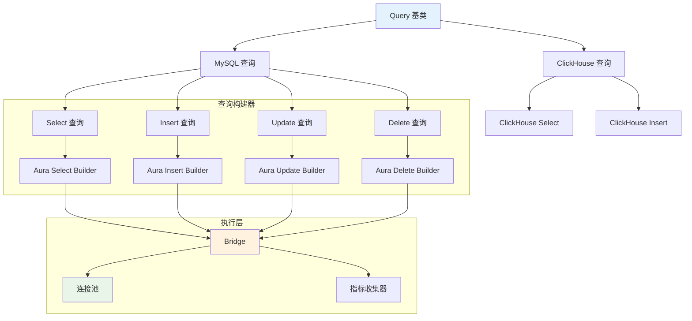

# 查询构建器

Hi Framework 提供了强大的查询构建器功能，基于 Aura SQL Query 库，支持链式调用、参数绑定和多种数据库驱动。查询构建器是构建安全、高效数据库查询的重要工具，特别适合复杂查询场景。

> **重要设计原则**：
> 1. **链式调用**：支持流畅的链式调用语法，提高代码可读性
> 2. **参数绑定**：自动参数绑定，防止 SQL 注入攻击
> 3. **多驱动支持**：支持 MySQL、ClickHouse 等不同数据库的特定语法
> 4. **读写分离**：自动根据操作类型选择主库或从库连接
> 5. **指标收集**：支持查询性能指标收集和监控

## 核心架构



## 基础使用

### 1. 依赖注入配置

查询构建器通过依赖注入自动配置：

```php
<?php

use Hi\Database\Query\MySQL;
use Hi\Database\Query\QueryInterface;

class UserService
{
    public function __construct(
        private readonly MySQL $query
    ) {}
    
    // 查询构建器会自动配置数据库管理器和指标收集器
}
```

### 2. 配置连接和表名

```php
<?php

use Hi\Database\Query\MySQL;

class UserQuery extends MySQL
{
    protected string $connection = 'default';           // 主库连接
    protected string $readonlyConnection = 'readonly';  // 只读连接
    protected string $table = 'users';                 // 默认表名
}
```

## MySQL 查询构建器

### 1. Select 查询

#### 基础查询

```php
use Hi\Database\Query\MySQL;

class UserRepository
{
    public function __construct(
        private readonly MySQL $query
    ) {}
    
    /**
     * 获取所有活跃用户
     */
    public function getActiveUsers(): array
    {
        return $this->query
            ->select(['id', 'name', 'email'], 'users', true) // true 表示只读
            ->where('status', 'active')
            ->orderBy(['created_at DESC'])
            ->fetchAll();
    }
    
    /**
     * 分页查询用户
     */
    public function getUsersWithPagination(int $page = 1, int $perPage = 20): array
    {
        $offset = ($page - 1) * $perPage;
        
        return $this->query
            ->select(['id', 'name', 'email', 'created_at'], 'users', true)
            ->where('status', 'active')
            ->orderBy(['created_at DESC'])
            ->limit($perPage)
            ->offset($offset)
            ->fetchAll();
    }
    
    /**
     * 复杂条件查询
     */
    public function searchUsers(array $criteria): array
    {
        $select = $this->query->select(['id', 'name', 'email', 'status'], 'users', true);
        
        if (isset($criteria['name'])) {
            $select->where('name LIKE ?', ['%' . $criteria['name'] . '%']);
        }
        
        if (isset($criteria['status'])) {
            $select->where('status', $criteria['status']);
        }
        
        if (isset($criteria['created_after'])) {
            $select->where('created_at >= ?', [$criteria['created_after']]);
        }
        
        if (isset($criteria['created_before'])) {
            $select->where('created_at <= ?', [$criteria['created_before']]);
        }
        
        return $select
            ->orderBy(['created_at DESC'])
            ->fetchAll();
    }
}
```

#### 高级查询特性

```php
use Hi\Database\Query\MySQL;

class AdvancedQueryExample
{
    public function __construct(
        private readonly MySQL $query
    ) {}
    
    /**
     * 使用 MySQL 特定功能
     */
    public function getUsersWithMySQLFeatures(): array
    {
        return $this->query
            ->select(['id', 'name', 'email'], 'users', true)
            ->calcFoundRows(true)        // 启用 SQL_CALC_FOUND_ROWS
            ->cache(true)                // 启用 SQL_CACHE
            ->highPriority(true)         // 启用 HIGH_PRIORITY
            ->where('status', 'active')
            ->orderBy(['created_at DESC'])
            ->fetchAll();
    }
    
    /**
     * 连接查询
     */
    public function getUsersWithProfiles(): array
    {
        return $this->query
            ->select([
                'u.id',
                'u.name',
                'u.email',
                'p.bio',
                'p.avatar'
            ], 'users', true)
            ->join('LEFT', 'user_profiles', 'p', 'u.id = p.user_id')
            ->where('u.status', 'active')
            ->orderBy(['u.created_at DESC'])
            ->fetchAll();
    }
    
    /**
     * 子查询
     */
    public function getUsersWithOrderCount(): array
    {
        $subQuery = $this->query
            ->select(['user_id', 'COUNT(*) as order_count'], 'orders')
            ->groupBy(['user_id']);
        
        return $this->query
            ->select([
                'u.id',
                'u.name',
                'u.email',
                'COALESCE(o.order_count, 0) as order_count'
            ], 'users', true)
            ->join('LEFT', $subQuery, 'o', 'u.id = o.user_id')
            ->where('u.status', 'active')
            ->orderBy(['o.order_count DESC'])
            ->fetchAll();
    }
}
```

### 2. Insert 查询

#### 基础插入

```php
use Hi\Database\Query\MySQL;

class UserCreator
{
    public function __construct(
        private readonly MySQL $query
    ) {}
    
    /**
     * 插入单个用户
     */
    public function createUser(array $userData): int
    {
        $insert = $this->query->insert('users');
        
        $insert->cols([
            'name',
            'email',
            'password_hash',
            'status',
            'created_at'
        ]);
        
        $insert->values([
            $userData['name'],
            $userData['email'],
            password_hash($userData['password'], PASSWORD_DEFAULT),
            'active',
            date('Y-m-d H:i:s')
        ]);
        
        return $insert->execute();
    }
    
    /**
     * 批量插入用户
     */
    public function createUsers(array $usersData): int
    {
        $insert = $this->query->insert('users');
        
        $insert->cols([
            'name',
            'email',
            'password_hash',
            'status',
            'created_at'
        ]);
        
        foreach ($usersData as $userData) {
            $insert->values([
                $userData['name'],
                $userData['email'],
                password_hash($userData['password'], PASSWORD_DEFAULT),
                'active',
                date('Y-m-d H:i:s')
            ]);
        }
        
        return $insert->execute();
    }
}
```

#### 高级插入特性

```php
use Hi\Database\Query\MySQL;

class AdvancedInsertExample
{
    public function __construct(
        private readonly MySQL $query
    ) {}
    
    /**
     * 使用 MySQL 特定功能
     */
    public function createUserWithMySQLFeatures(array $userData): int
    {
        $insert = $this->query->insert('users');
        
        $insert->cols([
            'name',
            'email',
            'password_hash',
            'created_at'
        ]);
        
        $insert->values([
            $userData['name'],
            $userData['email'],
            password_hash($userData['password'], PASSWORD_DEFAULT),
            date('Y-m-d H:i:s')
        ]);
        
        // MySQL 特定功能
        $insert->highPriority(true);     // 启用 HIGH_PRIORITY
        $insert->ignore(true);           // 启用 IGNORE
        $insert->delayed(true);          // 启用 DELAYED
        
        return $insert->execute();
    }
    
    /**
     * 使用 ON DUPLICATE KEY UPDATE
     */
    public function createOrUpdateUser(array $userData): int
    {
        $insert = $this->query->insert('users');
        
        $insert->cols([
            'name',
            'email',
            'password_hash',
            'updated_at'
        ]);
        
        $insert->values([
            $userData['name'],
            $userData['email'],
            password_hash($userData['password'], PASSWORD_DEFAULT),
            date('Y-m-d H:i:s')
        ]);
        
        // 当主键冲突时更新
        $insert->onDuplicateKeyUpdate('name', $userData['name']);
        $insert->onDuplicateKeyUpdate('password_hash', password_hash($userData['password'], PASSWORD_DEFAULT));
        $insert->onDuplicateKeyUpdate('updated_at', date('Y-m-d H:i:s'));
        
        return $insert->execute();
    }
}
```

### 3. Update 查询

```php
use Hi\Database\Query\MySQL;

class UserUpdater
{
    public function __construct(
        private readonly MySQL $query
    ) {}
    
    /**
     * 更新用户信息
     */
    public function updateUser(int $userId, array $updateData): int
    {
        $update = $this->query->update('users');
        
        $update->cols([
            'name' => $updateData['name'],
            'email' => $updateData['email'],
            'updated_at' => date('Y-m-d H:i:s')
        ]);
        
        $update->where('id', $userId);
        
        return $update->execute();
    }
    
    /**
     * 批量更新用户状态
     */
    public function updateUsersStatus(array $userIds, string $status): int
    {
        $update = $this->query->update('users');
        
        $update->cols([
            'status' => $status,
            'updated_at' => date('Y-m-d H:i:s')
        ]);
        
        $update->where('id IN ?', [$userIds]);
        
        return $update->execute();
    }
}
```

### 4. Delete 查询

```php
use Hi\Database\Query\MySQL;

class UserDeleter
{
    public function __construct(
        private readonly MySQL $query
    ) {}
    
    /**
     * 删除用户
     */
    public function deleteUser(int $userId): int
    {
        $delete = $this->query->delete('users');
        
        $delete->where('id', $userId);
        
        return $delete->execute();
    }
    
    /**
     * 批量删除非活跃用户
     */
    public function deleteInactiveUsers(): int
    {
        $delete = $this->query->delete('users');
        
        $delete->where('status', 'inactive');
        $delete->where('last_login_at < ?', [date('Y-m-d H:i:s', strtotime('-1 year'))]);
        
        return $delete->execute();
    }
}
```

## ClickHouse 查询构建器

### 1. ClickHouse 特定功能

```php
use Hi\Database\Query\ClickHouse;

class AnalyticsQuery
{
    public function __construct(
        private readonly ClickHouse $query
    ) {}
    
    /**
     * 分析查询
     */
    public function getUserAnalytics(string $startDate, string $endDate): array
    {
        return $this->query
            ->select([
                'toDate(created_at) as date',
                'COUNT(*) as user_count',
                'COUNT(DISTINCT user_id) as unique_users'
            ], 'user_events', true)
            ->where('created_at >= ?', [$startDate])
            ->where('created_at <= ?', [$endDate])
            ->groupBy(['date'])
            ->orderBy(['date ASC'])
            ->fetchAll();
    }
}
```

## 查询执行和结果处理

### 1. 执行查询

```php
use Hi\Database\Query\MySQL;

class QueryExecutor
{
    public function __construct(
        private readonly MySQL $query
    ) {}
    
    /**
     * 执行查询并获取结果
     */
    public function executeQuery(): array
    {
        $select = $this->query
            ->select(['id', 'name', 'email'], 'users', true)
            ->where('status', 'active');
        
        // 获取所有结果
        $allUsers = $select->fetchAll();
        
        // 获取单行结果
        $firstUser = $select->fetch();
        
        // 获取单个值
        $userCount = $select->fetchColumn();
        
        return [
            'all_users' => $allUsers,
            'first_user' => $firstUser,
            'user_count' => $userCount
        ];
    }
    
    /**
     * 分页查询
     */
    public function getPaginatedResults(int $page = 1, int $perPage = 20): array
    {
        $offset = ($page - 1) * $perPage;
        
        $select = $this->query
            ->select(['id', 'name', 'email'], 'users', true)
            ->where('status', 'active')
            ->orderBy(['created_at DESC'])
            ->limit($perPage)
            ->offset($offset);
        
        $users = $select->fetchAll();
        
        // 获取总记录数
        $totalCount = $this->query
            ->select(['COUNT(*)'], 'users', true)
            ->where('status', 'active')
            ->fetchColumn();
        
        return [
            'users' => $users,
            'total_count' => $totalCount,
            'current_page' => $page,
            'per_page' => $perPage,
            'total_pages' => ceil($totalCount / $perPage)
        ];
    }
}
```

### 2. 事务处理

```php
use Hi\Database\DatabaseProviderInterface;
use Hi\ConnectionPool\ConnectionInterface;

class TransactionExample
{
    public function __construct(
        private readonly DatabaseProviderInterface $databaseProvider
    ) {}
    
    /**
     * 事务处理示例
     */
    public function createUserWithProfile(array $userData, array $profileData): bool
    {
        $connection = $this->databaseProvider->getConnection('default');
        
        try {
            $connection->beginTransaction();
            
            // 创建用户
            $stmt = $connection->prepare('INSERT INTO users (name, email, created_at) VALUES (?, ?, ?)');
            $stmt->execute([
                $userData['name'],
                $userData['email'],
                date('Y-m-d H:i:s')
            ]);
            
            $userId = $connection->lastInsertId();
            
            // 创建用户资料
            $stmt = $connection->prepare('INSERT INTO user_profiles (user_id, bio, avatar) VALUES (?, ?, ?)');
            $stmt->execute([
                $userId,
                $profileData['bio'],
                $profileData['avatar']
            ]);
            
            $connection->commit();
            return true;
            
        } catch (\Exception $e) {
            $connection->rollBack();
            throw $e;
        } finally {
            $connection->release();
        }
    }
}
```

## 性能优化

### 1. 查询优化

```php
use Hi\Database\Query\MySQL;

class QueryOptimizer
{
    public function __construct(
        private readonly MySQL $query
    ) {}
    
    /**
     * 优化查询性能
     */
    public function getOptimizedQuery(): array
    {
        return $this->query
            ->select(['id', 'name', 'email'], 'users', true)
            ->where('status', 'active')
            ->where('created_at >= ?', [date('Y-m-d', strtotime('-30 days'))])
            ->orderBy(['created_at DESC'])
            ->limit(100)                    // 限制结果数量
            ->fetchAll();
    }
    
    /**
     * 使用索引优化查询
     */
    public function getIndexedQuery(): array
    {
        return $this->query
            ->select(['id', 'name', 'email'], 'users', true)
            ->where('status', 'active')     // 使用 status 索引
            ->where('created_at >= ?', [date('Y-m-d', strtotime('-7 days'))]) // 使用 created_at 索引
            ->orderBy(['created_at DESC'])  // 与 WHERE 条件匹配的排序
            ->fetchAll();
    }
}
```

### 2. 连接池优化

```php
use Hi\Database\DatabaseProviderInterface;

class ConnectionOptimizer
{
    public function __construct(
        private readonly DatabaseProviderInterface $databaseProvider
    ) {}
    
    /**
     * 批量操作优化
     */
    public function batchInsertUsers(array $usersData): int
    {
        $connection = $this->databaseProvider->getConnection('default');
        
        try {
            $connection->beginTransaction();
            
            $stmt = $connection->prepare('INSERT INTO users (name, email, created_at) VALUES (?, ?, ?)');
            
            foreach ($usersData as $userData) {
                $stmt->execute([
                    $userData['name'],
                    $userData['email'],
                    date('Y-m-d H:i:s')
                ]);
            }
            
            $connection->commit();
            return count($usersData);
            
        } catch (\Exception $e) {
            $connection->rollBack();
            throw $e;
        } finally {
            $connection->release();
        }
    }
}
```

## 数据库事务

实际使用示例

1. 基础使用

```php
// 使用默认隔离级别（READ COMMITTED）
$transactionManager->beginTransaction('user-update', TransactionType::Manual, 'default');

// 使用指定隔离级别
$transactionManager->beginTransactionWithIsolation(
    'financial-calc',
    TransactionType::Manual,
    'default',
    TransactionIsolation::RepeatableRead
);

```

2. 业务场景示例

```php
// 场景1：财务计算 - 需要可重复读
class FinancialService 
{
    public function calculateUserBalance(int $userId): float
    {
        return $this->transactionManager->transaction(function() use ($userId) {
            // 设置可重复读，确保计算过程中数据一致
            $this->transactionManager->beginTransactionWithIsolation(
                'balance-calc',
                TransactionType::Closure,
                'financial_db',
                TransactionIsolation::RepeatableRead
            );

            $transactions = $this->getTransactionHistory($userId);
            $deposits = $this->getDeposits($userId);
            $withdrawals = $this->getWithdrawals($userId);

            // 多次查询保证数据一致
            return $this->calculateBalance($transactions, $deposits, $withdrawals);
        });
    }
}

// 场景2：报表生成 - 可以使用读未提交提高性能
class ReportService
{
    public function generateDailyReport(): array
    {
        return $this->transactionManager->transaction(function() {
            // 报表对实时性要求不高，可以读取未提交数据提高性能
            $this->transactionManager->beginTransactionWithIsolation(
                'daily-report',
                TransactionType::Closure,
                'analytics_db',
                TransactionIsolation::ReadUncommitted
            );

            return [
                'users' => $this->getUserStats(),
                'orders' => $this->getOrderStats(),
                'revenue' => $this->getRevenueStats(),
            ];
        });
    }
}

// 场景3：银行转账 - 需要串行化
class BankTransferService
{
    public function transfer(int $fromAccount, int $toAccount, float $amount): void
    {
        $this->transactionManager->transaction(function() use ($fromAccount, $toAccount, $amount) {
            // 银行转账需要最高的一致性保证
            $this->transactionManager->beginTransactionWithIsolation(
                'bank-transfer',
                TransactionType::Closure,
                'banking_db',
                TransactionIsolation::Serializable
            );

            $this->debitAccount($fromAccount, $amount);
            $this->creditAccount($toAccount, $amount);
            $this->recordTransfer($fromAccount, $toAccount, $amount);
        });
    }
}
```

性能考虑

隔离级别性能对比（从高到低）

1. READ UNCOMMITTED - 最高性能，最低一致性
2. READ COMMITTED - 平衡性能和一致性
3. REPEATABLE READ - 较低性能，较高一致性
4. SERIALIZABLE - 最低性能，最高一致性

## 总结

Hi Framework 的查询构建器提供了强大而灵活的数据库查询功能：

1. **链式调用**：支持流畅的链式调用语法，提高代码可读性
2. **参数绑定**：自动参数绑定，防止 SQL 注入攻击
3. **多驱动支持**：支持 MySQL 和 ClickHouse 等不同数据库的特定语法
4. **读写分离**：自动根据操作类型选择主库或从库连接
5. **高级特性**：支持连接查询、子查询、事务处理等高级功能
6. **性能优化**：提供查询优化和连接池优化建议
7. **指标收集**：支持查询性能指标收集和监控

通过合理使用这些功能，可以构建安全、高效、可维护的数据库查询代码，特别适合复杂查询场景和高并发应用。
