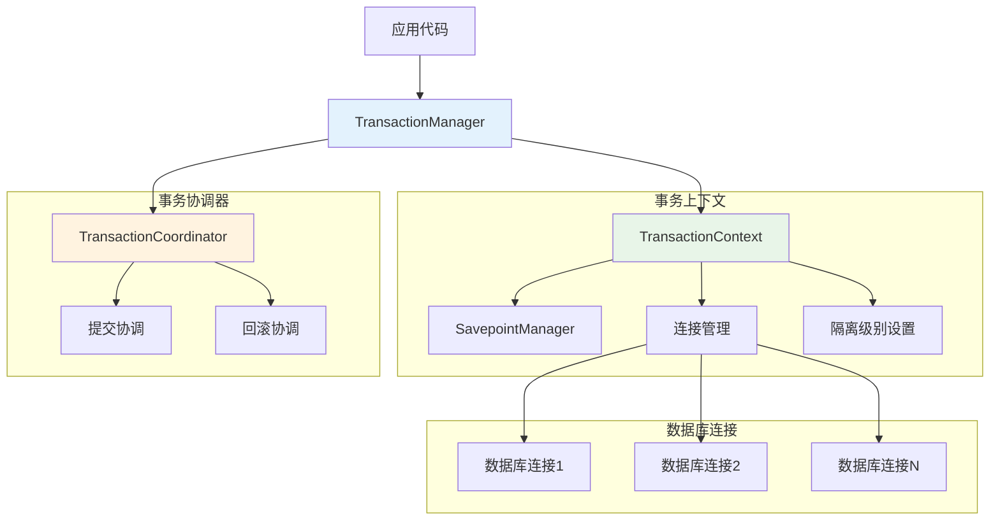

# 事务管理

Hi Framework 提供了基于协程上下文的事务管理系统，支持嵌套事务（Savepoint）、多种隔离级别和分布式事务协调。事务管理器通过 `TransactionManagerInterface` 接口提供统一的事务管理功能。

> **重要设计原则**：
> 1. **协程安全**：基于协程上下文管理，每个协程独立的事务环境
> 2. **嵌套事务支持**：通过 Savepoint 机制自动处理嵌套事务，对业务代码透明
> 3. **分布式事务**：支持跨多个数据库连接的事务协调
> 4. **多种隔离级别**：支持 4 种 SQL 标准隔离级别
> 5. **自动协调**：事务协调器处理提交、回滚和连接清理
> 6. **灵活事务类型**：支持手动事务、闭包事务和注解事务三种类型

## 核心架构



## TransactionManagerInterface 接口

### 核心方法

```php
<?php

interface TransactionManagerInterface
{
    /**
     * 激活事务上下文
     */
    public function activate(string $transactionName, TransactionTypeEnum $transactionType): TransactionContextInterface;

    /**
     * 获取数据库连接（事务感知）
     */
    public function getConnection(string $connectionName): PDOConnection;

    /**
     * 开始事务
     */
    public function beginTransaction(string $transactionName, TransactionTypeEnum $transactionType, string $connectionName): void;

    /**
     * 开始事务并设置隔离级别
     */
    public function beginTransactionWithIsolation(
        string $transactionName,
        TransactionTypeEnum $transactionType,
        string $connectionName,
        TransactionIsolationEnum $isolation,
    ): void;

    /**
     * 提交指定连接的事务
     */
    public function commit(string $connectionName): void;

    /**
     * 回滚指定连接的事务
     */
    public function rollback(string $connectionName): void;

    /**
     * 提交所有连接的事务
     */
    public function commitAll(): void;

    /**
     * 回滚所有连接的事务
     */
    public function rollbackAll(): void;
}
```

## 基础使用

### 1. 依赖注入配置

事务管理器通过依赖注入自动配置（绝大部份情况下**不推荐**使用这种方式，这是偏低层的用法，常用于需要事务自定义的场景，**更推荐**使用框架提供的其他事务管理方式，让框架接管事务管理）：

```php
<?php

use Hi\Database\Transaction\TransactionManagerInterface;

class UserService
{
    public function __construct(
        private readonly TransactionManagerInterface $transactionManager
    ) {}

    // 事务管理器会自动注入协程接口、数据库提供者、日志记录器等依赖
}
```

### 2. 手动事务管理

#### 方式一：通过 MySQL 查询类的便捷方法

```php
<?php

namespace App\Application\Service;

use App\Infrastructure\Repository\MySQL\UserMySQL;

class UserService
{
    public function __construct(
        private readonly UserMySQL $userMySQL
    ) {}

    /**
     * 手动事务管理示例
     * 事务作用在特定连接级别，不同的连接事务独立，互不干扰
     * 例如 A 开启事务，B 未开启事务，A 的提交或者回滚不会影响 B
     */
    public function createUserAndUpdate(array $userData): int
    {
        // 手动开启事务
        $this->userMySQL->beginTransaction();

        try {
            $userId = $this->userMySQL->createUser($userData);
            $this->userMySQL->updateUser(['id' => $userId, 'name' => 'updated']);
            $this->userMySQL->commit();
            return $userId;
        } catch (\Exception $e) {
            $this->userMySQL->rollback();
            throw $e;
        }
    }
}
```

#### 方式二：直接通过 TransactionManager

```php
<?php

use Hi\Database\Transaction\TransactionManagerInterface;
use Hi\Database\Transaction\TransactionTypeEnum;

class UserRepository
{
    public function __construct(
        private readonly TransactionManagerInterface $transactionManager
    ) {}

    /**
     * 创建用户及其资料
     */
    public function createUserWithProfile(array $userData, array $profileData): int
    {
        $connectionName = 'default';

        // 开始事务
        $this->transactionManager->beginTransaction(
            'create-user-profile',
            TransactionTypeEnum::Manual,
            $connectionName
        );

        try {
            // 获取事务中的数据库连接
            $connection = $this->transactionManager->getConnection($connectionName);

            // 创建用户
            $stmt = $connection->prepare('INSERT INTO users (name, email, created_at) VALUES (?, ?, ?)');
            $stmt->execute([
                $userData['name'],
                $userData['email'],
                date('Y-m-d H:i:s')
            ]);

            $userId = (int) $connection->lastInsertId();

            // 创建用户资料
            $stmt = $connection->prepare('INSERT INTO user_profiles (user_id, bio, avatar) VALUES (?, ?, ?)');
            $stmt->execute([
                $userId,
                $profileData['bio'],
                $profileData['avatar']
            ]);

            // 提交事务
            $this->transactionManager->commit($connectionName);

            return $userId;

        } catch (\Exception $e) {
            // 回滚事务
            $this->transactionManager->rollback($connectionName);
            throw $e;
        }
    }
}
```

### 3. 闭包事务管理

框架提供了闭包事务的便捷方法，自动处理事务的开始、提交和回滚：

```php
<?php

namespace App\Application\Service;

use App\Infrastructure\Repository\MySQL\UserMySQL;

class UserService
{
    public function __construct(
        private readonly UserMySQL $userMySQL
    ) {}

    /**
     * 闭包事务示例
     * 该方法内所有数据库操作包括整个调用的链路都将在事务中
     * 如果该方法内抛出异常，则事务会自动回滚
     * 如果该方法内没有抛出异常，则事务会自动提交
     */
    public function incrementUserCredit(int $userId, int $credit): void
    {
        $this->userMySQL->transaction('increment_user_credit', function () use ($userId, $credit) {
            $this->userMySQL->updateUser(['id' => $userId, 'credit' => $credit]);

            // 可以在闭包中进行多个数据库操作
            // 所有操作都在同一个事务中
            // 如果任何操作失败，整个事务将回滚
        });
    }
}
```

### 4. MySQL 查询类的事务方法

框架在 `Hi\Database\Query\MySQL` 类中提供了完整的事务方法：

#### 闭包事务方法

```php
<?php

/**
 * 执行闭包事务
 */
public function transaction(string $name, callable $callback): mixed
{
    $this->transactionManager->activate(
        transactionName: $name,
        transactionType: TransactionTypeEnum::Closure,
    );

    $success = false;

    try {
        // 执行回调函数
        $result = $callback();
        $success = true;
        return $result;
    } catch (\Throwable $e) {
        throw $e;
    } finally {
        if ($success) {
            $this->transactionManager->commitAll();
        } else {
            $this->transactionManager->rollbackAll();
        }
    }
}
```

#### 手动事务方法

```php
<?php

/**
 * 开始事务
 */
public function beginTransaction(): void
{
    // 在上下文标记事务状态为活动状态
    $this->transactionManager->beginTransaction(
        transactionName: sprintf('%s-default', $this->connection),
        transactionType: TransactionTypeEnum::Manual,
        connectionName: $this->connection,
    );
}

/**
 * 提交事务
 */
public function commit(): void
{
    $this->transactionManager->commit($this->connection);
}

/**
 * 回滚事务
 */
public function rollback(): void
{
    $this->transactionManager->rollback($this->connection);
}
```

这些方法使得在查询类中可以直接进行事务操作，而无需直接操作 TransactionManager。

### 5. 注解事务管理

框架提供了 `#[Transaction]` 注解，可以在方法级别声明事务，框架会自动生成代理类来处理事务逻辑：

#### Transaction 注解定义

```php
<?php

namespace Hi\Attributes\Database;

/**
 * Transaction 属性
 *
 * 用于声明式事务管理的属性标记
 * 可以应用在方法上，让方法自动在事务中执行
 */
#[\Attribute(\Attribute::TARGET_METHOD)]
final class Transaction
{
    public function __construct(
        public readonly string $name,
        public readonly bool $enable = true,
    ) {
    }
}
```

#### 使用注解事务

```php
<?php

namespace App\Application\Service;

use Hi\Attributes\Database\Transaction;

class OrderService
{
    /**
     * 注解事务示例
     * 该方法内所有数据库操作包括整个调用的链路都将在事务中
     * 如果该方法内抛出异常，则事务会自动回滚
     * 如果该方法内没有抛出异常，则事务会自动提交
     */
    #[Transaction('create_order')]
    public function createOrder(array $orderData): void
    {
        // 所有数据库操作自动在事务中执行
        // 无需手动调用 beginTransaction/commit/rollback

        // 业务逻辑代码...
    }

    /**
     * 禁用事务的方法
     */
    #[Transaction('disabled_transaction', enable: false)]
    public function nonTransactionalMethod(): void
    {
        // 此方法不会在事务中执行
    }
}
```

#### 注解事务的工作原理

框架会为带有 `#[Transaction]` 注解的类自动生成代理类，代理类实现了以下逻辑：

```php
<?php

// 框架自动生成的代理方法（简化版本）
public function createOrder($orderData): void
{
    $args = func_get_args();
    $transactionManager = construct(\Hi\Database\Transaction\TransactionManagerInterface::class);
    $transactionName = 'create_order';

    // 激活事务上下文
    $transactionContext = $transactionManager->activate(
        $transactionName,
        \Hi\Database\Transaction\TransactionTypeEnum::Attribute
    );

    $done = false;

    try {
        $result = parent::createOrder(...$args);
        $done = true;
        return $result;
    } finally {
        if ($done) {
            $transactionManager->commitAll();
        } else {
            $transactionManager->rollbackAll();
        }
    }
}
```

#### 注解事务的配置

注解事务在框架启动时通过 `AutowireBindLoader` 自动处理：

```php
<?php

// 在 AutowireBindLoader 中的处理逻辑
foreach ($this->getMethodCarriers(Transaction::class) as $classMethods) {
    foreach ($classMethods as $methodAttributeCarriers) {
        // 过滤启用的事务注解
        $enabledCarriers = array_filter(
            $methodAttributeCarriers,
            static fn ($carrier) => $carrier->attribute->enable
        );

        if (count($enabledCarriers) > 0) {
            $proxyClass = $this->createTransactionProxy($enabledCarriers);
            $className = $methodAttributeCarriers[0]->reflection->getDeclaringClass()->getName();
            $container->bindSingleton($className, $proxyClass);
        }
    }
}
```

### 6. 完整的 Repository 示例

基于真实的框架使用模式，创建继承自 MySQL 查询类的 Repository：

```php
<?php

namespace App\Infrastructure\Repository\MySQL;

use Hi\Database\Query\MySQL;

class UserMySQL extends MySQL
{
    protected string $connection = 'default';
    protected string $table = 'users';

    public function createUser(array $userData): int
    {
        return $this->insert()->cols($userData)->lastId();
    }

    public function updateUser(array $userData): int
    {
        return $this->update()->cols($userData)->where('id = :id', ['id' => $userData['id']])->rowCount();
    }

    public function getUserById(int $id): ?array
    {
        return $this->select(['*'], '', true)
            ->where('id = :id', ['id' => $id])
            ->fetch();
    }
}
```

#### 在服务层中使用事务

```php
<?php

namespace App\Application\Service;

use App\Infrastructure\Repository\MySQL\UserMySQL;

class UserService
{
    public function __construct(
        private readonly UserMySQL $userMySQL
    ) {}

    /**
     * 批量更新用户信息（手动事务）
     */
    public function batchUpdateUsers(array $users): void
    {
        $this->userMySQL->beginTransaction();

        try {
            foreach ($users as $userData) {
                $this->userMySQL->updateUser($userData);
            }
            $this->userMySQL->commit();
        } catch (\Exception $e) {
            $this->userMySQL->rollback();
            throw $e;
        }
    }

    /**
     * 创建用户并设置初始积分（闭包事务）
     */
    public function createUserWithCredit(array $userData, int $initialCredit): int
    {
        return $this->userMySQL->transaction('create_user_with_credit', function () use ($userData, $initialCredit) {
            $userId = $this->userMySQL->createUser($userData);
            $this->userMySQL->updateUser(['id' => $userId, 'credit' => $initialCredit]);
            return $userId;
        });
    }
}
```

## 事务隔离级别

### 1. 隔离级别类型

Hi Framework 支持 4 种 SQL 标准隔离级别：

```php
<?php

use Hi\Database\Transaction\TransactionIsolationEnum;

// 四种标准隔离级别
enum TransactionIsolationEnum: string
{
    case ReadUncommitted = 'READ UNCOMMITTED';  // 读未提交
    case ReadCommitted = 'READ COMMITTED';      // 读已提交
    case RepeatableRead = 'REPEATABLE READ';    // 可重复读
    case Serializable = 'SERIALIZABLE';         // 串行化
}
```

### 2. 使用指定隔离级别

```php
<?php

use Hi\Database\Transaction\TransactionManagerInterface;
use Hi\Database\Transaction\TransactionTypeEnum;
use Hi\Database\Transaction\TransactionIsolationEnum;

class FinancialService
{
    public function __construct(
        private readonly TransactionManagerInterface $transactionManager
    ) {}

    /**
     * 财务计算 - 需要可重复读保证数据一致性
     */
    public function calculateUserBalance(int $userId): float
    {
        $connectionName = 'financial_db';

        // 使用可重复读隔离级别
        $this->transactionManager->beginTransactionWithIsolation(
            'balance-calculation',
            TransactionTypeEnum::Manual,
            $connectionName,
            TransactionIsolationEnum::RepeatableRead
        );

        try {
            $connection = $this->transactionManager->getConnection($connectionName);

            // 多次查询确保数据一致性
            $transactions = $this->getTransactionHistory($connection, $userId);
            $deposits = $this->getDeposits($connection, $userId);
            $withdrawals = $this->getWithdrawals($connection, $userId);

            $balance = $this->calculateBalance($transactions, $deposits, $withdrawals);

            $this->transactionManager->commit($connectionName);

            return $balance;

        } catch (\Exception $e) {
            $this->transactionManager->rollback($connectionName);
            throw $e;
        }
    }

    /**
     * 银行转账 - 需要串行化防止并发问题
     */
    public function transfer(int $fromAccount, int $toAccount, float $amount): void
    {
        $connectionName = 'banking_db';

        // 使用串行化隔离级别
        $this->transactionManager->beginTransactionWithIsolation(
            'bank-transfer',
            TransactionTypeEnum::Manual,
            $connectionName,
            TransactionIsolationEnum::Serializable
        );

        try {
            $connection = $this->transactionManager->getConnection($connectionName);

            // 检查余额
            $stmt = $connection->prepare('SELECT balance FROM accounts WHERE id = ? FOR UPDATE');
            $stmt->execute([$fromAccount]);
            $fromBalance = $stmt->fetchColumn();

            if ($fromBalance < $amount) {
                throw new \RuntimeException('余额不足');
            }

            // 扣款
            $stmt = $connection->prepare('UPDATE accounts SET balance = balance - ? WHERE id = ?');
            $stmt->execute([$amount, $fromAccount]);

            // 入账
            $stmt = $connection->prepare('UPDATE accounts SET balance = balance + ? WHERE id = ?');
            $stmt->execute([$amount, $toAccount]);

            // 记录转账日志
            $stmt = $connection->prepare('INSERT INTO transfer_logs (from_account, to_account, amount, created_at) VALUES (?, ?, ?, ?)');
            $stmt->execute([$fromAccount, $toAccount, $amount, date('Y-m-d H:i:s')]);

            $this->transactionManager->commit($connectionName);

        } catch (\Exception $e) {
            $this->transactionManager->rollback($connectionName);
            throw $e;
        }
    }
}
```

### 3. 隔离级别详细功能

框架为每种隔离级别提供了详细的方法：

```php
<?php

use Hi\Database\Transaction\TransactionIsolationEnum;
use Hi\Database\Connection\DriverEnum;

// 获取隔离级别描述
$level = TransactionIsolationEnum::RepeatableRead;
echo $level->getDescription();
// 输出：保证同一事务内重复读取结果一致，避免不可重复读

// 检查并发问题
$issues = $level->getConcurrencyIssues();
// 返回：['phantom_read'] （可能出现幻读）

// 获取性能等级（1-4，数字越小性能越高）
$performance = $level->getPerformanceLevel(); // 3

// 获取推荐场景
$scenarios = $level->getRecommendedScenarios();
// 返回：['financial_calculation', 'inventory_update', 'audit_operations']

// 获取数据库默认隔离级别
$mysqlDefault = TransactionIsolationEnum::getDatabaseDefault(DriverEnum::MySQL);
// 返回：RepeatableRead

$postgresDefault = TransactionIsolationEnum::getDatabaseDefault(DriverEnum::PostgreSQL);
// 返回：ReadCommitted

// 获取不同数据库的 SQL 语句
$mysqlSQL = $level->getMySQLStatement();
// 返回：SET TRANSACTION ISOLATION LEVEL REPEATABLE READ

$postgresSQL = $level->getPostgreSQLStatement();
// 返回：SET TRANSACTION ISOLATION LEVEL REPEATABLE READ
```

### 4. 隔离级别对比表

| 隔离级别 | 脏读 | 不可重复读 | 幻读 | 性能等级 | 适用场景 |
|---------|------|----------|------|---------|---------|
| **READ UNCOMMITTED** | 可能 | 可能 | 可能 | 1（最高） | 报表生成、数据分析 |
| **READ COMMITTED** | 避免 | 可能 | 可能 | 2 | 一般业务操作 |
| **REPEATABLE READ** | 避免 | 避免 | 可能 | 3 | 财务计算、统计分析 |
| **SERIALIZABLE** | 避免 | 避免 | 避免 | 4（最低） | 银行转账、关键业务 |

## 嵌套事务（Savepoint）

### 1. 自动嵌套事务

框架自动处理嵌套事务，当在同一连接上多次调用 `beginTransaction` 时，框架会自动创建 Savepoint：

```php
<?php

use Hi\Database\Transaction\TransactionManagerInterface;
use Hi\Database\Transaction\TransactionTypeEnum;

class OrderProcessingService
{
    public function __construct(
        private readonly TransactionManagerInterface $transactionManager
    ) {}

    /**
     * 处理订单 - 展示嵌套事务的典型场景
     */
    public function processOrder(array $orderData, array $items): int
    {
        $connectionName = 'default';

        // 第一层事务：主订单事务
        $this->transactionManager->beginTransaction(
            'process-order',
            TransactionTypeEnum::Manual,
            $connectionName
        );

        try {
            $connection = $this->transactionManager->getConnection($connectionName);

            // 创建订单记录
            $stmt = $connection->prepare('INSERT INTO orders (user_id, total_amount, status) VALUES (?, ?, ?)');
            $stmt->execute([$orderData['user_id'], $orderData['total_amount'], 'processing']);
            $orderId = (int) $connection->lastInsertId();

            // 处理订单项目 - 这里会创建嵌套事务
            $this->processOrderItems($orderId, $items, $connectionName);

            // 更新库存 - 这里也会创建嵌套事务
            $this->updateInventory($items, $connectionName);

            // 提交主事务
            $this->transactionManager->commit($connectionName);

            return $orderId;

        } catch (\Exception $e) {
            // 回滚主事务（自动回滚所有嵌套事务）
            $this->transactionManager->rollback($connectionName);
            throw $e;
        }
    }

    /**
     * 处理订单项目 - 嵌套事务示例
     */
    private function processOrderItems(int $orderId, array $items, string $connectionName): void
    {
        // 第二层事务：在现有事务基础上创建 Savepoint
        // 框架检测到连接已有活跃事务，自动创建 sp_default_level_1
        $this->transactionManager->beginTransaction(
            'process-order-items',
            TransactionTypeEnum::Manual,
            $connectionName
        );

        try {
            $connection = $this->transactionManager->getConnection($connectionName);

            foreach ($items as $item) {
                // 处理每个商品项目 - 这里会创建更深层的嵌套事务
                $this->processItemWithValidation($orderId, $item, $connectionName);
            }

            // 提交订单项目事务（释放 sp_default_level_1）
            $this->transactionManager->commit($connectionName);

        } catch (\Exception $e) {
            // 回滚到 sp_default_level_1，不影响主事务的其他操作
            $this->transactionManager->rollback($connectionName);
            throw $e;
        }
    }

    /**
     * 处理单个商品项目并验证 - 更深层嵌套事务
     */
    private function processItemWithValidation(int $orderId, array $item, string $connectionName): void
    {
        // 第三层事务：创建 sp_default_level_2
        $this->transactionManager->beginTransaction(
            'process-single-item',
            TransactionTypeEnum::Manual,
            $connectionName
        );

        try {
            $connection = $this->transactionManager->getConnection($connectionName);

            // 验证商品是否存在且价格正确
            $stmt = $connection->prepare('SELECT price, stock FROM products WHERE id = ? FOR UPDATE');
            $stmt->execute([$item['product_id']]);
            $product = $stmt->fetch();

            if (!$product) {
                throw new \RuntimeException("商品不存在: {$item['product_id']}");
            }

            if ($product['price'] != $item['price']) {
                throw new \RuntimeException("商品价格已变更: {$item['product_id']}");
            }

            if ($product['stock'] < $item['quantity']) {
                throw new \RuntimeException("库存不足: {$item['product_id']}");
            }

            // 创建订单项目
            $stmt = $connection->prepare('INSERT INTO order_items (order_id, product_id, quantity, price) VALUES (?, ?, ?, ?)');
            $stmt->execute([$orderId, $item['product_id'], $item['quantity'], $item['price']]);

            // 提交单个商品项目事务（释放 sp_default_level_2）
            $this->transactionManager->commit($connectionName);

        } catch (\Exception $e) {
            // 回滚到 sp_default_level_2，只影响当前商品项目
            $this->transactionManager->rollback($connectionName);
            throw $e;
        }
    }

    /**
     * 更新库存 - 另一个嵌套事务示例
     */
    private function updateInventory(array $items, string $connectionName): void
    {
        // 第二层事务：创建另一个 sp_default_level_1（前一个已释放）
        $this->transactionManager->beginTransaction(
            'update-inventory',
            TransactionTypeEnum::Manual,
            $connectionName
        );

        try {
            $connection = $this->transactionManager->getConnection($connectionName);

            foreach ($items as $item) {
                $stmt = $connection->prepare('UPDATE products SET stock = stock - ? WHERE id = ?');
                $stmt->execute([$item['quantity'], $item['product_id']]);

                if ($stmt->rowCount() === 0) {
                    throw new \RuntimeException("更新库存失败: {$item['product_id']}");
                }
            }

            // 提交库存更新事务
            $this->transactionManager->commit($connectionName);

        } catch (\Exception $e) {
            // 回滚库存更新，不影响已完成的订单项目处理
            $this->transactionManager->rollback($connectionName);
            throw $e;
        }
    }
}
```

### 2. Savepoint 命名规则

框架自动生成 Savepoint 名称，遵循以下规则：

```
sp_{连接名}_level_{嵌套层级}

例如：
- sp_default_level_1      // 第一层嵌套
- sp_default_level_2      // 第二层嵌套
- sp_analytics_level_1    // analytics 连接的第一层嵌套
```

## 分布式事务

### 1. 跨连接事务

支持跨多个数据库连接的分布式事务：

```php
<?php

use Hi\Database\Transaction\TransactionManagerInterface;
use Hi\Database\Transaction\TransactionTypeEnum;

class EcommerceService
{
    public function __construct(
        private readonly TransactionManagerInterface $transactionManager
    ) {}

    /**
     * 下单处理 - 涉及订单库和库存库
     */
    public function placeOrder(array $orderData, array $items): int
    {
        $orderConnectionName = 'orders_db';
        $inventoryConnectionName = 'inventory_db';

        // 同时开始多个连接的事务
        $this->transactionManager->beginTransaction('place-order', TransactionTypeEnum::Manual, $orderConnectionName);
        $this->transactionManager->beginTransaction('place-order', TransactionTypeEnum::Manual, $inventoryConnectionName);

        try {
            // 在订单库创建订单
            $orderConnection = $this->transactionManager->getConnection($orderConnectionName);
            $stmt = $orderConnection->prepare('INSERT INTO orders (user_id, total_amount, created_at) VALUES (?, ?, ?)');
            $stmt->execute([
                $orderData['user_id'],
                $orderData['total_amount'],
                date('Y-m-d H:i:s')
            ]);

            $orderId = (int) $orderConnection->lastInsertId();

            // 在库存库扣减库存
            $inventoryConnection = $this->transactionManager->getConnection($inventoryConnectionName);
            foreach ($items as $item) {
                $stmt = $inventoryConnection->prepare('UPDATE products SET stock = stock - ? WHERE id = ? AND stock >= ?');
                $stmt->execute([
                    $item['quantity'],
                    $item['product_id'],
                    $item['quantity']
                ]);

                if ($stmt->rowCount() === 0) {
                    throw new \RuntimeException("库存不足，产品 ID: {$item['product_id']}");
                }

                // 在订单库记录订单项目
                $stmt = $orderConnection->prepare('INSERT INTO order_items (order_id, product_id, quantity, price) VALUES (?, ?, ?, ?)');
                $stmt->execute([
                    $orderId,
                    $item['product_id'],
                    $item['quantity'],
                    $item['price']
                ]);
            }

            // 提交所有连接的事务
            $this->transactionManager->commitAll();

            return $orderId;

        } catch (\Exception $e) {
            // 回滚所有连接的事务
            $this->transactionManager->rollbackAll();
            throw $e;
        }
    }
}
```

### 2. 单连接提交和回滚

也可以单独提交或回滚某个连接的事务：

```php
<?php

class PaymentService
{
    public function __construct(
        private readonly TransactionManagerInterface $transactionManager
    ) {}

    /**
     * 支付处理 - 分步提交
     */
    public function processPayment(array $paymentData): void
    {
        $paymentConnectionName = 'payment_db';
        $orderConnectionName = 'order_db';

        // 开始支付事务
        $this->transactionManager->beginTransaction('payment', TransactionTypeEnum::Manual, $paymentConnectionName);

        // 开始订单事务
        $this->transactionManager->beginTransaction('order-update', TransactionTypeEnum::Manual, $orderConnectionName);

        try {
            // 处理支付
            $paymentConnection = $this->transactionManager->getConnection($paymentConnectionName);
            $stmt = $paymentConnection->prepare('INSERT INTO payments (order_id, amount, status) VALUES (?, ?, ?)');
            $stmt->execute([$paymentData['order_id'], $paymentData['amount'], 'processing']);

            // 先提交支付记录
            $this->transactionManager->commit($paymentConnectionName);

            // 更新订单状态
            $orderConnection = $this->transactionManager->getConnection($orderConnectionName);
            $stmt = $orderConnection->prepare('UPDATE orders SET status = ? WHERE id = ?');
            $stmt->execute(['paid', $paymentData['order_id']]);

            // 提交订单更新
            $this->transactionManager->commit($orderConnectionName);

        } catch (\Exception $e) {
            // 如果支付已提交，只回滚订单事务
            $this->transactionManager->rollback($orderConnectionName);

            // 如果支付未提交，回滚支付事务
            // 注意：需要根据实际业务逻辑判断
            throw $e;
        }
    }
}
```

## 事务上下文管理

### 1. TransactionContextInterface

事务上下文接口提供了事务状态和连接管理功能：

```php
<?php

interface TransactionContextInterface
{
    // 基本信息
    public function getName(): string;
    public function getType(): TransactionTypeEnum;
    public function getState(): TransactionStateEnum;
    public function getStartTime(): float;

    // 连接管理
    public function markConnectionAsActive(string $connectionPoolName): void;
    public function isConnectionActive(string $connectionPoolName): bool;
    public function addConnection(string $connectionPoolName, PDOConnection $connection): void;
    public function getConnection(string $connectionPoolName): ?PDOConnection;
    public function getAllConnections(): array;
    public function removeConnection(string $connectionPoolName): void;

    // 隔离级别
    public function setConnectionIsolation(string $connectionPoolName, TransactionIsolationEnum $isolationLevel): void;
    public function getConnectionIsolation(string $connectionPoolName): ?TransactionIsolationEnum;

    // Savepoint 管理
    public function getSavepointManager(): TransactionSavepoint;
}
```

### 2. 事务状态

事务具有以下状态：

```php
<?php

use Hi\Database\Transaction\TransactionStateEnum;

enum TransactionStateEnum: string
{
    case Active = 'active';       // 活跃状态
    case Committed = 'committed'; // 已提交
    case RolledBack = 'rolled_back'; // 已回滚
}
```

## 最佳实践

### 1. 事务设计原则

```php
<?php

// ✅ 好的实践
class GoodTransactionExample
{
    /**
     * 1. 事务范围尽可能小
     * 2. 避免在事务中进行长时间操作
     * 3. 明确的错误处理
     */
    public function goodExample(): void
    {
        $connectionName = 'default';

        $this->transactionManager->beginTransaction('short-transaction', TransactionTypeEnum::Manual, $connectionName);

        try {
            // 只包含必要的数据库操作
            $this->createOrder();
            $this->updateInventory();

            $this->transactionManager->commit($connectionName);

            // 耗时操作放在事务外
            $this->sendEmailNotification();

        } catch (\Exception $e) {
            $this->transactionManager->rollback($connectionName);
            throw $e;
        }
    }
}

// ❌ 不好的实践
class BadTransactionExample
{
    /**
     * 1. 事务范围过大
     * 2. 包含耗时操作
     * 3. 异常处理不当
     */
    public function badExample(): void
    {
        $this->transactionManager->beginTransaction('long-transaction', TransactionTypeEnum::Manual, 'default');

        try {
            $this->createOrder();
            $this->updateInventory();

            // ❌ 在事务中进行耗时操作
            $this->sendEmailNotification();
            $this->generatePDFReport();
            $this->uploadToCloudStorage();

            $this->transactionManager->commit('default');

        } catch (\Exception $e) {
            // ❌ 没有回滚事务
            throw $e;
        }
    }
}
```

### 2. 隔离级别选择指南

```php
<?php

class IsolationLevelGuide
{
    /**
     * 根据业务场景选择合适的隔离级别
     */

    // 1. 读未提交 - 报表和分析
    public function generateAnalyticsReport()
    {
        $this->transactionManager->beginTransactionWithIsolation(
            'analytics',
            TransactionTypeEnum::Manual,
            'analytics_db',
            TransactionIsolationEnum::ReadUncommitted  // 性能优先
        );
    }

    // 2. 读已提交 - 一般业务操作（默认）
    public function normalBusinessOperation()
    {
        $this->transactionManager->beginTransaction(
            'normal-operation',
            TransactionTypeEnum::Manual,
            'default'
            // 使用数据库默认隔离级别（通常是 READ COMMITTED）
        );
    }

    // 3. 可重复读 - 财务计算
    public function financialCalculation()
    {
        $this->transactionManager->beginTransactionWithIsolation(
            'financial',
            TransactionTypeEnum::Manual,
            'financial_db',
            TransactionIsolationEnum::RepeatableRead  // 确保计算过程中数据一致
        );
    }

    // 4. 串行化 - 关键业务
    public function criticalBusinessOperation()
    {
        $this->transactionManager->beginTransactionWithIsolation(
            'critical',
            TransactionTypeEnum::Manual,
            'critical_db',
            TransactionIsolationEnum::Serializable  // 最高一致性保证
        );
    }
}
```

### 3. 死锁预防

```php
<?php

class DeadlockPreventionService
{
    /**
     * 按照固定顺序获取锁，预防死锁
     */
    public function transferBetweenAccounts(int $account1, int $account2, float $amount): void
    {
        // 始终按照账户 ID 的顺序获取锁，预防死锁
        $firstAccount = min($account1, $account2);
        $secondAccount = max($account1, $account2);

        $this->transactionManager->beginTransactionWithIsolation(
            'transfer-ordered',
            TransactionTypeEnum::Manual,
            'banking_db',
            TransactionIsolationEnum::RepeatableRead
        );

        try {
            $connection = $this->transactionManager->getConnection('banking_db');

            // 按顺序锁定账户
            $stmt = $connection->prepare('SELECT balance FROM accounts WHERE id = ? FOR UPDATE');
            $stmt->execute([$firstAccount]);
            $firstBalance = $stmt->fetchColumn();

            $stmt = $connection->prepare('SELECT balance FROM accounts WHERE id = ? FOR UPDATE');
            $stmt->execute([$secondAccount]);
            $secondBalance = $stmt->fetchColumn();

            // 执行转账逻辑
            if ($account1 < $account2) {
                $this->doTransfer($connection, $account1, $account2, $amount, $firstBalance);
            } else {
                $this->doTransfer($connection, $account2, $account1, -$amount, $secondBalance);
            }

            $this->transactionManager->commit('banking_db');

        } catch (\Exception $e) {
            $this->transactionManager->rollback('banking_db');
            throw $e;
        }
    }
}
```

## 总结

Hi Framework 的事务管理系统提供了完整的事务处理能力：

1. **协程安全**：基于协程上下文，支持高并发环境下的事务隔离
2. **嵌套事务**：通过 Savepoint 机制支持嵌套事务，简化复杂业务逻辑
3. **分布式事务**：支持跨多个数据库连接的事务协调
4. **多种隔离级别**：支持 4 种 SQL 标准隔离级别，满足不同场景需求
5. **自动协调**：事务协调器自动处理提交、回滚和连接清理
6. **灵活使用**：支持手动、闭包和注解三种事务管理模式
7. **丰富功能**：提供详细的隔离级别功能和最佳实践指导

通过合理使用这些功能，可以构建安全、可靠、高性能的数据库应用，确保数据的一致性和完整性。