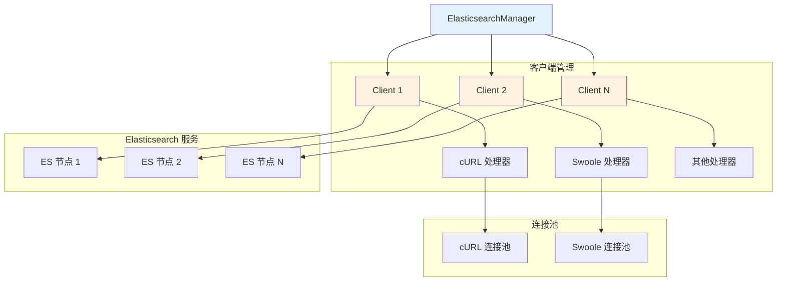

# Elasticsearch 连接配置

Hi Framework 提供了完整的 Elasticsearch 集成支持，基于官方的 Elasticsearch PHP 客户端，支持多种 HTTP 客户端驱动和连接池管理。

## 核心架构



## 核心组件

### 1. ElasticsearchProviderInterface

定义了 Elasticsearch 客户端提供者的标准接口：

```php
interface ElasticsearchProviderInterface
{
    /**
     * 根据名称获取 Elasticsearch 客户端
     */
    public function getClient(string $name): Client;
}
```

### 2. ElasticsearchManager

`ElasticsearchManager` 是 Elasticsearch 连接管理的核心类，负责：

- 管理多个命名 Elasticsearch 客户端实例
- 根据配置自动初始化客户端
- 支持多种 HTTP 客户端驱动
- 处理连接配置和验证

### 3. RequestHandler

抽象请求处理器，支持不同的 HTTP 客户端：

- **CurlRequestHandler**：基于 cURL 的请求处理
- **SwooleRequestHandler**：基于 Swoole 的请求处理

## 配置说明

### 1. 配置参数说明

| 参数名 | 类型 | 默认值 | 说明 |
|--------|------|--------|------|
| **hosts** | string[] | - | 主机地址（必需），支持 URL 格式 |
| **driver** | string | 'curl' | 驱动类型：'curl' 或 'swoole' |
| **username** | string | '' | 用户名（可选） |
| **password** | string | '' | 密码（可选） |
| **timeout** | float | 5.0 | 总超时时间（秒） |
| **connect_timeout** | float | 0.5 | 连接超时时间（秒） |
| **write_timeout** | float | 0.5 | 写入超时时间（秒） |
| **read_timeout** | float | 2.0 | 读取超时时间（秒） |
| **keepalive** | bool | true | 启用连接保活 |
| **max_reconnect_attempts** | int | 3 | 最大重连次数 |
| **reconnect_delay** | float | 0.01 | 重连延迟时间（秒） |
| **follow_location** | bool | true | 跟随重定向 |
| **max_redirs** | int | 5 | 最大重定向次数 |
| **ssl_verify** | bool | true | SSL 证书验证 |
| **ssl_cert_file** | string|null | null | SSL 证书文件路径 |
| **ssl_key_file** | string|null | null | SSL 私钥文件路径 |
| **ssl_ca_file** | string|null | null | SSL CA 文件路径 |

### 2. 基础配置

```yaml
# application.yaml
elasticsearch:
  # 默认连接
  default:
    hosts: 'localhost:9200'          # 主机地址（支持 URL 格式）
    driver: curl                    # 驱动类型：curl 或 swoole
    username: ''                    # 用户名（可选）
    password: ''                    # 密码（可选）
    
    # 连接超时配置
    timeout: 5.0                    # 总超时时间（秒）
    connect_timeout: 0.5            # 连接超时时间（秒）
    write_timeout: 0.5              # 写入超时时间（秒）
    read_timeout: 2.0               # 读取超时时间（秒）
    
    # 连接管理
    keepalive: true                 # 启用连接保活
    max_reconnect_attempts: 3       # 最大重连次数
    reconnect_delay: 0.01           # 重连延迟时间（秒）
    
    # 重定向配置
    follow_location: true           # 跟随重定向
    max_redirs: 5                   # 最大重定向次数
    
    # SSL 配置
    ssl_verify: true                # SSL 证书验证
    ssl_cert_file: null             # SSL 证书文件路径
    ssl_key_file: null              # SSL 私钥文件路径
    ssl_ca_file: null               # SSL CA 文件路径
```

### 2. 多连接配置

```yaml
elasticsearch:
  # 业务数据连接
  business:
    hosts: 'es-business-1:9200'      # 主节点地址
    driver: swoole
    username: 'business_user'
    password: 'business_pass'
    timeout: 60.0                    # 总超时时间
    connect_timeout: 3.0             # 连接超时时间
    read_timeout: 45.0               # 读取超时时间
    keepalive: true                  # 启用连接保活
    max_reconnect_attempts: 5        # 最大重连次数
  
  # 日志数据连接
  logging:
    hosts: 'es-logging-1:9200'        # 主节点地址
    driver: curl
    username: 'logging_user'
    password: 'logging_pass'
    timeout: 45.0                    # 总超时时间
    connect_timeout: 2.0             # 连接超时时间
    read_timeout: 30.0               # 读取超时时间
    keepalive: false                 # 禁用连接保活
    max_reconnect_attempts: 3        # 最大重连次数
  
  # 搜索服务连接
  search:
    hosts: 'es-search-1:9200'         # 主节点地址
    driver: swoole
    username: 'search_user'
    password: 'search_pass'
    timeout: 90.0                    # 总超时时间
    connect_timeout: 1.5             # 连接超时时间
    read_timeout: 60.0               # 读取超时时间
    keepalive: true                  # 启用连接保活
    max_reconnect_attempts: 3        # 最大重连次数
```

## 服务绑定

### 1. 在 database.php 中绑定

```php
<?php
// database.php

use Hi\Elasticsearch\ElasticsearchManager;
use Hi\Elasticsearch\ElasticsearchProviderInterface;
use Hi\Kernel\ConfigInterface;
use Spiral\Core\Container;

/**
 * Elasticsearch 服务绑定
 *
 * @var Container $di
 */
$di->bindSingleton(
    ElasticsearchProviderInterface::class,
    static fn (ConfigInterface $config): ElasticsearchManager => $di->make(ElasticsearchManager::class, [
        'configs' => $config->get('elasticsearch'),
    ]),
);
```

### 2. 自动装配配置

```php
<?php
// 在需要 Elasticsearch 客户端的类中

use Hi\Elasticsearch\ElasticsearchProviderInterface;
use Elastic\Elasticsearch\Client;

class SearchService
{
    public function __construct(
        private readonly ElasticsearchProviderInterface $elasticsearchProvider
    ) {}
    
    public function getClient(string $connection = 'default'): Client
    {
        return $this->elasticsearchProvider->getClient($connection);
    }
}
```

## 基础使用

### 1. 获取 Elasticsearch 客户端

```php
use Hi\Elasticsearch\ElasticsearchProviderInterface;
use Elastic\Elasticsearch\Client;

class ElasticsearchExample
{
    public function __construct(
        private readonly ElasticsearchProviderInterface $elasticsearchProvider
    ) {}
    
    /**
     * 获取默认客户端
     */
    public function getDefaultClient(): Client
    {
        return $this->elasticsearchProvider->getClient('default');
    }
    
    /**
     * 获取指定连接客户端
     */
    public function getBusinessClient(): Client
    {
        return $this->elasticsearchProvider->getClient('business');
    }
    
    /**
     * 获取多个客户端
     */
    public function getMultipleClients(): array
    {
        return [
            'default' => $this->elasticsearchProvider->getClient('default'),
            'business' => $this->elasticsearchProvider->getClient('business'),
            'logging' => $this->elasticsearchProvider->getClient('logging'),
            'search' => $this->elasticsearchProvider->getClient('search'),
        ];
    }
}
```

### 2. 基本操作示例

```php
use Hi\Elasticsearch\ElasticsearchProviderInterface;
use Elastic\Elasticsearch\Client;

class BasicElasticsearchOperations
{
    public function __construct(
        private readonly ElasticsearchProviderInterface $elasticsearchProvider
    ) {}
    
    /**
     * 检查集群健康状态
     */
    public function checkClusterHealth(): array
    {
        $client = $this->elasticsearchProvider->getClient('default');
        
        $response = $client->cluster()->health();
        
        return [
            'cluster_name' => $response['cluster_name'],
            'status' => $response['status'],
            'number_of_nodes' => $response['number_of_nodes'],
            'active_shards' => $response['active_shards'],
            'relocating_shards' => $response['relocating_shards'],
            'initializing_shards' => $response['initializing_shards'],
            'unassigned_shards' => $response['unassigned_shards'],
        ];
    }
    
    /**
     * 获取索引信息
     */
    public function getIndexInfo(string $indexName): array
    {
        $client = $this->elasticsearchProvider->getClient('default');
        
        try {
            $response = $client->indices()->get(['index' => $indexName]);
            return $response[$indexName];
        } catch (\Exception $e) {
            return ['error' => $e->getMessage()];
        }
    }
    
    /**
     * 创建索引
     */
    public function createIndex(string $indexName, array $mapping = []): bool
    {
        $client = $this->elasticsearchProvider->getClient('default');
        
        try {
            $params = [
                'index' => $indexName,
                'body' => [
                    'settings' => [
                        'number_of_shards' => 3,
                        'number_of_replicas' => 1,
                    ],
                ],
            ];
            
            if (!empty($mapping)) {
                $params['body']['mappings'] = $mapping;
            }
            
            $response = $client->indices()->create($params);
            return $response['acknowledged'] ?? false;
        } catch (\Exception $e) {
            error_log("Failed to create index {$indexName}: " . $e->getMessage());
            return false;
        }
    }
}
```

## 驱动选择

### 1. cURL 驱动

**适用场景**：
- 传统 PHP 环境
- 需要兼容性
- 简单的 HTTP 请求

**特点**：
- 兼容性好
- 功能完整
- 性能中等

### 2. Swoole 驱动

**适用场景**：
- Swoole 环境
- 高性能要求
- 异步处理

**特点**：
- 性能优异
- 异步支持
- 连接池管理

## 总结

Hi Framework 的 Elasticsearch 集成提供了：

1. **多连接管理**：支持多个命名连接配置
2. **驱动选择**：支持 cURL 和 Swoole 两种驱动
3. **连接管理**：内置连接保活、重连、超时管理
4. **配置灵活**：支持 SSL、重定向、认证等配置
5. **错误处理**：完善的异常处理机制
6. **性能优化**：支持批量操作和连接复用

通过合理配置和使用，可以构建高性能、可靠的 Elasticsearch 应用。
