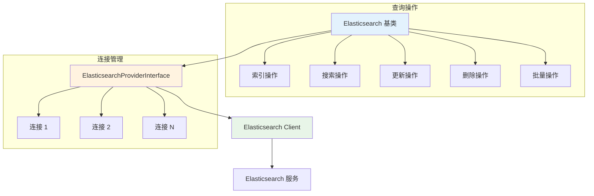

# Elasticsearch 查询操作

Hi Framework 提供了基于抽象基类的 Elasticsearch 查询操作支持，通过继承 `Library\Database\Elasticsearch` 基类，可以轻松实现各种 Elasticsearch 操作。这个基类继承自 `\Hi\Elasticsearch\Elasticsearch`，并提供了丰富的生产环境优化功能。本文档基于生产环境项目 `typing-jupiter` 的实际使用经验编写。

## 核心架构



## 基类特性

### 1. Elasticsearch 基类

`Library\Database\Elasticsearch` 基类提供了以下核心功能：

```php
abstract class Elasticsearch extends \Hi\Elasticsearch\Elasticsearch
{
    protected ElasticsearchProviderInterface $provider;
    protected string $connection;    // 连接名称
    protected string $index;         // 索引名称
    
    /**
     * 获取索引管理接口
     */
    public function indices(): Indices;
    
    /**
     * 创建索引和文档
     */
    public function index(array $body, string $id = '', bool $refresh = false): mixed;
    
    /**
     * 根据 ID 获取文档
     */
    public function getById(string|int $id, array $body = [], bool $throwException = true): mixed;
    
    /**
     * 搜索文档
     */
    public function search(array $body, array $option = []): mixed;
    
    /**
     * 删除文档
     */
    public function delete(array $body, bool $throwException = true): mixed;
    
    /**
     * 批量操作
     */
    public function bulk(array $data): mixed;
    
    /**
     * 根据查询更新文档
     */
    public function updateByQuery(array $query, bool $throwException = true): mixed;
    
    /**
     * 根据 ID 更新文档
     */
    public function updateById(array $query, string $id, bool $throwException = true, bool $refresh = false): mixed;
    
    /**
     * 检查文档是否存在
     */
    public function exists(array $body, bool $throwException = true): mixed;
    
    /**
     * 执行 Elasticsearch 操作的核心方法
     */
    protected function run(callable $callback): mixed;
}
```

### 2. 核心方法

- **`indices()`**：获取索引管理接口，用于索引级别的操作
- **`index()`**：创建索引和文档，支持自定义 ID 和刷新控制
- **`getById()`**：根据 ID 获取文档，支持异常控制
- **`search()`**：搜索文档，支持多种选项配置
- **`delete()`**：删除文档，支持异常控制
- **`bulk()`**：批量操作，提高数据处理效率
- **`updateByQuery()`**：根据查询条件更新文档
- **`updateById()`**：根据 ID 更新文档，支持刷新控制
- **`exists()`**：检查文档是否存在
- **`run()`**：执行 Elasticsearch 操作的核心方法，自动管理连接

## 基础查询操作

> **重要说明**：`Library\Database\Elasticsearch` 基类已经实现了大部分常用的 Elasticsearch 操作。在大多数情况下，你只需要直接调用基类方法即可。只有在需要特殊操作（如多索引查询、自定义客户端操作）时才需要直接使用 `run` 方法。

### 1. 索引操作

#### 单个文档索引

```php
use Library\Database\Elasticsearch;

class UserES extends Elasticsearch
{
    protected string $connection = 'business';
    protected string $index = 'users';
    
    /**
     * 索引单个文档 - 直接使用基类方法
     */
    public function createUser(array $document, string $id = '', bool $refresh = false): string
    {
        // 基类已经实现了 index 方法，直接调用即可
        return $this->index($document, $id, $refresh);
    }
}
```

#### 获取文档

```php
use Library\Database\Elasticsearch;

class UserES extends Elasticsearch
{
    protected string $connection = 'business';
    protected string $index = 'users';
    
    /**
     * 获取指定用户 - 直接使用基类方法
     */
    public function getUserById(string|int $id, array $body = [], bool $throwException = true): mixed
    {
        // 基类已经实现了 getById 方法，直接调用即可
        return $this->getById($id, $body, $throwException);
    }
    
    /**
     * 检查用户是否存在 - 直接使用基类方法
     */
    public function userExists(string $id): bool
    {
        // 基类已经实现了 exists 方法，直接调用即可
        return $this->exists(['id' => $id], false);
    }
}
```

### 2. 搜索操作

#### 基础搜索

```php
use Library\Database\Elasticsearch;

class UserSearchES extends Elasticsearch
{
    protected string $connection = 'search';
    protected string $index = 'users';
    
    /**
     * 搜索用户 - 直接使用基类方法
     */
    public function searchUsers(array $query, array $options = []): array
    {
        // 基类已经实现了 search 方法，直接调用即可
        $result = $this->search($query, $options);
        
        // 可以根据需要进一步处理结果
        return $result;
    }
    
    /**
     * 搜索用户并返回打分
     */
    public function searchUsersWithScore(array $query): array
    {
        // 使用基类的 search 方法，启用打分选项
        return $this->search($query, ['with_score' => true]);
    }
}
```

#### 复杂查询示例

```php
use Library\Database\Elasticsearch;

class HeartbeatStatusES extends Elasticsearch
{
    protected string $connection = 'business-common';
    protected string $index = 'jupiter-heartbeat-status';
    
    /**
     * 获取最近在线用户 - 使用基类的 search 方法
     */
    public function getRecentlyOnlineUsers(
        AppIdEnum $appId, 
        DividePoolNameEnum $divide, 
        HumenLabelEnum $targetClass, 
        GenderEnum $gender, 
        int $baseTime, 
        int $limit
    ): array {
        $query = [
            '_source' => ['uid'],
            'query' => [
                'bool' => [
                    'must' => [
                        ['term' => ['app_id' => $appId->value]],
                        ['term' => ['divide' => $divide->value]],
                        ['term' => ['gender' => $gender->value]],
                        ['term' => ['target_class' => $targetClass->value]],
                        ['range' => ['time' => ['gt' => $baseTime]]],
                    ],
                ],
            ],
            'size' => $limit,
            'sort' => [
                'time' => 'desc',
            ],
        ];

        // 直接使用基类的 search 方法
        return $this->search($query);
    }
    
    /**
     * 随机获取一批最近在线用户 - 使用基类的 search 方法
     */
    public function getRandomRecentlyOnlineUsers(
        AppIdEnum $appId, 
        DividePoolNameEnum $divide, 
        HumenLabelEnum $targetClass, 
        GenderEnum $gender, 
        int $baseTime, 
        int $limit
    ): array {
        $query = [
            '_source' => ['uid'],
            'query' => [
                'function_score' => [
                    'query' => [
                        'bool' => [
                            'must' => [
                                ['term' => ['app_id' => $appId->value]],
                                ['term' => ['divide' => $divide->value]],
                                ['term' => ['gender' => $gender->value]],
                                ['term' => ['target_class' => $targetClass->value]],
                                ['range' => ['time' => ['gt' => $baseTime]]],
                            ],
                        ],
                    ],
                    'functions' => [
                        ['random_score' => new \stdClass()],
                    ],
                    'boost_mode' => 'replace',
                    'score_mode' => 'sum',
                ],
            ],
            'size' => $limit,
        ];

        // 直接使用基类的 search 方法
        return $this->search($query);
    }
}
```

### 3. 更新操作

#### 根据 ID 更新

```php
use Library\Database\Elasticsearch;

class UserUpdateES extends Elasticsearch
{
    protected string $connection = 'business';
    protected string $index = 'users';
    
    /**
     * 更新用户信息 - 直接使用基类方法
     */
    public function updateUser(string $id, array $userData, bool $refresh = false): mixed
    {
        // 基类已经实现了 updateById 方法，直接调用即可
        return $this->updateById($userData, $id, true, $refresh);
    }
}
```

#### 根据查询更新

```php
use Library\Database\Elasticsearch;

class UserUpdateES extends Elasticsearch
{
    protected string $connection = 'business';
    protected string $index = 'users';
    
    /**
     * 批量更新用户状态 - 直接使用基类方法
     */
    public function updateUsersByStatus(string $oldStatus, string $newStatus): mixed
    {
        $query = [
            'query' => [
                'term' => ['status' => $oldStatus]
            ],
            'script' => [
                'source' => 'ctx._source.status = params.new_status',
                'params' => ['new_status' => $newStatus]
            ]
        ];
        
        // 基类已经实现了 updateByQuery 方法，直接调用即可
        return $this->updateByQuery($query);
    }
}
```

### 4. 删除操作

#### 删除文档

```php
use Library\Database\Elasticsearch;

class UserDeleteES extends Elasticsearch
{
    protected string $connection = 'business';
    protected string $index = 'users';
    
    /**
     * 删除用户 - 直接使用基类方法
     */
    public function deleteUser(string $id): bool
    {
        // 基类已经实现了 delete 方法，直接调用即可
        return $this->delete(['id' => $id], false);
    }
    
    /**
     * 批量删除用户 - 直接使用基类方法
     */
    public function deleteUsers(array $ids): bool
    {
        $success = true;
        foreach ($ids as $id) {
            if (!$this->delete(['id' => $id], false)) {
                $success = false;
            }
        }
        return $success;
    }
}
```

### 5. 批量操作

#### 批量索引

```php
use Library\Database\Elasticsearch;

class HeartbeatStatusES extends Elasticsearch
{
    protected string $connection = 'business-common';
    protected string $index = 'jupiter-heartbeat-status';
    
    /**
     * 批量保存数据 - 使用基类的 bulk 方法
     */
    public function bulkSave(array $list): int
    {
        if (! $list) {
            return 0;
        }

        $records = [];
        foreach ($list as $item) {
            $records[] = $this->index;
            $records[] = [
                '@timestamp' => \date('Y-m-d H:i:s', $item->time ?: \time()),
                ...$item->toArray(),
            ];
        }

        // 基类已经实现了 bulk 方法，直接调用即可
        $result = $this->bulk($records);

        return \count($result['items']);
    }
}
```

#### 批量操作基础方法

```php
use Library\Database\Elasticsearch;

class BulkOperationsES extends Elasticsearch
{
    protected string $connection = 'business';
    protected string $index = 'documents';
    
    /**
     * 批量索引文档 - 使用基类的 bulk 方法
     */
    public function bulkIndex(array $documents): mixed
    {
        $bulkBody = [];
        foreach ($documents as $document) {
            $bulkBody[] = [
                'index' => [
                    '_index' => $this->index,
                ],
            ];
            $bulkBody[] = $document;
        }
        
        // 基类已经实现了 bulk 方法，直接调用即可
        return $this->bulk($bulkBody);
    }
    
    /**
     * 批量更新文档 - 使用基类的 bulk 方法
     */
    public function bulkUpdate(array $updates): mixed
    {
        $bulkBody = [];
        foreach ($updates as $id => $doc) {
            $bulkBody[] = [
                'update' => [
                    '_index' => $this->index,
                    '_id' => $id,
                ],
            ];
            $bulkBody[] = [
                'doc' => $doc,
            ];
        }
        
        // 基类已经实现了 bulk 方法，直接调用即可
        return $this->bulk($bulkBody);
    }
}
```

## 高级查询功能

### 1. 多索引查询

```php
use Library\Database\Elasticsearch;

class MatchChatResultLogES extends Elasticsearch
{
    protected string $connection = 'business-common';
    protected string $indexTpl = 'jupiter-match-chat-carry-log';
    
    /**
     * 检查两个人指定日期内是否已经存在匹配记录
     * 注意：这个方法需要直接使用 run 方法，因为涉及多索引查询
     */
    public function isExistBoundWithoutToday(
        AppIdEnum $appId, 
        int $requestUserId, 
        int $targetUserId, 
        int $days, 
        MatchResultTypeEnum $matchResultType
    ): array {
        return $this->run(function (Client $client) use ($appId, $requestUserId, $targetUserId, $days, $matchResultType) {
            // 索引列表（指定天数）
            $indexes = [];
            for ($i = 1; $i <= $days; $i++) {
                $indexes[] = \sprintf('%s-%s', $this->indexTpl, \date('Y.m.d', \strtotime("-{$i} day")));
            }

            $result = $client->search([
                'index' => $indexes,
                'body' => [
                    'size' => 1,
                    'query' => [
                        'bool' => [
                            'must' => [
                                ['match' => ['app_id' => $appId->value]],
                                ['match' => ['request_user_id' => $requestUserId]],
                                ['match' => ['target_user_id' => $targetUserId]],
                                ['match' => ['result' => 'success']],
                                ['match' => ['match_result_type' => $matchResultType->value]],
                            ],
                        ],
                    ],
                    '_source' => ['app_id', 'datetime'],
                ],
            ]);

            return $result['hits']['hits'] ?? [];
        });
    }
}
```

### 2. 聚合查询

#### 复杂嵌套聚合

```php
use Library\Database\Elasticsearch;

class MatchChatResultLogES extends Elasticsearch
{
    protected string $connection = 'business-common';
    protected string $indexTpl = 'jupiter-match-chat-carry-log';
    
    /**
     * 按照匹配池、标签聚合匹配结果
     * 注意：这个方法需要直接使用 run 方法，因为涉及多索引查询
     */
    public function aggsResult(int $pastMinites = 15, string $result = ''): array
    {
        return $this->run(function (Client $client) use ($pastMinites, $result) {
            // 索引列表（两天，避免凌晨出现数据边界）
            $indexes = [
                \sprintf('%s-%s', $this->indexTpl, \date('Y.m.d')),
                \sprintf('%s-%s', $this->indexTpl, \date('Y.m.d', \strtotime('-1 day'))),
            ];

            // 计算时间范围
            $decrement = 1;
            $pastMinites = \abs($pastMinites) + $decrement;
            $startTime = (new \DateTimeImmutable("-{$pastMinites} minutes", new \DateTimeZone('UTC')))->format('Y-m-d\TH:i:s\Z');
            $endTime = (new \DateTimeImmutable("-{$decrement} minutes", new \DateTimeZone('UTC')))->format('Y-m-d\TH:i:s\Z');

            // 查询条件
            $uqeryMust = [];
            if ($result) {
                $uqeryMust[] = ['match' => ['result' => $result]];
            }
            $uqeryMust[] = [
                'range' => [
                    '@timestamp' => [
                        'gte' => $startTime, 
                        'lte' => $endTime, 
                        'format' => 'strict_date_optional_time'
                    ]
                ]
            ];

            $searchBody = [
                'index' => $indexes,
                'body' => [
                    'size' => 0,
                    'query' => [
                        'bool' => [
                            'must' => $uqeryMust,
                        ],
                    ],
                    'aggs' => [
                        'by_app_id' => [
                            'terms' => [
                                'field' => 'app_id',
                            ],
                            'aggs' => [
                                'by_target_user_divide' => [
                                    'terms' => [
                                        'field' => 'target_user_divide',
                                    ],
                                    'aggs' => [
                                        'by_target_user_label' => [
                                            'terms' => [
                                                'field' => 'target_user_label',
                                            ],
                                            'aggs' => [
                                                'by_result' => [
                                                    'terms' => [
                                                        'field' => 'result',
                                                    ],
                                                    'aggs' => [
                                                        'total_count' => [
                                                            'value_count' => [
                                                                'field' => '_id',
                                                            ],
                                                        ],
                                                    ],
                                                ],
                                            ],
                                        ],
                                    ],
                                ],
                            ],
                        ],
                    ],
                ],
            ];

            $result = $client->search($searchBody);

            return $result['aggregations'] ?? [];
        });
    }
}
```

### 3. 动态索引管理

```php
use Library\Database\Elasticsearch;

class HumenLabelRecordES extends Elasticsearch
{
    protected string $connection = 'business-common';
    
    /**
     * 索引（按性别分索引）
     */
    public array $indexes = [
        Type::Male => 'jupiter-humen-label-record-male',
        Type::Female => 'jupiter-humen-label-record-female',
    ];
    
    /**
     * 新增/更新标签数据 - 使用基类的 index 方法
     */
    public function save(AppIdEnum $appId, MaleHumenLabelVO|FemaleHumenLabelVO $vo): string
    {
        $gender = GenderEnum::from($this->getGenderByUserLabel($vo->label));

        // 先设置索引，然后使用基类的 index 方法
        $this->setIndex($this->indexes[$gender->value]);
        return $this->index($vo->toArray(), $this->joinId($appId, $vo->userId));
    }
    
    /**
     * 查询指定用户标签用户列表（随机）- 使用基类的 search 方法
     */
    public function findByUserLabelWithRandom(string $label, string $gender, int $size, array $columns = ['uid']): ?array
    {
        // 先设置索引，然后使用基类的 search 方法
        $this->setIndex($this->indexes[$gender]);
        $result = $this->search([
            'query' => [
                'function_score' => [
                    'query' => [
                        'match' => [
                            'label' => $label,
                        ],
                    ],
                    'random_score' => new \stdClass,
                    'boost_mode' => 'replace',
                    'score_mode' => 'sum',
                ],
            ],
            '_source' => $columns,
            'size' => $size,
        ]);

        return $result['hits'];
    }
}
```

## 实际应用场景

### 1. 用户在线状态管理

```php
class HeartbeatStatusES extends Elasticsearch
{
    /**
     * 保存心跳状态
     */
    public function save(
        DividePoolNameEnum $divide, 
        GenderEnum $gender, 
        HumenLabelEnum $targetClass, 
        HeartbeatStatusVO $vo
    ): void {
        $body = $vo->toArray();
        $body['divide'] = $divide->value;
        $body['gender'] = $gender->value;
        $body['target_class'] = $targetClass->value;

        $id = \sprintf('%s-%s', $vo->appId->value, $vo->userId);

        $this->index($body, $id);
    }
}
```

### 2. 匹配日志记录

```php
class MatchChatResultLogES extends Elasticsearch
{
    /**
     * 创建匹配日志
     */
    public function save(array $data): string
    {
        $this->index = \sprintf('%s-%s', $this->indexTpl, \date('Y.m.d'));

        return $this->index($data);
    }
}
```

### 3. 用户标签管理

```php
class HumenLabelRecordES extends Elasticsearch
{
    /**
     * 返回指定用户 ID 对应身份标签信息
     */
    public function findByUserId(AppIdEnum $appId, int $userId, string $gender): ?array
    {
        return $this
            ->setIndex($this->indexes[$gender])
            ->get($this->joinId($appId, $userId), [], false)
        ;
    }
    
    /**
     * 删除指定记录
     */
    public function deleteByUserId(AppIdEnum $appId, int $userId, string $gender): bool
    {
        return $this
            ->setIndex($this->indexes[$gender])
            ->delete(['id' => $this->joinId($appId, $userId)])
        ;
    }
}
```

## 总结

Hi Framework 的 Elasticsearch 查询操作提供了：

1. **抽象基类**：统一的 Elasticsearch 操作接口，简化开发
2. **连接管理**：自动连接池管理和多连接支持
3. **查询构建**：灵活的查询构建和组合，支持复杂业务逻辑
4. **批量操作**：高效的批量索引、更新、删除操作
5. **聚合查询**：强大的数据聚合和分析能力
6. **索引管理**：动态索引设置和多索引查询支持
7. **错误处理**：完善的异常处理和容错机制

通过继承 `Library\Database\Elasticsearch` 基类，开发者可以快速构建功能完整的 Elasticsearch 应用，实现高效的搜索、分析和数据处理功能。基于 `typing-jupiter` 项目的实际使用经验，这些功能已经在生产环境中得到验证，为高并发、大数据量的应用场景提供了可靠的技术支撑。
