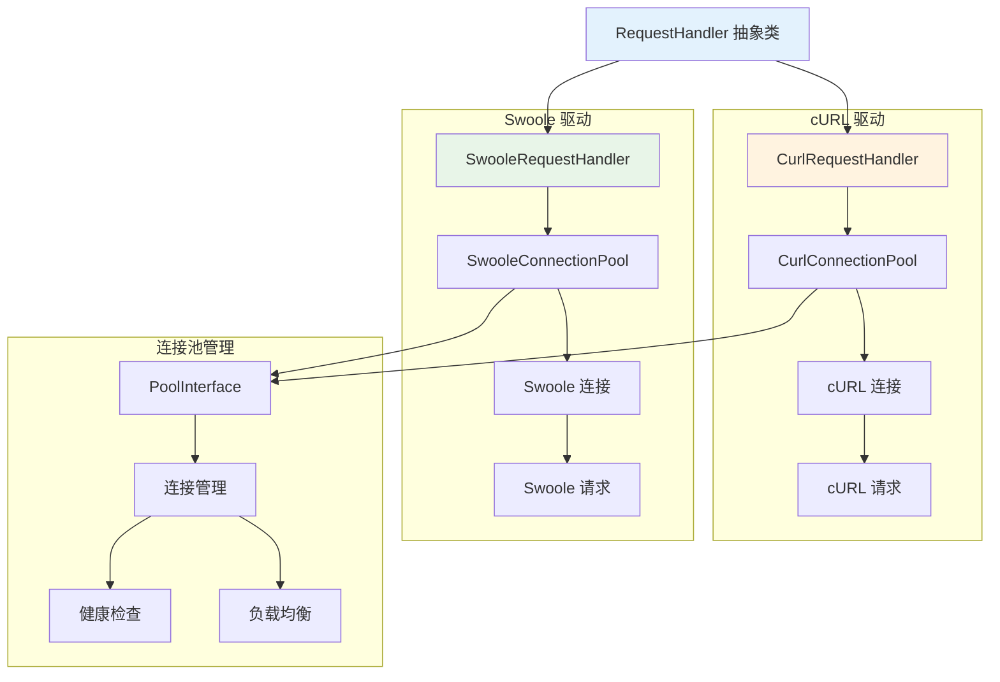

# Elasticsearch 请求处理器

Hi Framework 的 Elasticsearch 请求处理器提供了灵活的 HTTP 客户端抽象，支持多种驱动类型，包括 cURL 和 Swoole，每种驱动都基于连接池管理，提供高性能和可靠的请求处理能力。

## 核心架构



## 核心组件

### 1. RequestHandler 抽象类

`RequestHandler` 是所有请求处理器的基类，实现了 PSR-18 HTTP 客户端接口：

```php
abstract class RequestHandler implements ClientInterface
{
    protected PoolInterface $pool;
    
    /**
     * 发送 HTTP 请求
     */
    abstract public function sendRequest(RequestInterface $request): ResponseInterface;
}
```

### 2. CurlRequestHandler

基于 cURL 的请求处理器，适用于传统 PHP 环境：

```php
class CurlRequestHandler extends RequestHandler
{
    public function __construct(
        string $connectionName,
        array $config,
        protected readonly ContainerInterface $container,
        protected readonly ExceptionHandlerInterface $exceptionHandler,
    ) {
        $this->pool = $this->container->make(CurlConnectionPool::class, [
            'name' => $connectionName,
            'config' => $config,
        ]);
    }
    
    public function sendRequest(RequestInterface $request): ResponseInterface
    {
        $success = true;
        
        try {
            /** @var \Hi\Http\Client\Connection\Driver\Curl\CurlConnection $connection */
            $connection = $this->pool->get();
            return $connection->request($request);
        } catch (CurlRequestFailedException $e) {
            $success = false;
            throw $e;
        } finally {
            if ($success) {
                $this->pool->put($connection);
            }
        }
    }
}
```

### 3. SwooleRequestHandler

基于 Swoole 的请求处理器，适用于高性能环境：

```php
class SwooleRequestHandler extends RequestHandler
{
    public function __construct(
        string $connectionName,
        array $config,
        protected readonly Container $container,
        protected readonly ExceptionHandlerInterface $exceptionHandler,
    ) {
        $this->pool = $this->container->make(SwooleConnectionPool::class, [
            'name' => $connectionName,
            'config' => $config,
        ]);
    }
    
    public function sendRequest(RequestInterface $request): ResponseInterface
    {
        $success = true;
        $connection = null;
        
        try {
            /** @var \Hi\Http\Client\Connection\Driver\Swoole\SwooleConnection $connection */
            $connection = $this->pool->get();
            return $connection->request($request);
        } catch (SwooleRequestFailedException $e) {
            $success = false;
            throw $e;
        } finally {
            if ($success && null !== $connection) {
                $this->pool->put($connection);
            }
        }
    }
}
```

## 驱动选择策略

### 1. 自动驱动选择

```php
use Hi\Elasticsearch\ElasticsearchManager;

class ElasticsearchDriverSelector
{
    /**
     * 根据环境自动选择驱动
     */
    public function selectOptimalDriver(): string
    {
        // 检查 Swoole 扩展
        if (extension_loaded('swoole') && $this->isSwooleEnvironment()) {
            return 'swoole';
        }
        
        // 检查 cURL 扩展
        if (extension_loaded('curl')) {
            return 'curl';
        }
        
        // 默认使用 cURL
        return 'curl';
    }
    
    /**
     * 检查是否为 Swoole 环境
     */
    private function isSwooleEnvironment(): bool
    {
        return defined('SWOOLE_VERSION') || 
               (function_exists('swoole_coroutine_id') && swoole_coroutine_id() >= 0);
    }
    
    /**
     * 根据性能需求选择驱动
     */
    public function selectDriverByPerformance(string $performance): string
    {
        return match ($performance) {
            'high' => 'swoole',
            'medium' => 'curl',
            'low' => 'curl',
            default => 'curl',
        };
    }
}
```

### 2. 驱动性能对比

| 特性 | cURL 驱动 | Swoole 驱动 |
|------|-----------|-------------|
| **兼容性** | 高（传统 PHP） | 中（需要 Swoole） |
| **性能** | 中等 | 高 |
| **异步支持** | 否 | 是 |
| **连接池** | 是 | 是 |
| **内存使用** | 中等 | 低 |
| **并发处理** | 中等 | 高 |

## 总结

Hi Framework 的 Elasticsearch 请求处理器提供了：

1. **多驱动支持**：cURL 和 Swoole 两种驱动选择
2. **连接池管理**：高效的连接复用和管理
3. **错误处理**：完善的异常处理和重试机制
4. **性能优化**：智能的连接池优化和查询优化
5. **监控支持**：详细的性能指标和连接状态监控
6. **配置灵活**：根据环境和使用模式优化配置
7. **最佳实践**：基于实际使用场景的驱动选择建议

通过合理选择和配置请求处理器，可以构建高性能、可靠的 Elasticsearch 应用，满足不同环境下的性能需求。
