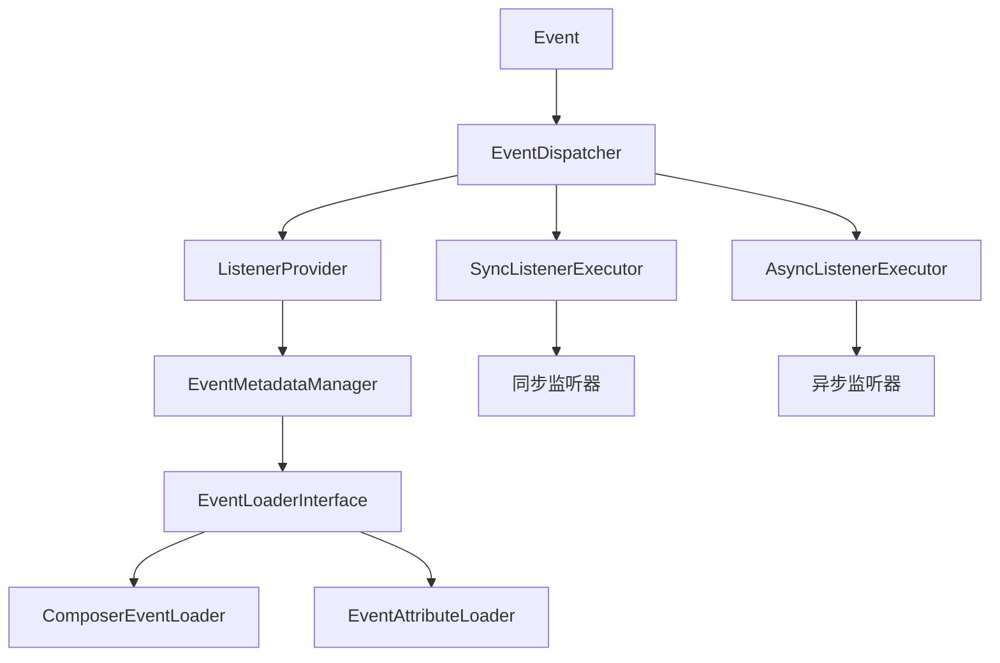

# 事件系统

Hi Framework 提供了完整的事件系统，基于 PSR-14 标准实现，支持同步和异步事件处理。事件系统采用发布-订阅模式，帮助您构建松耦合、可扩展的应用程序。

## 设计理念

### 核心架构

事件系统采用元数据驱动架构，通过注解自动发现事件监听器：



### PSR-14 标准兼容

框架完全遵循 PSR-14 事件分发器标准：

- `EventDispatcherInterface` - 事件分发器接口
- `ListenerProviderInterface` - 监听器提供者接口  
- `StoppableEventInterface` - 可停止事件接口

## 定义事件

### Event 注解

框架推荐使用 `Event` 注解来标记事件类，提供更好的元数据支持：

```php
<?php

use Hi\Attributes\Event\Event;

#[Event(
    name: 'user.registered',      // 自定义事件名称（可选）
    stoppable: false,             // 是否可停止传播
    owner: 'user-module',         // 事件所有者
    desc: '用户注册完成事件'       // 事件描述
)]
class UserRegisteredEvent
{
    // 事件属性和方法
}
```

`Event` 注解支持以下参数：

- **name**: 自定义事件名称，如果不提供则使用类名
- **stoppable**: 标记事件是否实现了 `StoppableEventInterface`
- **owner**: 事件的所有者或来源模块
- **desc**: 事件的描述信息

### 基本事件

事件可以是任何 PHP 对象，无需继承特定基类：

```php
<?php

namespace App\Event;

use Hi\Attributes\Event\Event;

#[Event(
    desc: '用户注册事件'
)]
class UserRegisteredEvent
{
    public function __construct(
        public readonly int $userId,
        public readonly string $email,
        public readonly \DateTimeImmutable $registeredAt
    ) {}
}
```

### 可停止事件

如果需要控制事件传播，可以实现 `StoppableEventInterface`：

```php
<?php

namespace App\Event;

use Hi\Event\StoppableEvent;
use Hi\Attributes\Event\Event;

#[Event(
    stoppable: true,
    desc: '用户登录事件'
)]
class UserLoginEvent extends StoppableEvent
{
    public function __construct(
        public readonly int $userId,
        public string $email,
        public bool $successful = true
    ) {}
    
    public function markAsFailed(): void
    {
        $this->successful = false;
        $this->stopPropagation(); // 阻止后续监听器执行
    }
}
```

### 事件接口

定义事件接口可以实现更灵活的监听器绑定：

```php
<?php

namespace App\Event\Contract;

use Hi\Attributes\Event\Event;

interface UserEventInterface
{
    public function getUserId(): int;
}

#[Event(
    desc: '用户注册事件，实现用户事件接口'
)]
class UserRegisteredEvent implements UserEventInterface
{
    public function __construct(
        private readonly int $userId,
        public readonly string $email
    ) {}
    
    public function getUserId(): int
    {
        return $this->userId;
    }
}
```

## 创建监听器

### 注解监听器

推荐使用注解方式定义监听器：

```php
<?php

namespace App\Event\Listener;

use Hi\Attributes\Event\EventListener;
use App\Event\UserRegisteredEvent;
use Psr\Log\LoggerInterface;

class UserEventListener
{
    public function __construct(
        private LoggerInterface $logger
    ) {}

    #[EventListener(
        event: UserRegisteredEvent::class,
        priority: 100,
        async: false
    )]
    public function onUserRegistered(UserRegisteredEvent $event): void
    {
        $this->logger->info('New user registered', [
            'user_id' => $event->userId,
            'email' => $event->email,
            'registered_at' => $event->registeredAt->format('Y-m-d H:i:s')
        ]);
    }
    
    #[EventListener(
        event: UserRegisteredEvent::class,
        priority: 50,
        async: true,
        retries: 3
    )]
    public function sendWelcomeEmail(UserRegisteredEvent $event): void
    {
        // 异步发送欢迎邮件
        $emailService = \construct(EmailServiceInterface::class);
        $emailService->sendWelcomeEmail($event->email);
    }
}
```

### 接口监听器

监听器可以监听事件接口，实现更通用的处理：

```php
<?php

namespace App\Event\Listener;

use Hi\Attributes\Event\EventListener;
use App\Event\Contract\UserEventInterface;

class UserActivityListener
{
    #[EventListener(
        event: UserEventInterface::class,
        priority: 10
    )]
    public function recordActivity(UserEventInterface $event): void
    {
        $activityService = \construct(ActivityServiceInterface::class);
        $activityService->record($event->getUserId(), get_class($event));
    }
}
```

### 监听器注册

除了注解方式，也可以手动注册监听器：

```php
<?php

use Hi\Event\EventMetadataManager;
use Hi\Event\Metadata\ListenerMetadata;

$metadataManager = \construct(EventMetadataManager::class);

// 手动注册监听器
$metadataManager->registerListener(new ListenerMetadata(
    event: UserRegisteredEvent::class,
    callable: [$listener, 'onUserRegistered'],
    priority: 100,
    async: false
));
```

## 分发事件

### 基本分发

使用事件分发器分发事件：

```php
<?php

use Hi\Event\EventDispatcherInterface;
use App\Event\UserRegisteredEvent;

class UserService
{
    public function __construct(
        private EventDispatcherInterface $eventDispatcher
    ) {}
    
    public function registerUser(array $userData): int
    {
        // 创建用户逻辑
        $userId = $this->createUser($userData);
        
        // 分发事件
        $event = new UserRegisteredEvent(
            userId: $userId,
            email: $userData['email'],
            registeredAt: new \DateTimeImmutable()
        );
        
        $this->eventDispatcher->dispatch($event);
        
        return $userId;
    }
}
```

### 在控制器中分发事件

```php
<?php

namespace App\Transport\Http\Routes;

use Hi\Attributes\Http\Post;
use Hi\Attributes\Http\Route;
use Hi\Http\Context;
use Hi\Event\EventDispatcherInterface;

#[Route(prefix: '/api')]
class UserController
{
    public function __construct(
        private EventDispatcherInterface $eventDispatcher
    ) {}
    
    #[Post('/users/register')]
    public function register(Context $ctx): array
    {
        $data = $ctx->getRequest()->getParsedBody();
        
        // 验证数据
        $this->validateUserData($data);
        
        // 创建用户
        $userId = $this->createUser($data);
        
        // 分发事件
        $event = new UserRegisteredEvent(
            userId: $userId,
            email: $data['email'],
            registeredAt: new \DateTimeImmutable()
        );
        
        // 事件分发后，所有同步监听器已执行完成
        // 异步监听器会在后台继续执行
        $this->eventDispatcher->dispatch($event);
        
        return [
            'success' => true,
            'user_id' => $userId,
        ];
    }
}
```

## 同步 vs 异步处理

### 同步监听器

同步监听器在事件分发的同一线程中按优先级顺序执行：

```php
<?php

#[EventListener(
    event: OrderCreatedEvent::class,
    priority: 100,  // 高优先级，先执行
    async: false     // 同步执行
)]
public function validateOrder(OrderCreatedEvent $event): void
{
    if (!$this->isValidOrder($event->order)) {
        throw new InvalidOrderException('订单验证失败');
    }
}

#[EventListener(
    event: OrderCreatedEvent::class,
    priority: 90,   // 较低优先级，后执行
    async: false
)]
public function updateInventory(OrderCreatedEvent $event): void
{
    $this->inventoryService->decrease($event->order->getItems());
}
```

### 异步监听器

异步监听器在后台协程中并行执行，不会阻塞主流程：

```php
<?php

#[EventListener(
    event: OrderCreatedEvent::class,
    async: true,        // 异步执行
    retries: 3,         // 失败重试 3 次
    retryDelay: 1000    // 重试间隔 1 秒
)]
public function sendOrderConfirmation(OrderCreatedEvent $event): void
{
    // 发送订单确认邮件（可能失败，有重试机制）
    $this->emailService->sendOrderConfirmation($event->order);
}

#[EventListener(
    event: OrderCreatedEvent::class,
    async: true
)]
public function logOrderAnalytics(OrderCreatedEvent $event): void
{
    // 记录订单分析数据（后台处理，不影响用户体验）
    $this->analyticsService->recordOrder($event->order);
}
```

### 执行顺序

事件分发的执行顺序：

1. **同步监听器**：按优先级从高到低顺序执行
2. **异步监听器**：在所有同步监听器完成后，并行执行
3. **返回结果**：同步监听器执行完成后立即返回

```php
<?php

// 事件分发流程示例
$event = new UserRegisteredEvent($userId, $email, new \DateTimeImmutable());

// 1. 同步监听器按优先级执行（阻塞）
// Priority 100: 数据验证
// Priority 90:  用户权限设置  
// Priority 80:  缓存更新

$result = $this->eventDispatcher->dispatch($event);

// 2. 异步监听器开始并行执行（非阻塞）
// - 发送欢迎邮件
// - 更新推荐系统
// - 记录用户行为

// 3. 立即返回，异步任务在后台继续
return $result;
```

## 事件订阅器

### 订阅器类

订阅器可以在一个类中处理多个相关事件：

```php
<?php

namespace App\Event\Subscriber;

use Hi\Attributes\Event\EventSubscriber;
use Hi\Attributes\Event\EventListener;

#[EventSubscriber]
class UserSubscriber
{
    #[EventListener(
        event: UserRegisteredEvent::class,
        priority: 50
    )]
    public function onUserRegistered(UserRegisteredEvent $event): void
    {
        // 处理用户注册
    }
    
    #[EventListener(
        event: UserLoginEvent::class,
        priority: 30
    )]
    public function onUserLogin(UserLoginEvent $event): void
    {
        // 处理用户登录
    }
    
    #[EventListener(
        event: UserLogoutEvent::class,
        priority: 20
    )]
    public function onUserLogout(UserLogoutEvent $event): void
    {
        // 处理用户注销
    }
}
```

## 事件发现与加载

### Composer 集成

在 `composer.json` 中配置事件发现：

```json
{
    "extra": {
        "hi-framework": {
            "events": {
                "listeners": [
                    "App\\Event\\Listener\\",
                    "App\\Event\\Subscriber\\"
                ],
                "scan_dirs": [
                    "app/Event/Listener",
                    "app/Event/Subscriber"
                ]
            }
        }
    }
}
```

### 自动发现

框架会自动扫描配置的目录，发现带有 `#[EventListener]` 注解的方法和 `#[Event]` 注解的事件类：

```php
<?php

namespace App\Event;

use Hi\Attributes\Event\Event;
use Hi\Attributes\Event\EventListener;

// 事件类会被自动发现
#[Event(desc: '用户注册事件')]
class UserRegisteredEvent
{
    public function __construct(
        public readonly int $userId,
        public readonly string $email
    ) {}
}

namespace App\Event\Listener;

class NotificationListener
{
    // 这个方法会被自动发现并注册为监听器
    #[EventListener(event: UserRegisteredEvent::class)]
    public function sendNotification(UserRegisteredEvent $event): void
    {
        // 发送通知逻辑
    }
}
```

## 错误处理

### 监听器异常处理

框架提供了完善的异常处理机制：

```php
<?php

#[EventListener(
    event: UserRegisteredEvent::class,
    retries: 3,      // 失败重试次数
    retryDelay: 2000 // 重试间隔（毫秒）
)]
public function processUserRegistration(UserRegisteredEvent $event): void
{
    try {
        // 可能失败的操作
        $this->externalService->createUser($event->email);
    } catch (\Throwable $e) {
        // 框架会自动重试，重试失败会记录错误日志
        throw $e;
    }
}
```

### 全局错误监听器

创建全局错误处理监听器：

```php
<?php

namespace App\Event\Listener;

use Hi\Attributes\Event\EventListener;
use Psr\Log\LoggerInterface;

class ErrorListener
{
    public function __construct(
        private LoggerInterface $logger
    ) {}

    public function handleUserRegistrationError(UserRegisteredEvent $event): void
    {
        try {
            // 一些可能失败的操作
            $this->processUser($event);
        } catch (\Throwable $e) {
            // 记录错误
            $this->logger->error('User registration processing failed', [
                'user_id' => $event->userId,
                'error' => $e->getMessage(),
                'trace' => $e->getTraceAsString()
            ]);
            
            // 发送告警通知
            $this->alertService->sendAlert($e);
        }
    }
}
```

## 性能优化

### 事件缓存

框架会自动缓存事件元数据以提高性能：

```php
<?php

// 在生产环境中预热事件缓存
use Hi\Event\EventMetadataManager;

$metadataManager = \construct(EventMetadataManager::class);

// 预加载所有事件元数据
$metadataManager->warmUpCache();
```

### 批量事件处理

对于高频事件，可以实现批量处理：

```php
<?php

namespace App\Event\Listener;

use Hi\Attributes\Event\EventListener;

class BatchOrderListener
{
    private array $orders = [];
    private int $batchSize = 100;
    
    #[EventListener(
        event: OrderCreatedEvent::class,
        async: true
    )]
    public function collectOrder(OrderCreatedEvent $event): void
    {
        $this->orders[] = $event->order;
        
        if (count($this->orders) >= $this->batchSize) {
            $this->processBatch();
            $this->orders = [];
        }
    }
    
    private function processBatch(): void
    {
        // 批量处理订单
        $this->orderAnalyticsService->processBatch($this->orders);
    }
}
```

### 监听器性能监控

使用指标监控监听器性能：

```php
<?php

#[EventListener(event: UserRegisteredEvent::class)]
public function monitoredListener(UserRegisteredEvent $event): void
{
    $startTime = microtime(true);
    
    try {
        // 业务逻辑
        $this->processUser($event);
        
    } finally {
        $duration = microtime(true) - $startTime;
        
        // 记录执行时间指标
        $this->metricsCollector->histogram('event_listener_duration', $duration, [
            'event' => get_class($event),
            'listener' => __METHOD__
        ]);
    }
}
```

## 测试事件系统

### 测试事件分发

```php
<?php

namespace Tests\Unit\Event;

use Hi\Testing\TestCase;
use Hi\Event\EventDispatcherInterface;
use App\Event\UserRegisteredEvent;

class EventDispatcherTest extends TestCase
{
    private EventDispatcherInterface $dispatcher;
    private array $executedListeners = [];

    protected function setUp(): void
    {
        parent::setUp();
        $this->dispatcher = \construct(EventDispatcherInterface::class);
    }

    public function testEventDispatch(): void
    {
        $event = new UserRegisteredEvent(
            userId: 123,
            email: 'test@example.com',
            registeredAt: new \DateTimeImmutable()
        );
        
        // 注册测试监听器
        $this->registerTestListener($event);
        
        // 分发事件
        $result = $this->dispatcher->dispatch($event);
        
        // 验证事件被正确处理
        $this->assertSame($event, $result);
        $this->assertTrue($this->executedListeners['user_registered']);
    }
    
    private function registerTestListener(UserRegisteredEvent $event): void
    {
        $metadataManager = \construct(EventMetadataManager::class);
        $metadataManager->registerListener(new ListenerMetadata(
            event: UserRegisteredEvent::class,
            callable: function (UserRegisteredEvent $event) {
                $this->executedListeners['user_registered'] = true;
                $this->assertEquals(123, $event->userId);
            },
            priority: 100,
            async: false
        ));
    }
}
```

### Mock 事件监听器

```php
<?php

public function testWithMockedListener(): void
{
    $mockListener = $this->createMock(NotificationService::class);
    $mockListener->expects($this->once())
        ->method('sendWelcomeEmail')
        ->with('test@example.com');
    
    // 在作用域中注入 Mock 服务
    \scope(function () use ($mockListener) {
        $event = new UserRegisteredEvent(123, 'test@example.com', new \DateTimeImmutable());
        $this->dispatcher->dispatch($event);
    }, bindings: [
        NotificationService::class => $mockListener
    ]);
}
```

## 最佳实践

### 1. 事件设计原则

```php
<?php

// ✅ 好的事件设计：不可变、包含足够上下文
use Hi\Attributes\Event\Event;

#[Event(desc: '订单完成事件')]
class OrderCompletedEvent
{
    public function __construct(
        public readonly int $orderId,
        public readonly int $userId,
        public readonly array $items,
        public readonly float $totalAmount,
        public readonly \DateTimeImmutable $completedAt
    ) {}
}

// ❌ 避免：可变事件、上下文不足
class BadOrderEvent
{
    public int $orderId; // 可变
    // 缺少必要上下文信息
}
```

### 2. 监听器职责分离

```php
<?php

// ✅ 单一职责：每个监听器只处理一个具体任务
class EmailNotificationListener
{
    #[EventListener(event: UserRegisteredEvent::class)]
    public function sendWelcomeEmail(UserRegisteredEvent $event): void
    {
        // 只负责发送邮件
    }
}

class UserAnalyticsListener  
{
    #[EventListener(event: UserRegisteredEvent::class)]
    public function recordRegistration(UserRegisteredEvent $event): void
    {
        // 只负责记录分析数据
    }
}
```

### 3. 异步处理指南

```php
<?php

// 同步处理：关键业务逻辑、数据一致性要求高
#[EventListener(event: PaymentProcessedEvent::class, async: false)]
public function updateOrderStatus(PaymentProcessedEvent $event): void
{
    // 必须立即更新订单状态
}

// 异步处理：通知、分析、非关键操作
#[EventListener(event: PaymentProcessedEvent::class, async: true)]
public function sendPaymentReceipt(PaymentProcessedEvent $event): void
{
    // 可以稍后发送收据
}
```

### 4. 错误恢复策略

```php
<?php

#[EventListener(
    event: CriticalSystemEvent::class,
    retries: 5,         // 关键操作多重试
    retryDelay: 1000
)]
public function criticalHandler(CriticalSystemEvent $event): void
{
    // 关键操作处理
}

#[EventListener(
    event: NonCriticalEvent::class,
    retries: 1,         // 非关键操作少重试
    retryDelay: 500
)]
public function nonCriticalHandler(NonCriticalEvent $event): void
{
    // 非关键操作处理
}
```

通过事件系统，您可以构建高度解耦、可扩展的应用程序，实现业务逻辑的清晰分离和灵活的功能扩展。