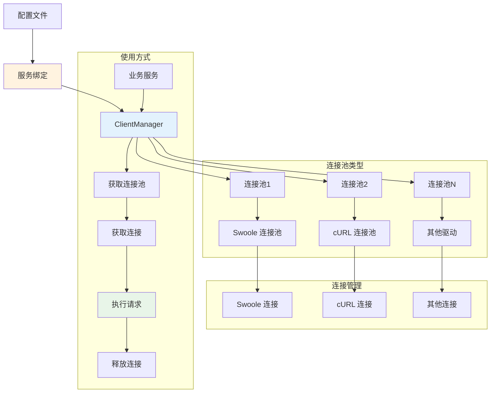

# HTTP 客户端

Hi Framework 提供了完整的 HTTP 客户端功能，基于连接池架构设计，支持多种驱动、命名服务和统一管理。HTTP 客户端系统是构建微服务架构和 API 集成的重要组件，特别适合高并发场景下的外部服务调用。

> **重要设计原则**：
> 1. **连接池架构**：基于连接池管理，支持高并发和连接复用
> 2. **命名服务**：通过命名服务配置，支持多个外部服务端点
> 3. **多驱动支持**：支持 Swoole、cURL 等多种 HTTP 驱动
> 4. **统一管理**：通过 `ClientManager` 统一管理所有客户端连接
> 5. **配置驱动**：基于配置文件的服务绑定，支持环境差异化配置

## 核心架构



## 基础使用

### 1. 通过依赖注入获取客户端

```php
use Hi\Http\Client\ClientProviderInterface;
use Hi\ConnectionPool\ConnectionInterface;

class MessageService
{
    public function __construct(
        private readonly ClientProviderInterface $clientProvider
    ) {}
    
    /**
     * 发送消息到 Voya 服务
     */
    public function sendToVoya(array $messageData): array
    {
        // 获取连接
        $connection = $this->clientProvider->getConnection('service.voya-message');
        
        try {
            // 使用连接发送请求
            $response = $connection->request('POST', '/api/message', [
                'headers' => [
                    'Content-Type' => 'application/json',
                    'Authorization' => 'Bearer ' . $this->getToken()
                ],
                'json' => $messageData
            ]);
            
            return json_decode($response->getBody(), true);
            
        } finally {
            // 释放连接回连接池
            $connection->release();
        }
    }
    
    /**
     * 批量发送消息
     */
    public function sendBatchMessages(array $messages): array
    {
        $results = [];
        
        foreach ($messages as $index => $message) {
            try {
                $connection = $this->clientProvider->getConnection('service.fma-message');
                
                $response = $connection->request('POST', '/api/batch', [
                    'headers' => ['Content-Type' => 'application/json'],
                    'json' => $message
                ]);
                
                $results[$index] = [
                    'success' => true,
                    'data' => json_decode($response->getBody(), true)
                ];
                
            } catch (\Exception $e) {
                $results[$index] = [
                    'success' => false,
                    'error' => $e->getMessage()
                ];
            } finally {
                if (isset($connection)) {
                    $connection->release();
                }
            }
        }
        
        return $results;
    }
}
```

### 2. 直接使用连接池

```php
use Hi\Http\Client\ClientProviderInterface;
use Hi\ConnectionPool\PoolInterface;

class ExternalApiClient
{
    public function __construct(
        private readonly ClientProviderInterface $clientProvider
    ) {}
    
    /**
     * 获取连接池进行自定义操作
     */
    public function getConnectionPool(string $serviceName): PoolInterface
    {
        return $this->clientProvider->getPool('service.' . $serviceName);
    }
    
    /**
     * 健康检查
     */
    public function healthCheck(string $serviceName): bool
    {
        try {
            $pool = $this->getConnectionPool($serviceName);
            $connection = $pool->get();
            
            $response = $connection->request('GET', '/health');
            $isHealthy = $response->getStatusCode() === 200;
            
            $connection->release();
            
            return $isHealthy;
            
        } catch (\Exception $e) {
            return false;
        }
    }
    
    /**
     * 获取服务状态
     */
    public function getServiceStatus(): array
    {
        $services = ['voya-message', 'fma-message', 'ringo-message'];
        $status = [];
        
        foreach ($services as $service) {
            $status[$service] = [
                'healthy' => $this->healthCheck($service),
                'pool_info' => $this->getPoolInfo($service)
            ];
        }
        
        return $status;
    }
    
    private function getPoolInfo(string $serviceName): array
    {
        $pool = $this->getConnectionPool($serviceName);
        
        return [
            'max_open' => $pool->getMaxOpen(),
            'max_idle' => $pool->getMaxIdle(),
            'current_open' => $pool->getCurrentOpen(),
            'current_idle' => $pool->getCurrentIdle()
        ];
    }
}
```

## 驱动支持

### 1. Swoole 驱动

Swoole 驱动基于 Swoole 协程 HTTP 客户端，适合高并发场景：

```php
use Hi\Http\Client\ClientProviderInterface;

class SwooleClientExample
{
    public function __construct(
        private readonly ClientProviderInterface $clientProvider
    ) {}
    
    /**
     * 使用 Swoole 驱动发送请求
     */
    public function sendWithSwoole(): array
    {
        // 确保配置中 driver 设置为 'swoole'
        $connection = $this->clientProvider->getConnection('service.voya-message');
        
        try {
            // Swoole 驱动支持协程并发
            $response = $connection->request('GET', '/api/users', [
                'headers' => [
                    'Accept' => 'application/json',
                    'User-Agent' => 'Hi-Framework/1.0'
                ]
            ]);
            
            return [
                'status_code' => $response->getStatusCode(),
                'headers' => $response->getHeaders(),
                'body' => json_decode($response->getBody(), true)
            ];
            
        } finally {
            $connection->release();
        }
    }
}
```

### 2. cURL 驱动

cURL 驱动基于 PHP 的 cURL 扩展，兼容性更好：

```php
use Hi\Http\Client\ClientProviderInterface;

class CurlClientExample
{
    public function __construct(
        private readonly ClientProviderInterface $clientProvider
    ) {}
    
    /**
     * 使用 cURL 驱动发送请求
     */
    public function sendWithCurl(): array
    {
        // 确保配置中 driver 设置为 'curl'
        $connection = $this->clientProvider->getConnection('service.fma-message');
        
        try {
            $response = $connection->request('POST', '/api/data', [
                'headers' => [
                    'Content-Type' => 'application/json',
                    'X-API-Key' => 'your-api-key'
                ],
                'json' => [
                    'action' => 'create',
                    'data' => ['name' => 'test', 'value' => 123]
                ]
            ]);
            
            return [
                'status_code' => $response->getStatusCode(),
                'body' => json_decode($response->getBody(), true)
            ];
            
        } finally {
            $connection->release();
        }
    }
}
```

## 连接池配置

### 1. 配置参数说明

| 参数名 | 类型 | 默认值 | 说明 |
|--------|------|--------|------|
| **host** | string | - | 服务主机地址（必需） |
| **port** | int | 80/443 | 服务端口（根据 SSL 自动判断） |
| **ssl** | bool | false | 是否使用 SSL 连接 |
| **timeout** | float | 5.0 | 总超时时间（秒） |
| **connect_timeout** | float | 0.5 | 连接超时时间（秒） |
| **write_timeout** | float | 0.5 | 写入超时时间（秒） |
| **read_timeout** | float | 2.0 | 读取超时时间（秒） |
| **keepalive** | bool | true | 是否保持连接 |
| **max_reconnect_attempts** | int | 3 | 最大重连尝试次数 |
| **reconnect_delay** | float | 0.01 | 重连延迟时间（秒） |
| **follow_location** | bool | true | 是否跟随重定向 |
| **max_redirs** | int | 5 | 最大重定向次数 |
| **ssl_verify** | bool | true | 是否验证 SSL 证书 |
| **ssl_cert_file** | string|null | null | SSL 证书文件路径 |
| **ssl_key_file** | string|null | null | SSL 私钥文件路径 |
| **ssl_ca_file** | string|null | null | SSL CA 文件路径 |

### 2. 基础连接参数

基于 `ClientConnectionConfig`，每个服务可以配置以下基础连接参数：

```yaml
service:
  voya-message:
    host: api.sandbox.voya.world
    port: 443
    ssl: true
    driver: swoole
    
    # 基础连接配置
    timeout: 5                    # 总超时时间（秒）
    connect_timeout: 0.5          # 连接超时时间（秒）
    write_timeout: 0.5            # 写入超时时间（秒）
    read_timeout: 2               # 读取超时时间（秒）
    keepalive: true               # 是否保持连接
    
    # 重连配置
    max_reconnect_attempts: 3     # 最大重连尝试次数
    reconnect_delay: 0.01         # 重连延迟时间（秒）
    
    # 重定向配置
    follow_location: true         # 是否跟随重定向
    max_redirs: 5                 # 最大重定向次数
    
    # 认证配置
    username: ""                  # 用户名
    password: ""                  # 密码
    
    # SSL 配置
    ssl_verify: true              # 是否验证 SSL 证书
    ssl_cert_file: null           # SSL 证书文件路径
    ssl_key_file: null            # SSL 私钥文件路径
    ssl_ca_file: null             # SSL CA 文件路径
```

### 3. 连接池管理参数

除了基础连接参数，还可以配置连接池管理参数：

```yaml
service:
  voya-message:
    # ... 基础连接配置 ...
    
    # 连接池管理配置
    max_open: 32                  # 最大连接数
    max_idle: 8                   # 最大空闲连接数
    idle_timeout: 30              # 空闲连接超时时间（秒）
    max_lifetime: 300             # 连接最大生命周期（秒）
    max_get_retries: 100          # 获取连接最大重试次数
    disable_predicting: false     # 是否禁用连接预测
    demand_history: [1, 1, 1, 1, 1] # 需求历史数据
```

## 总结

Hi Framework 的 HTTP 客户端系统提供了强大而灵活的连接池管理功能：

1. **连接池架构**：基于连接池设计，支持高并发和连接复用
2. **命名服务**：通过配置文件管理多个外部服务端点
3. **多驱动支持**：支持 Swoole 和 cURL 两种驱动
4. **统一管理**：通过 `ClientManager` 统一管理所有客户端连接
5. **配置驱动**：基于配置文件的服务绑定，支持环境差异化配置
6. **错误处理**：完善的异常处理和重试机制
7. **监控支持**：连接池状态监控和指标收集

通过合理使用这些功能，可以构建高性能、可靠的 HTTP 客户端应用，特别适合微服务架构中的外部服务调用场景。
