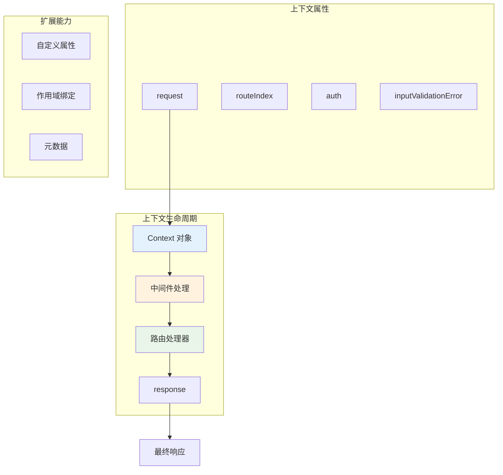

# Context

Hi Framework 的上下文管理系统提供了强大的请求生命周期管理能力，通过 `Context` 对象统一管理请求、响应、路由信息和验证状态。上下文系统是连接请求处理、中间件和响应生成的核心桥梁。

> **重要设计原则**：
> 1. **统一上下文对象**：所有请求处理过程共享同一个 Context 对象
> 2. **生命周期管理**：Context 对象贯穿整个请求处理生命周期
> 3. **状态共享**：中间件、路由处理器和异常处理器可以共享和修改上下文状态
> 4. **类型安全**：支持自定义上下文类扩展，保持类型安全

## 核心架构



## Context 类

### 基础 Context 类

```php
class Context
{
    /**
     * Use for scope name.
     */
    public string $routeIndex;

    /**
     * Is current request need auth.
     */
    public bool $auth;

    /**
     * Input parameters validation error.
     *
     * @var ?\Symfony\Component\Validator\ConstraintViolationListInterface
     */
    public mixed $inputValidationError = null;

    public ServerRequestInterface $request;

    public ResponseInterface $response;
}
```

### 核心属性说明

- **`routeIndex`**：路由索引，格式为 `METHOD:PATH`，用于标识当前请求的路由
- **`auth`**：认证要求标志，指示当前路由是否需要认证
- **`request`**：PSR-7 请求对象，包含所有请求信息
- **`response`**：PSR-7 响应对象，用于构建最终响应
- **`inputValidationError`**：输入验证错误，由框架自动填充

## 基础使用

### 1. 在路由处理器中访问上下文

```php
use Hi\Attributes\Http\Get;
use Hi\Http\Context;

class UserController
{
    #[Get(pattern: '/user/profile')]
    public function getProfile(Context $context): array
    {
        // 访问路由信息
        $routeIndex = $context->routeIndex; // 例如: "GET:/user/profile"
        $needsAuth = $context->auth; // 是否需要认证
        
        // 访问请求信息
        $method = $context->request->getMethod();
        $path = $context->request->getUri()->getPath();
        $headers = $context->request->getHeaders();
        
        // 检查验证错误
        if ($context->inputValidationError) {
            $errors = [];
            foreach ($context->inputValidationError as $violation) {
                $errors[$violation->getPropertyPath()] = $violation->getMessage();
            }
            return ['errors' => $errors];
        }
        
        return [
            'route' => $routeIndex,
            'auth_required' => $needsAuth,
            'method' => $method,
            'path' => $path,
            'user' => ['id' => 1, 'name' => 'John Doe']
        ];
    }
}
```

### 2. 在中间件中使用上下文

```php
use Hi\Attributes\Http\Middleware;
use Hi\Http\Middleware\MiddlewareInterface;
use Hi\Http\Context;

#[Middleware(alias: 'logging')]
class LoggingMiddleware implements MiddlewareInterface
{
    public function handle(Context $context, callable $next): mixed
    {
        $startTime = microtime(true);
        $routeIndex = $context->routeIndex;
        $method = $context->request->getMethod();
        $path = $context->request->getUri()->getPath();
        
        // 记录请求开始
        error_log("Request started: {$method} {$path} [{$routeIndex}]");
        
        // 执行下一个中间件或路由处理器
        $result = $next($context);
        
        // 记录请求完成
        $duration = microtime(true) - $startTime;
        error_log("Request completed: {$method} {$path} - {$duration}s");
        
        return $result;
    }
}
```

## 自定义上下文

### 1. 扩展基础 Context 类

```php
use Hi\Http\Context;
use Psr\Log\LoggerInterface;

class EnhancedContext extends Context
{
    /**
     * 当前用户信息
     */
    public ?User $currentUser = null;
    
    /**
     * 用户权限列表
     */
    public array $permissions = [];
    
    /**
     * 请求元数据
     */
    public array $metadata = [];
    
    /**
     * 请求开始时间
     */
    public float $requestStartTime;
    
    /**
     * 日志记录器
     */
    public LoggerInterface $logger;
    
    public function __construct()
    {
        $this->requestStartTime = microtime(true);
    }
    
    /**
     * 获取请求处理时间
     */
    public function getProcessingTime(): float
    {
        return microtime(true) - $this->requestStartTime;
    }
    
    /**
     * 检查用户是否有指定权限
     */
    public function hasPermission(string $permission): bool
    {
        return in_array($permission, $this->permissions);
    }
    
    /**
     * 添加元数据
     */
    public function addMetadata(string $key, mixed $value): self
    {
        $this->metadata[$key] = $value;
        return $this;
    }
    
    /**
     * 获取元数据
     */
    public function getMetadata(string $key, mixed $default = null): mixed
    {
        return $this->metadata[$key] ?? $default;
    }
}
```

### 2. 注册自定义上下文

```php
use Hi\Http\Application;

$app = new Application();

// 设置自定义上下文类
$app->setBackgroundContext(new EnhancedContext());
```

### 3. 在中间件中填充自定义上下文

```php
use Hi\Attributes\Http\Middleware;
use Hi\Http\Middleware\MiddlewareInterface;
use Hi\Http\Context;
use Infrastructure\External\HeartbeatInterface;
use Infrastructure\External\SourceAppClientInterface;
use Server\User;

#[Middleware(alias: 'scope')]
class ScopeMiddleware implements MiddlewareInterface
{
    protected array $appScopeBindings = [];

    public function __construct()
    {
        // 应用服务绑定配置
        $this->appScopeBindings = [
            'voya' => [
                HeartbeatInterface::class => \construct(VoyaHeartbeatService::class),
                SourceAppClientInterface::class => \construct(VoyaMessageService::class),
            ],
            'bene' => [
                HeartbeatInterface::class => \construct(BeneHeartbeatService::class),
                SourceAppClientInterface::class => \construct(BeneMessageService::class),
            ],
        ];
    }

    public function handle(Context $context, callable $next): mixed
    {
        // 跳过健康检查和指标导出
        if ('GET:/health/alive' === $context->routeIndex) {
            return new Response;
        }
        if ('GET:/internal/metrics/export' === $context->routeIndex) {
            return $next($context);
        }

        // 从请求头获取应用信息
        $rawAppId = $context->request->getHeaderLine('source-app-id');
        $appVersion = $context->request->getHeaderLine('source-app-version');
        $userId = (int) $context->request->getHeaderLine('source-user-id');

        // 兜底：从请求体获取
        if (!$rawAppId) {
            $parsedBody = \json_decode((string) $context->request->getBody(), true);
            $rawAppId = $parsedBody['app_id'] ?? '';
            $appVersion = $parsedBody['version'] ?? '';
            $userId = $parsedBody['uid'] ?? 0;
        }

        // 为应用绑定对应的服务
        $bindings = $this->appScopeBindings[$rawAppId] ?? [];
        $bindings[AppSourceVO::class] = new AppSourceVO($rawAppId, $appVersion);
        $bindings[LoggerInterface::class] = $this->getLogger($context->routeIndex, $userId);
        $bindings[User::class] = new User($userId);

        // 在作用域中执行后续逻辑
        return \scope(
            fn: function () use ($next, $context): mixed {
                try {
                    return $next($context);
                } catch (\Throwable $th) {
                    return $this->exceptionHandler->handle($th, $context);
                }
            },
            bindings: $bindings,
        );
    }
}
```

## 上下文状态管理

### 1. 请求属性管理

```php
use Hi\Http\Context;
use Hi\Attributes\Http\Post;

class RequestAttributeController
{
    #[Post(pattern: '/api/process')]
    public function process(Context $context): array
    {
        // 添加自定义属性到请求
        $context->request = $context->request->withAttribute('processed_at', time());
        $context->request = $context->request->withAttribute('user_agent', $context->request->getHeaderLine('User-Agent'));
        
        // 从请求属性获取值
        $processedAt = $context->request->getAttribute('processed_at');
        $userAgent = $context->request->getAttribute('user_agent');
        
        return [
            'message' => 'Request processed',
            'processed_at' => $processedAt,
            'user_agent' => $userAgent
        ];
    }
}
```

### 2. 响应状态管理

```php
use Hi\Http\Context;
use Hi\Http\Message\Response;
use Hi\Attributes\Http\Get;

class ResponseStateController
{
    #[Get(pattern: '/api/status')]
    public function getStatus(Context $context): Response
    {
        // 修改响应状态
        $context->response = $context->response->withStatus(200);
        
        // 添加响应头部
        $context->response = $context->response->withHeader('X-Request-ID', uniqid());
        $context->response = $context->response->withHeader('X-Processing-Time', $context->getProcessingTime() . 'ms');
        
        // 设置响应体
        $context->response = $context->response->writeBody([
            'status' => 'success',
            'timestamp' => time(),
            'processing_time' => $context->getProcessingTime()
        ]);
        
        return $context->response;
    }
}
```

### 3. 验证错误处理

```php
use Hi\Http\Context;
use Hi\Attributes\Http\Post;
use Symfony\Component\Validator\ConstraintViolationListInterface;

class ValidationController
{
    #[Post(pattern: '/api/validate')]
    public function validate(ValidationDTO $dto, Context $context): array
    {
        // 检查验证错误
        if ($context->inputValidationError instanceof ConstraintViolationListInterface) {
            $errors = [];
            foreach ($context->inputValidationError as $violation) {
                $field = $violation->getPropertyPath();
                $message = $violation->getMessage();
                $errors[$field] = $message;
            }
            
            return [
                'success' => false,
                'errors' => $errors,
                'message' => 'Validation failed'
            ];
        }
        
        // 验证通过，处理业务逻辑
        return [
            'success' => true,
            'message' => 'Validation passed',
            'data' => $dto
        ];
    }
}
```

## 总结

Hi Framework 的上下文管理系统提供了强大而灵活的功能：

1. **统一状态管理**：通过 Context 对象统一管理请求处理过程中的所有状态
2. **生命周期控制**：Context 对象贯穿整个请求处理生命周期
3. **类型安全扩展**：支持自定义上下文类，保持类型安全
4. **作用域管理**：提供强大的作用域绑定和执行机制
5. **中间件集成**：中间件可以轻松访问和修改上下文状态
6. **性能监控**：支持性能指标收集和监控

通过合理的上下文设计和管理，可以构建高性能、可维护的 HTTP 应用程序。
