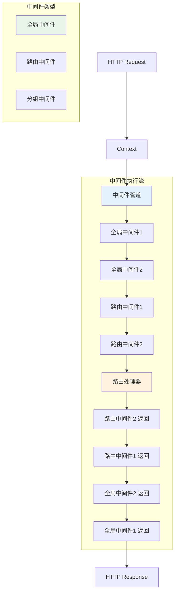

# 中间件系统

Hi Framework 的中间件系统基于 PSR-7 HTTP 消息接口和管道模式，提供了灵活、可组合的请求处理机制。中间件可以在请求到达路由处理器之前和响应返回客户端之前执行任意逻辑。

> **重要设计原则**：
> 1. **中间件必须使用 `#[Middleware]` 注解标记**：只有标记了该注解的类才会被框架识别为中间件
> 2. **推荐使用别名引用**：在路由中使用中间件时，推荐使用别名（alias）进行引用，而不是直接使用类名
> 3. **基于 Context 设计**：中间件使用 `Context` 对象作为参数，而不是传统的 PSR-7 接口

## 核心架构



## 中间件接口

### MiddlewareInterface

```php
interface MiddlewareInterface
{
    /**
     * Process middleware.
     * 
     * @param Context $context Request context
     * @param callable $next Next middleware in the pipeline
     * @return mixed Response or context
     */
    public function handle(Context $context, callable $next): mixed;
}
```

**重要说明**：
- Hi Framework 的中间件接口使用 `Context` 对象，而不是 PSR-7 的 `ServerRequestInterface`
- `Context` 对象包含了请求、响应和路由信息
- 返回值类型为 `mixed`，支持返回响应对象或继续传递上下文

## 中间件注解

### Middleware 注解

```php
/**
 * HTTP middleware class attribute.
 */
#[Attribute(Attribute::TARGET_CLASS)]
class Middleware
{
    /**
     * @param string $alias Alias of the middleware
     */
    public function __construct(public readonly string $alias = '')
    {
    }
}
```

**使用方式**：
- 必须标记在中间件类上
- `alias` 参数用于定义中间件的别名，便于在路由中引用
- 如果不设置别名，则使用类名作为标识符

## 中间件实现

### 1. 基础中间件实现

```php
<?php

namespace Transport\Http\Middleware;

use Hi\Attributes\Http\Middleware;
use Hi\Http\Middleware\MiddlewareInterface;
use Hi\Http\Context;

#[Middleware(alias: 'logging')]
class LoggingMiddleware implements MiddlewareInterface
{
    public function handle(Context $context, callable $next): mixed
    {
        $start = microtime(true);
        $method = $context->request->getMethod();
        $uri = $context->request->getUri()->getPath();
        $routeIndex = $context->routeIndex;
        
        // 请求前处理
        error_log("Request started: {$method} {$uri} [{$routeIndex}]");
        
        // 执行下一个中间件或路由处理器
        $result = $next($context);
        
        // 响应后处理
        $duration = microtime(true) - $start;
        error_log("Request completed: {$method} {$uri} - {$duration}s");
        
        return $result;
    }
}
```

### 2. 认证中间件

```php
<?php

namespace Transport\Http\Middleware;

use Hi\Attributes\Http\Middleware;
use Hi\Http\Middleware\MiddlewareInterface;
use Hi\Http\Context;
use Hi\Http\Message\Response;

#[Middleware(alias: 'auth')]
class AuthMiddleware implements MiddlewareInterface
{
    public function __construct(
        private TokenValidatorInterface $tokenValidator
    ) {}

    public function handle(Context $context, callable $next): mixed
    {
        // 获取认证令牌
        $authHeader = $context->request->getHeaderLine('Authorization');
        
        if (!$authHeader) {
            return $this->unauthorizedResponse('Missing authorization header');
        }

        // 解析 Bearer token
        if (!preg_match('/Bearer\s+(.*)$/i', $authHeader, $matches)) {
            return $this->unauthorizedResponse('Invalid authorization format');
        }

        $token = $matches[1];

        // 验证令牌
        try {
            $user = $this->tokenValidator->validate($token);
        } catch (InvalidTokenException $e) {
            return $this->unauthorizedResponse('Invalid token');
        }

        // 将用户信息添加到请求属性
        $context->request = $context->request->withAttribute('user', $user);
        $context->request = $context->request->withAttribute('user_id', $user->getId());

        return $next($context);
    }

    private function unauthorizedResponse(string $message): Response
    {
        return new Response(
            statusCode: 401,
            body: json_encode(['error' => 'Unauthorized', 'message' => $message]),
            headers: ['Content-Type' => 'application/json']
        );
    }
}
```

### 3. 基于 typing-jupiter 的实际中间件示例

```php
<?php

namespace Transport\Http\Middleware;

use Infrastructure\External\HeartbeatInterface;
use Infrastructure\External\SourceAppClientInterface;
use Server\User;
use Hi\Attributes\Http\Middleware;
use Transport\Http\Context;
use Psr\Http\Message\ResponseInterface;
use Infrastructure\Common\Enum\AppIdEnum;
use Infrastructure\Common\ValueObject\AppSourceVO;
use Infrastructure\External\VoyaHeartbeatService;
use Infrastructure\External\VoyaMessageService;
use Hi\Exception\ExceptionHandler;
use Hi\Http\Message\Response;
use Hi\Kernel\Logger\LoggerFactoryInterface;
use Infrastructure\External\BeneHeartbeatService;
use Infrastructure\External\BeneMessageService;
use Psr\Log\LoggerInterface;

#[Middleware(alias: 'scope')]
class Scope implements MiddlewareInterface
{
    protected LoggerFactoryInterface $loggerFactory;
    protected ExceptionHandler $exceptionHandler;
    protected array $appScopeBindings = [];

    protected const DebugUserIds = [81688950, 91868949];

    public function __construct()
    {
        $this->loggerFactory = \construct(LoggerFactoryInterface::class);
        $this->exceptionHandler = \construct(ExceptionHandler::class);

        // 应用服务绑定配置
        $this->appScopeBindings = [
            AppIdEnum::Voya->value => [
                HeartbeatInterface::class => \construct(VoyaHeartbeatService::class),
                SourceAppClientInterface::class => \construct(VoyaMessageService::class),
            ],
            AppIdEnum::Bene->value => [
                HeartbeatInterface::class => \construct(BeneHeartbeatService::class),
                SourceAppClientInterface::class => \construct(BeneMessageService::class),
            ],
        ];
    }

    public function handle(Context $context, callable $next): mixed
    {
        // 跳过健康检查和指标导出
        if ('GET:/health/alive' === $context->routeIndex) {
            return new Response;
        }
        if ('GET:/internal/metrics/export' === $context->routeIndex) {
            return $next($context);
        }

        // 从请求头获取应用信息
        $rawAppId = $context->request->getHeaderLine('source-app-id');
        $appVersion = $context->request->getHeaderLine('source-app-version');
        $userId = (int) $context->request->getHeaderLine('source-user-id');

        // 兜底：从请求体获取
        if (!$rawAppId) {
            $parsedBody = \json_decode((string) $context->request->getBody(), true);
            $rawAppId = $parsedBody['app_id'] ?? '';
            $appVersion = $parsedBody['version'] ?? '';
            $userId = $parsedBody['uid'] ?? 0;
        }

        $appId = AppIdEnum::from($rawAppId);

        // 为应用绑定对应的服务
        $bindings = $this->appScopeBindings[$rawAppId] ?? [];
        $bindings[AppSourceVO::class] = new AppSourceVO($appId, $appVersion);
        $bindings[LoggerInterface::class] = $this->getLogger($context->routeIndex, $userId);
        $bindings[User::class] = new User($userId);

        // 在作用域中执行后续逻辑
        return \scope(
            fn: function () use ($next, $context): mixed {
                try {
                    return $next($context);
                } catch (\Throwable $th) {
                    return $this->exceptionHandler->handle($th, $context);
                }
            },
            bindings: $bindings,
        );
    }
    
    protected function getLogger(string $routeIndex, int $userId): LoggerInterface
    {
        // 基于用户决定日志等级
        if (\in_array($userId, self::DebugUserIds)) {
            return $this->loggerFactory->get($routeIndex, 'debug', true);
        }

        $level = \config('logger.level');
        $newLogger = false;

        return $this->loggerFactory->get($routeIndex, $level, $newLogger);
    }
}
```

## 中间件注册和配置

### 1. 全局中间件注册

```php
use Hi\Http\Application;

$app = new Application();

// 单个中间件
$app->use(Scope::class);
$app->use(LoggingMiddleware::class);

// 批量注册
$app->uses([
    Scope::class,
    LoggingMiddleware::class,
    AuthMiddleware::class
]);
```

### 2. 基于配置的中间件注册

基于 typing-jupiter 项目的配置：

```yaml
# application.yaml
server:
  host: 0.0.0.0
  port: 9529
  middlewares:
    - \Transport\Http\Middleware\Scope
```

```php
// 在 Kernel 配置中注册
$kernel->load(function (Container $di, ConfigInterface $config): void {
    $di->bindSingleton(Application::class, function () use ($config) {
        $app = new Application();
        
        // 从配置加载中间件
        $middlewares = $config->get('server.middlewares', []);
        $app->uses($middlewares);
        
        return $app;
    });
});
```

### 3. 在路由中使用中间件

#### 类级别中间件

```php
<?php

namespace Transport\Http\Routes;

use Hi\Attributes\Http\Route;
use Hi\Attributes\Http\Get;
use Hi\Attributes\Http\Post;

#[Route(
    prefix: '/api/v1/admin',
    middlewares: ['auth', 'admin'] // 使用别名引用中间件
)]
class AdminController
{
    #[Get(pattern: '/dashboard', desc: '管理面板')]
    public function dashboard(): array
    {
        return ['dashboard' => 'data'];
    }

    #[Post(pattern: '/users', desc: '创建用户')]
    public function createUser(): array
    {
        return ['message' => 'User created'];
    }
}
```

#### 方法级别中间件

```php
<?php

namespace Transport\Http\Routes;

use Hi\Attributes\Http\Route;
use Hi\Attributes\Http\Get;
use Hi\Attributes\Http\Post;

#[Route(prefix: '/api/v1/users')]
class UserController
{
    #[Get(pattern: '/list', desc: '用户列表')]
    public function list(): array
    {
        return ['users' => []];
    }

    #[Post(
        pattern: '/create',
        desc: '创建用户',
        middlewares: ['validation', 'rate_limit'] // 方法级别中间件
    )]
    public function create(): array
    {
        return ['message' => 'User created'];
    }
}
```

## 中间件执行机制

### Pipeline 执行流程

```php
class Pipeline
{
    private array $middlewares = [];

    public function __construct(array $middlewares = [])
    {
        $this->middlewares = $middlewares;
    }

    public function process(Context $context, callable $finalHandler): mixed
    {
        $runner = $this->createRunner($finalHandler);
        
        // 从后往前构建中间件链
        foreach (array_reverse($this->middlewares) as $middleware) {
            $runner = function (Context $ctx) use ($middleware, $runner) {
                if (is_string($middleware)) {
                    $middleware = new $middleware();
                }
                
                if ($middleware instanceof MiddlewareInterface) {
                    return $middleware->handle($ctx, $runner);
                }
                
                throw new InvalidMiddlewareException("Invalid middleware: " . gettype($middleware));
            };
        }

        return $runner($context);
    }

    private function createRunner(callable $finalHandler): callable
    {
        return function (Context $context) use ($finalHandler) {
            return $finalHandler($context);
        };
    }
}
```

## 最佳实践

### 1. 中间件设计原则

- **单一职责**：每个中间件只处理一个关注点
- **无状态**：中间件应该是无状态的，避免实例变量
- **正确调用**：必须调用 `$next($context)` 以继续管道

## 总结

Hi Framework 的中间件系统提供了强大的请求处理能力：

1. **注解驱动**：使用 `#[Middleware]` 注解标记中间件类
2. **别名引用**：推荐在路由中使用别名引用中间件
3. **Context 设计**：基于 `Context` 对象，提供丰富的上下文信息
4. **灵活配置**：支持全局、路由级别和分组级别的中间件配置
5. **高性能**：编译时中间件解析，运行时高效执行

通过合理的中间件设计和配置，可以构建高性能、可维护的 HTTP 应用程序。