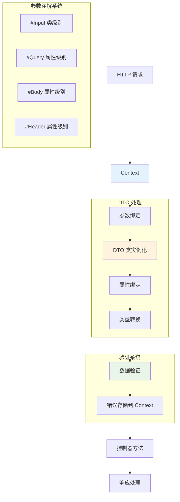

# 请求

Hi Framework 基于 PSR-7 HTTP 消息接口提供了完整的请求处理功能，支持参数绑定、数据验证、文件上传和多种数据格式处理。通过注解驱动的方式，可以优雅地处理各种类型的 HTTP 请求数据。

> **重要设计原则**：
> 1. **参数注解职责分离**：参数注解不能在路由方法直接编写，需要在专门的 DTO 类中维护，实现职责分离
> 2. **基于 Context 设计**：请求处理使用 `Context` 对象，提供丰富的上下文信息和验证错误处理
> 3. **静态路由设计**：所有参数通过查询参数、请求体或请求头传递，不支持动态路径参数

## 核心架构



## 参数注解系统

Hi Framework 提供了丰富的参数注解来简化请求数据的获取和处理。为了职责分离和最佳性能，参数注解应该在专门的 DTO 类中定义，而不是直接在路由方法的参数上使用。

### 1. Query 参数注解

```php
/**
 * Query parameter attribute.
 */
#[Attribute(Attribute::TARGET_PARAMETER)]
class Query
{
    /**
     * @param string|null $name Parameter name, if null use parameter variable name
     */
    public function __construct(
        public readonly ?string $name = null
    ) {}
}
```

使用示例：

```php
use Hi\Attributes\Http\Get;
use Hi\Attributes\Http\Input;
use Hi\Attributes\Http\Query;

#[Input(validate: true)]
class ProductListDTO
{
    #[Query('page', desc: '页码')]
    public int $page = 1;

    #[Query('size', desc: '每页数量')]
    public int $size = 20;

    #[Query('search', desc: '搜索关键词')]
    public string $searchTerm = '';

    #[Query('category', desc: '分类')]
    public ?string $category = null;
}

class ProductController
{
    #[Get(pattern: '/products')]
    public function list(ProductListDTO $dto): array
    {
        return [
            'products' => [],
            'pagination' => [
                'page' => $dto->page,
                'size' => $dto->size,
                'search' => $dto->searchTerm,
                'category' => $dto->category
            ]
        ];
    }
}

// 请求: GET /products?page=2&size=50&search=laptop&category=electronics
```

### 2. Body 参数注解

```php
/**
 * Request body attribute.
 */
#[Attribute(Attribute::TARGET_PARAMETER)]
class Body
{
    /**
     * @param string|null $name Field name in body, if null use entire body
     */
    public function __construct(
        public readonly ?string $name = null
    ) {}
}
```

使用示例：

```php
use Hi\Attributes\Http\Post;
use Hi\Attributes\Http\Input;
use Hi\Attributes\Http\Body;

#[Input(validate: true)]
class CreateUserDTO
{
    #[Body('name', desc: '用户名')]
    public string $name;

    #[Body('email', desc: '邮箱')]
    public string $email;

    #[Body('profile', desc: '用户资料')]
    public ?array $profile = null;
}

#[Input(validate: true)]
class UpdateAvatarDTO
{
    #[Body('user_id', desc: '用户ID')]
    public int $userId;

    #[Body('avatar', desc: '头像数据')]
    public string $avatarBase64;
}

class UserController
{
    #[Post(pattern: '/users')]
    public function create(CreateUserDTO $dto): array
    {
        return [
            'message' => 'User created',
            'user_data' => [
                'name' => $dto->name,
                'email' => $dto->email,
                'profile' => $dto->profile
            ]
        ];
    }

    #[Post(pattern: '/user/avatar')]
    public function updateAvatar(UpdateAvatarDTO $dto): array
    {
        return [
            'message' => 'Avatar updated',
            'user_id' => $dto->userId,
            'avatar_size' => strlen($dto->avatarBase64)
        ];
    }
}

// 请求体示例:
// {
//   "name": "John Doe",
//   "email": "john@example.com",
//   "profile": {
//     "age": 30,
//     "city": "New York"
//   }
// }
```

### 3. Header 参数注解

```php
/**
 * Request header attribute.
 */
#[Attribute(Attribute::TARGET_PARAMETER)]
class Header
{
    /**
     * @param string $name Header name
     */
    public function __construct(
        public readonly string $name
    ) {}
}
```

使用示例：

```php
use Hi\Attributes\Http\Get;
use Hi\Attributes\Http\Input;
use Hi\Attributes\Http\Header;

#[Input(validate: true)]
class UserProfileDTO
{
    #[Header('Authorization', desc: '认证令牌')]
    public string $authorization;

    #[Header('User-Agent', desc: '用户代理')]
    public string $userAgent;

    #[Header('X-Request-ID', desc: '请求ID')]
    public ?string $requestId = null;

    #[Header('Accept-Language', desc: '接受语言')]
    public string $language = 'en';
}

class ApiController
{
    #[Get(pattern: '/api/user/profile')]
    public function getProfile(UserProfileDTO $dto): array
    {
        // 解析 Bearer token
        $token = str_replace('Bearer ', '', $dto->authorization);
        
        return [
            'user' => [],
            'meta' => [
                'token_length' => strlen($token),
                'user_agent' => $dto->userAgent,
                'request_id' => $dto->requestId,
                'language' => $dto->language
            ]
        ];
    }
}
```

## 请求数据格式处理

Hi Framework 通过 `Hi\Http\Message\Decoder` 类自动处理多种请求数据格式，支持 JSON、XML 和 igbinary 格式。框架会根据 `#[Input]` 注解中指定的 `type` 参数自动解析请求体。

### 1. 自动数据解析

框架会自动调用 `Decoder::decode()` 方法来解析请求数据，无需手动处理：

```php
use Hi\Attributes\Http\Post;
use Hi\Attributes\Http\Input;
use Hi\Attributes\Http\Body;

#[Input(validate: true, type: 'json')] // 默认就是 json
class CreateUserDTO
{
    #[Body('name', desc: '用户名')]
    public string $name;

    #[Body('email', desc: '邮箱')]
    public string $email;
}

class UserController
{
    #[Post(pattern: '/users')]
    public function create(CreateUserDTO $dto): array
    {
        // 框架已经自动解析了 JSON 请求体
        // 无需手动调用 json_decode()
        return [
            'message' => 'User created',
            'user_data' => [
                'name' => $dto->name,
                'email' => $dto->email
            ]
        ];
    }
}
```

### 2. 支持的数据格式

#### JSON 格式 (默认)

```php
#[Input(type: 'json')] // 默认值，可省略
class JsonDTO
{
    #[Body('data')]
    public array $data;
}

// 请求体: {"data": {"key": "value"}}
```

#### XML 格式

```php
#[Input(type: 'xml')]
class XmlDTO
{
    #[Body('name')]
    public string $name;
}

// 请求体: <root><name>John</name></root>
```

#### igbinary 格式

```php
#[Input(type: 'igbinary')]
class IgbinaryDTO
{
    #[Body('serialized')]
    public mixed $serialized;
}
```

### 3. 错误处理

框架会自动处理解析错误：

```php
#[Input(type: 'json')]
class ErrorHandlingDTO
{
    #[Body('required_field')]
    public string $requiredField;
}

// 如果发送无效 JSON，框架会自动抛出 JsonException
// 如果发送无效 XML，框架会自动抛出 Exception
```

### 4. 嵌套数据访问

支持通过点号访问嵌套数据：

```php
#[Input(type: 'json')]
class NestedDataDTO
{
    #[Body('user.name')]
    public string $userName;

    #[Body('user.profile.age')]
    public int $userAge;

    #[Body('meta.version')]
    public string $version = '1.0';
}

// 请求体:
// {
//   "user": {
//     "name": "John",
//     "profile": {
//       "age": 30
//     }
//   },
//   "meta": {
//     "version": "2.0"
//   }
// }
```

### 5. 最佳实践

#### 数据格式选择

- **JSON**: 适用于大多数 API 场景（默认推荐）
- **XML**: 适用于需要 XML 格式的集成场景
- **igbinary**: 适用于高性能二进制序列化场景

#### 类型安全

```php
#[Input(type: 'json', validate: true)]
class TypeSafeDTO
{
    #[Body('id')]
    public int $id; // 框架会自动转换为 int 类型

    #[Body('price')]
    public float $price; // 框架会自动转换为 float 类型

    #[Body('active')]
    public bool $active; // 框架会自动转换为 bool 类型
}
```

#### 错误处理

```php
try {
    $response = $router->dispatch($request);
} catch (\JsonException $e) {
    // 处理 JSON 解析错误
    return new Response(400, [], 'Invalid JSON format');
} catch (\Exception $e) {
    // 处理其他解析错误（如 XML）
    return new Response(400, [], 'Invalid request format');
}
```

### 6. 注意事项

1. **Content-Type 匹配**: 确保请求的 `Content-Type` 与 `Input` 注解的 `type` 参数匹配
2. **自动类型转换**: 框架会根据属性类型自动进行类型转换
3. **验证集成**: 结合 `validate: true` 可以启用自动数据验证
4. **性能考虑**: XML 解析比 JSON 慢，igbinary 最快但兼容性较差

## 最佳实践

### 1. 参数验证

- **使用强类型**：尽可能使用具体的类型声明
- **提供默认值**：为可选参数提供合理的默认值
- **验证边界**：检查数值范围和字符串长度

### 2. 安全考虑

- **输入过滤**：对所有输入进行适当的过滤和转义
- **文件上传安全**：限制文件类型、大小和存储位置
- **XXE 防护**：处理 XML 时禁用外部实体

### 3. 性能优化

- **延迟加载**：只在需要时解析请求数据
- **缓存验证结果**：避免重复验证相同数据
- **流式处理**：对大文件使用流式处理

### 4. 错误处理

- **详细日志**：记录详细的错误信息用于调试
- **友好响应**：向客户端返回友好的错误消息
- **状态码规范**：使用正确的 HTTP 状态码