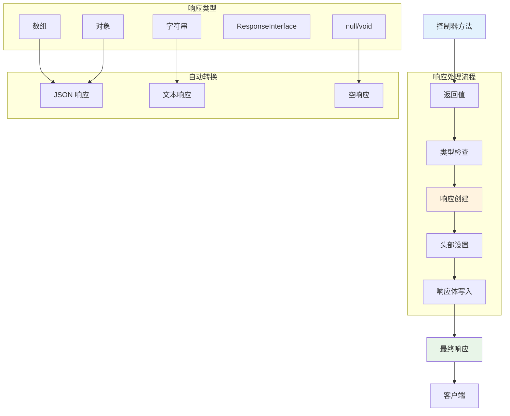

# 响应

Hi Framework 提供了完整的 HTTP 响应处理功能，基于 PSR-7 HTTP 消息接口，支持多种响应类型、状态码管理、头部设置和内容序列化。通过统一的响应接口，可以优雅地处理各种 HTTP 响应场景。

> **重要设计原则**：
> 1. **PSR-7 兼容**：完全遵循 PSR-7 HTTP 消息接口标准
> 2. **灵活响应类型**：支持数组、对象、字符串等多种返回类型自动转换
> 3. **统一状态码管理**：内置标准 HTTP 状态码和原因短语
> 4. **基于 Context 设计**：响应处理与 Context 对象紧密集成

## 核心架构



## 响应接口

### VersatileResponseInterface

Hi Framework 扩展了 PSR-7 的 `ResponseInterface`，提供了更灵活的响应处理能力：

```php
interface VersatileResponseInterface extends ResponseInterface
{
    /**
     * Write response body
     * The implementation class can perform custom data serialization
     */
    public function writeBody(mixed $body): self;
}
```

### Response 类

```php
class Response extends Message implements VersatileResponseInterface
{
    /**
     * @param array<string, string[]|string> $headers
     */
    public function __construct(
        StreamInterface|string $body = '',
        int $statusCode = 200,
        array $headers = [],
        string $protocol = '1.1',
        string $reasonPhrase = '',
    );
    
    public function getStatusCode(): int;
    public function withStatus(int $code, string $reasonPhrase = ''): ResponseInterface;
    public function getReasonPhrase(): string;
    public function writeBody(mixed $body): self;
}
```

## 基础响应处理

### 1. 自动响应类型转换

Hi Framework 会自动将控制器方法的返回值转换为适当的 HTTP 响应：

```php
use Hi\Attributes\Http\Get;
use Hi\Attributes\Http\Post;

class UserController
{
    #[Get(pattern: '/users')]
    public function list(): array
    {
        // 数组自动转换为 JSON 响应
        return [
            'users' => [
                ['id' => 1, 'name' => 'John Doe'],
                ['id' => 2, 'name' => 'Jane Smith']
            ],
            'total' => 2
        ];
    }

    #[Get(pattern: '/user/detail')]
    public function show(Context $ctx): ?array
    {
        $id = (int) ($ctx->getRequest()->getQueryParams()['id'] ?? 0);
        if ($id === 1) {
            // 对象自动转换为 JSON 响应
            return ['id' => 1, 'name' => 'John Doe', 'email' => 'john@example.com'];
        }
        
        // null 自动转换为 404 响应
        return null;
    }

    #[Post(pattern: '/users')]
    public function create(): string
    {
        // 字符串自动转换为文本响应
        return 'User created successfully';
    }

    #[Post(pattern: '/users/batch')]
    public function batchCreate(): void
    {
        // void 自动转换为 204 No Content 响应
        // 执行批量创建逻辑...
    }
}
```

### 2. 显式响应对象

对于需要精确控制的场景，可以直接返回 `Response` 对象：

```php
use Hi\Http\Message\Response;
use Hi\Attributes\Http\Get;
use Hi\Attributes\Http\Post;

class ApiController
{
    #[Get(pattern: '/api/health')]
    public function health(): Response
    {
        return new Response(
            body: json_encode(['status' => 'healthy', 'timestamp' => time()]),
            statusCode: 200,
            headers: [
                'Content-Type' => 'application/json',
                'Cache-Control' => 'no-cache'
            ]
        );
    }

    #[Post(pattern: '/api/upload')]
    public function upload(): Response
    {
        // 自定义状态码和头部
        return new Response(
            body: 'File uploaded successfully',
            statusCode: 201,
            headers: [
                'Content-Type' => 'text/plain',
                'Location' => '/files/123'
            ]
        );
    }
}
```

## 状态码管理

### 1. 标准 HTTP 状态码

Hi Framework 内置了完整的 HTTP 状态码和原因短语：

```php
// 信息响应 (1xx)
100 => 'Continue',
101 => 'Switching Protocols',
102 => 'Processing',
103 => 'Early Hints',

// 成功响应 (2xx)
200 => 'OK',
201 => 'Created',
202 => 'Accepted',
204 => 'No Content',
206 => 'Partial Content',

// 重定向 (3xx)
300 => 'Multiple Choices',
301 => 'Moved Permanently',
302 => 'Found',
304 => 'Not Modified',

// 客户端错误 (4xx)
400 => 'Bad Request',
401 => 'Unauthorized',
403 => 'Forbidden',
404 => 'Not Found',
422 => 'Unprocessable Entity',
429 => 'Too Many Requests',

// 服务器错误 (5xx)
500 => 'Internal Server Error',
501 => 'Not Implemented',
502 => 'Bad Gateway',
503 => 'Service Unavailable',
504 => 'Gateway Timeout'
```

### 2. 状态码使用示例

```php
use Hi\Http\Message\Response;
use Hi\Attributes\Http\Get;
use Hi\Attributes\Http\Post;

class StatusCodeController
{
    #[Get(pattern: '/user/show')]
    public function show(Context $ctx): Response
    {
        $id = (int) ($ctx->getRequest()->getQueryParams()['id'] ?? 0);
        if ($id <= 0) {
            return new Response(
                body: json_encode(['error' => 'Invalid user ID']),
                statusCode: 400
            );
        }

        $user = $this->findUser($id);
        if (!$user) {
            return new Response(
                body: json_encode(['error' => 'User not found']),
                statusCode: 404
            );
        }

        return new Response(
            body: json_encode($user),
            statusCode: 200
        );
    }

    #[Post(pattern: '/users')]
    public function create(): Response
    {
        try {
            $user = $this->createUser();
            return new Response(
                body: json_encode(['id' => $user->id, 'message' => 'User created']),
                statusCode: 201,
                headers: ['Location' => "/users/{$user->id}"]
            );
        } catch (ValidationException $e) {
            return new Response(
                body: json_encode(['errors' => $e->getErrors()]),
                statusCode: 422
            );
        } catch (\Exception $e) {
            return new Response(
                body: json_encode(['error' => 'Internal server error']),
                statusCode: 500
            );
        }
    }
}
```

## 响应头部管理

### 1. 常用响应头部

```php
use Hi\Http\Message\Response;
use Hi\Attributes\Http\Get;

class HeaderController
{
    #[Get(pattern: '/api/data')]
    public function getData(): Response
    {
        return new Response(
            body: json_encode(['data' => 'some data']),
            statusCode: 200,
            headers: [
                'Content-Type' => 'application/json',
                'Cache-Control' => 'max-age=3600',
                'ETag' => '"abc123"',
                'X-Request-ID' => uniqid(),
                'Access-Control-Allow-Origin' => '*'
            ]
        );
    }

    #[Get(pattern: '/download/file')]
    public function downloadFile(): Response
    {
        return new Response(
            body: 'file content...',
            statusCode: 200,
            headers: [
                'Content-Type' => 'application/octet-stream',
                'Content-Disposition' => 'attachment; filename="document.pdf"',
                'Content-Length' => '1234'
            ]
        );
    }
}
```

### 2. 动态头部设置

```php
use Hi\Http\Message\Response;
use Hi\Attributes\Http\Get;

class DynamicHeaderController
{
    #[Get(pattern: '/api/version')]
    public function getVersion(): Response
    {
        $response = new Response(
            body: json_encode(['version' => '1.0.0']),
            statusCode: 200
        );

        // 动态添加头部
        $response = $response->withHeader('X-API-Version', '1.0.0');
        $response = $response->withHeader('X-Response-Time', microtime(true) . 'ms');
        
        // 添加多个值到同一个头部
        $response = $response->withHeader('X-Custom-Headers', 'value1');
        $response = $response->withAddedHeader('X-Custom-Headers', 'value2');

        return $response;
    }
}
```

## 内容类型处理

### 1. JSON 响应

```php
use Hi\Attributes\Http\Get;
use Hi\Attributes\Http\Post;

class JsonController
{
    #[Get(pattern: '/api/users')]
    public function list(): array
    {
        // 自动转换为 JSON 响应，Content-Type: application/json
        return [
            'success' => true,
            'data' => [
                ['id' => 1, 'name' => 'John'],
                ['id' => 2, 'name' => 'Jane']
            ],
            'pagination' => [
                'page' => 1,
                'size' => 20,
                'total' => 2
            ]
        ];
    }

    #[Post(pattern: '/api/users')]
    public function create(): array
    {
        // 创建用户逻辑...
        
        return [
            'success' => true,
            'message' => 'User created successfully',
            'data' => [
                'id' => 123,
                'name' => 'New User'
            ]
        ];
    }
}
```

### 2. 文本响应

```php
use Hi\Attributes\Http\Get;
use Hi\Http\Message\Response;

class TextController
{
    #[Get(pattern: '/health')]
    public function health(): string
    {
        // 自动转换为文本响应，Content-Type: text/plain
        return 'OK';
    }

    #[Get(pattern: '/robots.txt')]
    public function robots(): Response
    {
        return new Response(
            body: "User-agent: *\nDisallow: /admin/\nAllow: /",
            statusCode: 200,
            headers: ['Content-Type' => 'text/plain']
        );
    }
}
```

### 3. HTML 响应

```php
use Hi\Attributes\Http\Get;
use Hi\Http\Message\Response;

class HtmlController
{
    #[Get(pattern: '/welcome')]
    public function welcome(): Response
    {
        $html = '<!DOCTYPE html>
        <html>
        <head>
            <title>Welcome</title>
        </head>
        <body>
            <h1>Welcome to Hi Framework</h1>
            <p>This is a simple HTML response.</p>
        </body>
        </html>';

        return new Response(
            body: $html,
            statusCode: 200,
            headers: ['Content-Type' => 'text/html; charset=utf-8']
        );
    }
}
```

## 文件响应

### 1. 文件下载

```php
use Hi\Attributes\Http\Get;
use Hi\Http\Message\Response;
use Hi\Http\Message\Stream;

class FileController
{
    #[Get(pattern: '/download/file')]
    public function download(Context $ctx): Response
    {
        $filename = $ctx->getRequest()->getQueryParams()['filename'] ?? '';
        if (empty($filename)) {
            return new Response(
                body: json_encode(['error' => 'Filename is required']),
                statusCode: 400
            );
        }
        $filePath = "/var/www/uploads/{$filename}";
        
        if (!file_exists($filePath)) {
            return new Response(
                body: json_encode(['error' => 'File not found']),
                statusCode: 404
            );
        }

        $fileSize = filesize($filePath);
        $mimeType = mime_content_type($filePath);

        return new Response(
            body: new Stream(fopen($filePath, 'r')),
            statusCode: 200,
            headers: [
                'Content-Type' => $mimeType,
                'Content-Disposition' => "attachment; filename=\"{$filename}\"",
                'Content-Length' => $fileSize,
                'Cache-Control' => 'no-cache'
            ]
        );
    }
}
```

### 2. 图片响应

```php
use Hi\Attributes\Http\Get;
use Hi\Http\Message\Response;

class ImageController
{
    #[Get(pattern: '/image/show')]
    public function show(Context $ctx): Response
    {
        $id = $ctx->getRequest()->getQueryParams()['id'] ?? '';
        if (empty($id)) {
            return new Response(
                body: json_encode(['error' => 'Image ID is required']),
                statusCode: 400
            );
        }
        $imagePath = "/var/www/images/{$id}.jpg";
        
        if (!file_exists($imagePath)) {
            return new Response(
                body: json_encode(['error' => 'Image not found']),
                statusCode: 404
            );
        }

        $imageData = file_get_contents($imagePath);
        
        return new Response(
            body: $imageData,
            statusCode: 200,
            headers: [
                'Content-Type' => 'image/jpeg',
                'Cache-Control' => 'max-age=86400',
                'ETag' => md5($imageData)
            ]
        );
    }
}
```

## 错误响应处理

### 1. 统一错误响应格式

```php
use Hi\Http\Message\Response;
use Hi\Attributes\Http\Get;

class ErrorController
{
    #[Get(pattern: '/api/error/demonstrate')]
    public function demonstrateError(Context $ctx): Response
    {
        $type = $ctx->getRequest()->getQueryParams()['type'] ?? 'generic';
        return match($type) {
            'validation' => new Response(
                body: json_encode([
                    'success' => false,
                    'error' => 'Validation Error',
                    'code' => 'VALIDATION_FAILED',
                    'message' => 'The provided data is invalid',
                    'details' => [
                        'field' => 'email',
                        'message' => 'Invalid email format'
                    ]
                ]),
                statusCode: 422
            ),
            
            'not_found' => new Response(
                body: json_encode([
                    'success' => false,
                    'error' => 'Not Found',
                    'code' => 'RESOURCE_NOT_FOUND',
                    'message' => 'The requested resource was not found'
                ]),
                statusCode: 404
            ),
            
            'unauthorized' => new Response(
                body: json_encode([
                    'success' => false,
                    'error' => 'Unauthorized',
                    'code' => 'ACCESS_DENIED',
                    'message' => 'Authentication required'
                ]),
                statusCode: 401
            ),
            
            default => new Response(
                body: json_encode([
                    'success' => false,
                    'error' => 'Internal Server Error',
                    'code' => 'INTERNAL_ERROR',
                    'message' => 'An unexpected error occurred'
                ]),
                statusCode: 500
            )
        };
    }
}
```

### 2. 异常响应处理

```php
use Hi\Http\Message\Response;
use Hi\Attributes\Http\Post;

class ExceptionController
{
    #[Post(pattern: '/api/risky-operation')]
    public function riskyOperation(): Response
    {
        try {
            // 执行可能有风险的操作
            $result = $this->performRiskyOperation();
            
            return new Response(
                body: json_encode(['success' => true, 'result' => $result]),
                statusCode: 200
            );
            
        } catch (ValidationException $e) {
            return new Response(
                body: json_encode([
                    'success' => false,
                    'error' => 'Validation Error',
                    'message' => $e->getMessage(),
                    'details' => $e->getErrors()
                ]),
                statusCode: 422
            );
            
        } catch (NotFoundException $e) {
            return new Response(
                body: json_encode([
                    'success' => false,
                    'error' => 'Not Found',
                    'message' => $e->getMessage()
                ]),
                statusCode: 404
            );
            
        } catch (\Exception $e) {
            // 记录错误日志
            error_log($e->getMessage());
            
            return new Response(
                body: json_encode([
                    'success' => false,
                    'error' => 'Internal Server Error',
                    'message' => 'An unexpected error occurred'
                ]),
                statusCode: 500
            );
        }
    }
}
```

## 基于 typing-jupiter 的实际使用

### 1. 标准 API 响应格式

```php
use Hi\Attributes\Http\Post;
use Hi\Attributes\Http\Route;

#[Route(prefix: '/api/v1/internal/jupiter', auth: false, desc: '私聊路由')]
class ChatMatchingController
{
    #[Post('/god-match', desc: '爱神牵线触发')]
    public function triggerCupid(ParticipantDTO $dto): array
    {
        // 在 worker 中执行
        \task(\Transport\Task\PrivateChatMatchRequestTrigger::class, ['dto' => $dto]);
        \task(\Transport\Task\PrivateChatMatchAwaitTrigger::class, ['dto' => $dto]);

        // 返回标准格式的响应
        return [
            'code' => 1,
            'message' => 'Match trigger initiated',
            'data' => [
                'user_id' => $dto->userId,
                'status' => 'processing'
            ]
        ];
    }

    #[Post('/match-chat/state', desc: '获取牵线状态')]
    public function matchState(ChatMatchDispatchService $service, MatchChatMakingStasteDTO $dto): ?array
    {
        $state = $service->getState($dto);
        
        if (!$state) {
            return null; // 自动转换为 404 响应
        }
        
        return [
            'code' => 1,
            'data' => $state
        ];
    }
}
```

### 2. 健康检查响应

```php
use Hi\Http\Message\Response;

class HealthController
{
    #[Get(pattern: '/health/alive')]
    public function alive(): Response
    {
        return new Response(
            body: json_encode([
                'status' => 'healthy',
                'timestamp' => time(),
                'service' => 'typing-jupiter',
                'version' => '1.0.0'
            ]),
            statusCode: 200,
            headers: [
                'Content-Type' => 'application/json',
                'Cache-Control' => 'no-cache'
            ]
        );
    }

    #[Get(pattern: '/internal/metrics/export')]
    public function metrics(): Response
    {
        $metrics = [
            'requests_total' => 1000,
            'requests_success' => 950,
            'requests_error' => 50,
            'response_time_avg' => 150.5
        ];

        return new Response(
            body: json_encode($metrics),
            statusCode: 200,
            headers: ['Content-Type' => 'application/json']
        );
    }
}
```

## 响应中间件

### 1. 响应转换中间件

```php
use Hi\Http\Middleware\MiddlewareInterface;
use Hi\Http\Context;

#[Middleware(alias: 'response_transform')]
class ResponseTransformMiddleware implements MiddlewareInterface
{
    public function handle(Context $context, callable $next): mixed
    {
        $result = $next($context);
        
        // 如果返回的是数组或对象，转换为标准格式
        if (is_array($result) || is_object($result)) {
            $transformed = [
                'success' => true,
                'data' => $result,
                'timestamp' => time(),
                'request_id' => uniqid()
            ];
            
            return $transformed;
        }
        
        return $result;
    }
}
```

### 2. 响应压缩中间件

```php
use Hi\Http\Middleware\MiddlewareInterface;
use Hi\Http\Context;
use Hi\Http\Message\Response;

#[Middleware(alias: 'response_compress')]
class ResponseCompressMiddleware implements MiddlewareInterface
{
    public function handle(Context $context, callable $next): mixed
    {
        $result = $next($context);
        
        // 如果返回的是 Response 对象，检查是否需要压缩
        if ($result instanceof Response) {
            $acceptEncoding = $context->request->getHeaderLine('Accept-Encoding');
            
            if (str_contains($acceptEncoding, 'gzip')) {
                $body = $result->getBody()->getContents();
                $compressed = gzencode($body);
                
                $response = new Response(
                    body: $compressed,
                    statusCode: $result->getStatusCode(),
                    headers: array_merge(
                        $result->getHeaders(),
                        [
                            'Content-Encoding' => 'gzip',
                            'Content-Length' => strlen($compressed)
                        ]
                    )
                );
                
                return $response;
            }
        }
        
        return $result;
    }
}
```

## 最佳实践

### 1. 响应设计原则

- **一致性**：保持响应格式的一致性，使用统一的成功/失败结构
- **状态码规范**：使用正确的 HTTP 状态码表示响应状态
- **内容类型**：根据内容设置正确的 `Content-Type` 头部
- **缓存控制**：合理设置缓存头部，提高性能

### 2. 性能优化

```php
#[Middleware(alias: 'response_cache')]
class ResponseCacheMiddleware implements MiddlewareInterface
{
    public function handle(Context $context, callable $next): mixed
    {
        $result = $next($context);
        
        if ($result instanceof Response) {
            $path = $context->request->getUri()->getPath();
            
            // 为静态资源设置缓存
            if (str_starts_with($path, '/static/') || str_starts_with($path, '/images/')) {
                $result = $result->withHeader('Cache-Control', 'max-age=86400, public');
                $result = $result->withHeader('ETag', md5($result->getBody()->getContents()));
            }
            
            // 为 API 响应设置适当的缓存策略
            if (str_starts_with($path, '/api/')) {
                $result = $result->withHeader('Cache-Control', 'no-cache, must-revalidate');
            }
        }
        
        return $result;
    }
}
```

### 3. 错误处理

```php
#[Middleware(alias: 'error_handler')]
class ErrorHandlerMiddleware implements MiddlewareInterface
{
    public function handle(Context $context, callable $next): mixed
    {
        try {
            return $next($context);
        } catch (\Throwable $e) {
            // 记录错误
            error_log($e->getMessage());
            
            // 返回友好的错误响应
            return new Response(
                body: json_encode([
                    'success' => false,
                    'error' => 'Internal Server Error',
                    'message' => 'An unexpected error occurred',
                    'request_id' => uniqid()
                ]),
                statusCode: 500,
                headers: ['Content-Type' => 'application/json']
            );
        }
    }
}
```

## 总结

Hi Framework 的响应处理系统提供了强大而灵活的功能：

1. **自动类型转换**：支持数组、对象、字符串等类型的自动响应转换
2. **PSR-7 兼容**：完全遵循 PSR-7 HTTP 消息接口标准
3. **状态码管理**：内置完整的 HTTP 状态码和原因短语
4. **灵活头部设置**：支持动态设置和修改响应头部
5. **多种内容类型**：支持 JSON、文本、HTML、文件等多种响应类型
6. **错误处理**：统一的错误响应格式和异常处理机制

通过合理的响应设计和配置，可以构建高性能、用户友好的 HTTP 服务。
