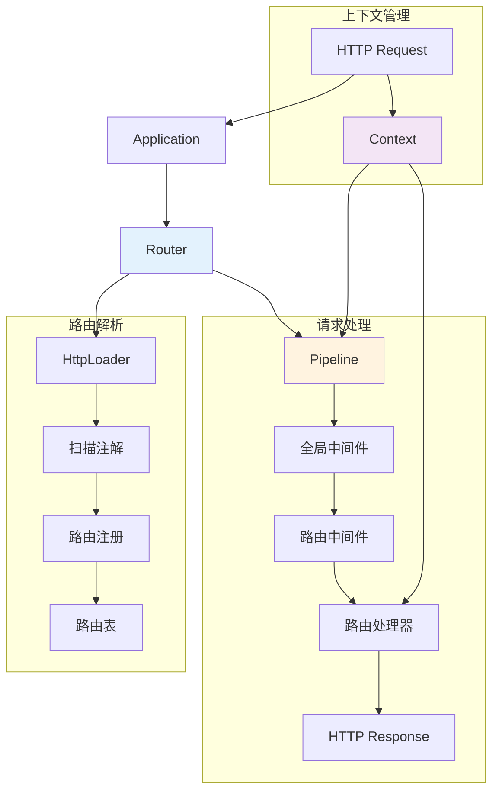

# 路由系统

Hi Framework 提供了强大而灵活的路由系统，支持基于注解的声明式路由定义、中间件集成、参数绑定和多种运行时环境。路由系统是 HTTP 服务的核心，负责将 HTTP 请求分发到相应的处理程序。

> **重要设计原则**：
> 1. **静态路由设计**：为了最佳性能，路由路径不支持动态参数（如 `/users/{id}`），所有参数通过查询参数、请求体或请求头传递
> 2. **参数注解职责分离**：参数注解不能在路由方法直接编写，需要在专门的 DTO 类中维护，实现职责分离

## 核心架构



## Application 接口

### ApplicationInterface

```php
interface ApplicationInterface
{
    /**
     * Register global middleware.
     *
     * @param callable|class-string $middleware
     */
    public function use(callable|string $middleware): self;

    /**
     * Register global middlewares.
     *
     * @param array<callable|class-string> $middlewares
     */
    public function uses(array $middlewares): self;

    /**
     * Set route not found handle.
     *
     * @param callable $handler
     */
    public function notFound(callable $handler): self;

    /**
     * Set HTTP process throw handle.
     *
     * @param callable $handler
     */
    public function throw(callable $handler): self;

    /**
     * Set HTTP request context class.
     */
    public function setBackgroundContext(Context $class): self;

    /**
     * Return current router.
     */
    public function getRouter(): RouterInterface;

    /**
     * Set runtime server.
     */
    public function setRuntime(ServerInterface $server): self;

    /**
     * Return runtime server.
     */
    public function getRuntime(): ServerInterface;

    /**
     * Start HTTP server by specified port and host.
     */
    public function listen(int $port = 0, string $host = ''): void;
}
```

## RouterInterface

```php
interface RouterInterface
{
    /**
     * Register GET route.
     *
     * @param callable $handler
     */
    public function get(string $pattern, callable $handler, ?Extend $extend = null): void;

    /**
     * Register POST route.
     *
     * @param callable $handler
     */
    public function post(string $pattern, callable $handler, ?Extend $extend = null): void;

    /**
     * Register PUT route.
     *
     * @param callable $handler
     */
    public function put(string $pattern, callable $handler, ?Extend $extend = null): void;

    /**
     * Register DELETE route.
     *
     * @param callable $handler
     */
    public function delete(string $pattern, callable $handler, ?Extend $extend = null): void;

    /**
     * Register HEAD route.
     *
     * @param callable $handler
     */
    public function head(string $pattern, callable $handler, ?Extend $extend = null): void;

    /**
     * Register OPTIONS route.
     *
     * @param callable $handler
     */
    public function options(string $pattern, callable $handler, ?Extend $extend = null): void;

    /**
     * Register PATCH route.
     *
     * @param callable $handler
     */
    public function patch(string $pattern, callable $handler, ?Extend $extend = null): void;

    /**
     * Register route group.
     *
     * @param callable $handler
     */
    public function group(string $prefix, callable $handler, ?Extend $extend = null): void;

    /**
     * Set HTTP process throw handle.
     */
    public function setThrowHandler(callable|ExceptionHandlerInterface $handler): void;

    /**
     * Set route process context class.
     */
    public function setBackgroundContext(Context $class): void;

    /**
     * Register 404 handle.
     *
     * When request not match any route this handle will be called
     * If not set, default handle will be used
     *
     * @param callable $handler
     */
    public function setNotFoundHandler(callable $handler): void;

    /**
     * Append middlewares.
     *
     * @param array<callable|class-string> $middlewares
     */
    public function appendMiddlewares(array $middlewares): void;

    /**
     * Get all routes.
     *
     * @return array<string, Route>
     */
    public function getRoutes(): array;

    /**
     * Boot before dispatch.
     *
     * @param bool $purge If true, when loaded clear all routes
     */
    public function boot(bool $purge = true): self;

    /**
     * Dispatch request and execute route.
     */
    public function dispatch(string $method, string $pattern, ServerRequestInterface $request): ResponseInterface;
}
```

## 基础用法

### 1. 创建 HTTP 应用

```php
use Hi\Http\Application;
use Psr\Http\Message\ServerRequestInterface;

// 创建应用实例
$app = new Application();

// 基本路由定义
$app->get('/hello', function () {
    return ['message' => 'Hello World!'];
});

$app->post('/user', function (ServerRequestInterface $request) {
    $data = json_decode($request->getBody()->getContents(), true);
    return ['message' => 'User created', 'data' => $data];
});

// 启动服务器
echo "Server starting at http://0.0.0.0:8080\n";
$app->listen(8080, '0.0.0.0');
```

### 2. 支持的 HTTP 方法

```php
// GET 请求
$app->get('/users', function () {
    return ['users' => []];
});

// POST 请求
$app->post('/users', function () {
    return ['message' => 'User created'];
});

// PUT 请求
$app->put('/user/update', function (ServerRequestInterface $request) {
    $id = $request->getQueryParams()['id'] ?? null;
    return ['message' => "User {$id} updated"];
});

// DELETE 请求
$app->delete('/user/delete', function (ServerRequestInterface $request) {
    $id = $request->getQueryParams()['id'] ?? null;
    return ['message' => "User {$id} deleted"];
});

// PATCH 请求
$app->patch('/user/patch', function (ServerRequestInterface $request) {
    $id = $request->getQueryParams()['id'] ?? null;
    return ['message' => "User {$id} patched"];
});

// HEAD 请求
$app->head('/user/status', function (ServerRequestInterface $request) {
    $id = $request->getQueryParams()['id'] ?? null;
    return new Response(200);
});

// OPTIONS 请求
$app->options('/users', function () {
    return new Response(200, ['Allow' => 'GET,POST,PUT,DELETE']);
});
```

### 3. 静态路由设计

Hi Framework 为了获得最佳性能，采用静态路由设计，不支持动态参数：

```php
// ✅ 正确：静态路由
$app->get('/users', function () {
    return ['users' => []];
});

$app->get('/user/profile', function () {
    return ['profile' => []];
});

$app->get('/api/v1/products', function () {
    return ['products' => []];
});

// ❌ 错误：不支持动态参数
// $app->get('/user/{id}', function (int $id) {
//     return ['user_id' => $id];
// });

// ✅ 替代方案：使用查询参数
$app->get('/user', function (ServerRequestInterface $request) {
    $id = $request->getQueryParams()['id'] ?? null;
    return ['user_id' => $id];
});

// ✅ 或者为每个具体路径定义路由（适用于固定且数量有限的场景）
$app->get('/user/1', function () { return ['user_id' => 1]; });
$app->get('/user/2', function () { return ['user_id' => 2]; });

// ✅ 推荐：使用查询参数处理动态 ID
$app->get('/user', function (ServerRequestInterface $request) {
    $id = $request->getQueryParams()['id'] ?? null;
    return ['user_id' => $id];
});
```

### 4. 路由分组

```php
// 基本分组
$app->group('/api/v1', function (RouterInterface $router) {
    $router->get('/users', function () {
        return ['users' => []];
    });
    
    $router->post('/users', function () {
        return ['message' => 'User created'];
    });
});

// 带扩展配置的分组
$extend = new Extend(
    middlewares: [AuthMiddleware::class],
    prefix: '/admin'
);

$app->group('/api', function (RouterInterface $router) {
    $router->get('/dashboard', function () {
        return ['dashboard' => 'data'];
    });
}, $extend);
```

## 注解路由

Hi Framework 支持强大的注解路由系统，使路由定义更加声明式和组织化。

### 1. 路由注解

#### @Route - 类级别注解

```php
use Hi\Attributes\Http\Route;

/**
 * HTTP route class attribute.
 */
#[Attribute(Attribute::TARGET_CLASS)]
class Route
{
    /**
     * @param string       $prefix      Routing prefix, all methods of this type will automatically add this prefix to the route
     * @param string       $desc        Route description
     * @param array|string $middlewares Middlewares
     * @param bool         $auth        Need authentication
     * @param string       $cors        Route cors policy(middleware alias)
     * @param string       $owner       Route owner
     * @param int          $priority    Route priority for sorting, low priority routes will be sorted to the end of the route list
     */
    public function __construct(
        public readonly string $prefix = '',
        public readonly string $desc = '',
        public readonly array|string $middlewares = [],
        public readonly ?bool $auth = null,
        public readonly string $cors = '',
        public readonly string $owner = '',
        public readonly int $priority = 0,
    );
}
```

#### HTTP 方法注解

```php
/**
 * HTTP route action attribute
 * Using it means supporting all HTTP request methods.
 */
#[Attribute(Attribute::TARGET_METHOD)]
class Any
{
    /**
     * @param string       $pattern     Route pattern
     * @param string       $desc        Route description
     * @param array|string $middlewares Route middlewares
     * @param bool|null    $auth        Route need authentication
     * @param string       $cors        Route cors policy(middleware alias)
     * @param string       $owner       Route owner
     */
    public function __construct(
        public readonly string $pattern,
        public readonly string $desc,
        public readonly array|string $middlewares = [],
        public readonly ?bool $auth = null,
        public readonly string $cors = '',
        public readonly string $owner = '',
    );
}

// 继承自 Any 的具体 HTTP 方法注解
class Get extends Any { protected string $method = 'get'; }
class Post extends Any { protected string $method = 'post'; }
class Put extends Any { protected string $method = 'put'; }
class Delete extends Any { protected string $method = 'delete'; }
class Patch extends Any { protected string $method = 'patch'; }
class Head extends Any { protected string $method = 'head'; }
class Options extends Any { protected string $method = 'options'; }
```

### 2. 使用注解定义路由

```php
<?php

namespace App\Http\Controller;

use Hi\Attributes\Http\Route;
use Hi\Attributes\Http\Get;
use Hi\Attributes\Http\Post;
use Hi\Attributes\Http\Put;
use Hi\Attributes\Http\Delete;
use Psr\Http\Message\ServerRequestInterface;

#[Route(
    prefix: '/api/v1/users',
    desc: '用户管理接口',
    middlewares: [AuthMiddleware::class],
    auth: true
)]
class UserController
{
    #[Get(
        pattern: '',
        desc: '获取用户列表'
    )]
    public function list(ServerRequestInterface $request): array
    {
        $page = $request->getQueryParams()['page'] ?? 1;
        return [
            'users' => [],
            'pagination' => ['page' => $page]
        ];
    }

    #[Get(
        pattern: '/show',
        desc: '获取用户详情'
    )]
    public function show(ServerRequestInterface $request): array
    {
        $id = $request->getQueryParams()['id'] ?? null;
        return ['user' => ['id' => $id, 'name' => 'John Doe']];
    }

    #[Post(
        pattern: '',
        desc: '创建用户',
        middlewares: [ValidateMiddleware::class]
    )]
    public function create(ServerRequestInterface $request): array
    {
        $data = json_decode($request->getBody()->getContents(), true);
        return ['message' => 'User created', 'id' => 123];
    }

    #[Put(
        pattern: '/update',
        desc: '更新用户'
    )]
    public function update(ServerRequestInterface $request): array
    {
        $id = $request->getQueryParams()['id'] ?? null;
        $data = json_decode($request->getBody()->getContents(), true);
        return ['message' => "User {$id} updated"];
    }

    #[Delete(
        pattern: '/delete',
        desc: '删除用户'
    )]
    public function delete(ServerRequestInterface $request): array
    {
        $id = $request->getQueryParams()['id'] ?? null;
        return ['message' => "User {$id} deleted"];
    }
}
```

### 3. 参数注解

Hi Framework 为了职责分离和最佳性能，参数注解不能在路由方法直接编写，需要在专门的 DTO 类中维护：

```php
use Hi\Attributes\Http\Input;
use Hi\Attributes\Http\Body;
use Hi\Attributes\Http\Query;
use Hi\Attributes\Http\Header;

// ✅ 正确：在专门的 DTO 类中定义参数注解
#[Input(validate: true)]
class ProductListDTO
{
    #[Query('page', desc: '页码')]
    public int $page = 1;

    #[Query('size', desc: '每页数量')]
    public int $size = 20;

    #[Query('search', desc: '搜索关键词')]
    public string $search = '';

    #[Header('X-Client-Version', desc: '客户端版本')]
    public string $clientVersion = '1.0.0';
}

#[Input(validate: true)]
class ProductCreateDTO
{
    #[Body('name', desc: '产品名称')]
    public string $name;

    #[Body('price', desc: '产品价格')]
    public float $price;

    #[Body('description', desc: '产品描述')]
    public string $description = '';
}

#[Route(prefix: '/')]
class ProductController
{
    #[Get(pattern: '/products')]
    public function list(ProductListDTO $dto): array
    {
        return [
            'products' => [],
            'pagination' => ['page' => $dto->page, 'size' => $dto->size],
            'search' => $dto->search,
            'client_version' => $dto->clientVersion
        ];
    }

    #[Post(pattern: '/products')]
    public function create(ProductCreateDTO $dto): array
    {
        return [
            'message' => 'Product created',
            'data' => $dto
        ];
    }

    // ✅ 正确：使用查询参数获取 ID，而不是路径参数
    #[Get(pattern: '/product')]
    public function show(ServerRequestInterface $request): array
    {
        $id = $request->getQueryParams()['id'] ?? null;
        return [
            'product' => ['id' => $id],
            'message' => 'Product details'
        ];
    }
}
```

## 中间件集成

### 1. 全局中间件

```php
// 注册全局中间件
$app->use(CorsMiddleware::class);
$app->use(function (ServerRequestInterface $request, callable $next) {
    // 记录请求
    $start = microtime(true);
    $response = $next($request);
    $duration = microtime(true) - $start;
    
    error_log("Request processed in {$duration}s");
    return $response;
});

// 批量注册中间件
$app->uses([
    CorsMiddleware::class,
    AuthMiddleware::class,
    LoggingMiddleware::class
]);
```

### 2. 路由级别中间件

```php
// 单个路由中间件
$extend = new Extend(middlewares: [AuthMiddleware::class]);
$app->get('/admin/dashboard', function () {
    return 'Admin Panel';
}, $extend);

// 注解方式
#[Route(middlewares: [AuthMiddleware::class, AdminMiddleware::class])]
class AdminController
{
    #[Get(
        pattern: '/dashboard',
        middlewares: [CacheMiddleware::class]
    )]
    public function dashboard(): array
    {
        return ['dashboard' => 'data'];
    }
}
```

## 异常处理

### 1. 全局异常处理

```php
$app->throw(function (\Throwable $e, ServerRequestInterface $request) {
    return new Response(
        statusCode: 500,
        body: json_encode([
            'error' => 'Internal Server Error',
            'message' => $e->getMessage(),
            'code' => $e->getCode()
        ]),
        headers: ['Content-Type' => 'application/json']
    );
});
```

### 2. 404 处理

```php
$app->notFound(function (ServerRequestInterface $request) {
    return new Response(
        statusCode: 404,
        body: json_encode([
            'error' => 'Not Found',
            'path' => $request->getUri()->getPath()
        ]),
        headers: ['Content-Type' => 'application/json']
    );
});
```

## 上下文管理

### Context 类

```php
class Context
{
    /**
     * Use for scope name.
     */
    public string $routeIndex;

    /**
     * Is current request need auth.
     */
    public bool $auth;

    /**
     * Input parameters validation error.
     *
     * @var ?\Symfony\Component\Validator\ConstraintViolationListInterface
     */
    public mixed $inputValidationError = null;

    public ServerRequestInterface $request;

    public ResponseInterface $response;
}
```

### 使用自定义上下文

```php
class CustomContext extends Context
{
    public string $userId;
    public array $permissions;
    public array $metadata;
}

$app->setBackgroundContext(new CustomContext());
```

## 运行时集成

Hi Framework 支持多种运行时环境：

### 1. 设置运行时

Hi Framework 支持多种运行时环境，默认会根据环境自动选择：

```php
use Hi\Http\Runtime\Swoole\SwooleServer;
use Hi\Http\Runtime\React\ReactServer;
use Hi\Http\Runtime\Builtin\BuiltinServer;
use Hi\Http\Runtime\Workerman\WorkermanServer;
use Hi\Http\Runtime\Swow\SwowServer;

// Application 会根据可用扩展自动选择最佳运行时
$app = new Application();

// 或者手动设置特定运行时
if (extension_loaded('swoole')) {
    $app->setRuntime(new SwooleServer());
} elseif (extension_loaded('swow')) {
    $app->setRuntime(new SwowServer());
} else {
    // 回退到内置服务器
    $app->setRuntime(new BuiltinServer());
}

$app->listen(8080, '0.0.0.0');
```

### 2. 生产环境配置

```php
use Hi\Http\Application;
use Hi\Http\Runtime\Swoole\SwooleServer;

$app = new Application();

// 配置 Swoole 服务器用于生产环境
if (getenv('APP_ENV') === 'production') {
    $swooleServer = new SwooleServer();
    
    // 可以通过服务器方法配置 Swoole 选项
    $swooleServer
        ->withHost('0.0.0.0')
        ->withPort(9000);
    
    $app->setRuntime($swooleServer);
}

// 全局中间件
$app->uses([
    \App\Http\Middleware\CorsMiddleware::class,
    \App\Http\Middleware\AuthMiddleware::class,
]);

$app->listen(9000, '0.0.0.0');
```

## 高级特性

### 1. 静态路由的性能优势

```php
// Hi Framework 使用静态路由映射，O(1) 查找性能
$router = $app->getRouter();
$router->boot(purge: true); // 编译为高效的静态路由表

// 内部实现类似于：
// $routes = [
//     'GET:/api/users' => $handler1,
//     'POST:/api/users' => $handler2,
//     'GET:/api/products' => $handler3
// ];
```

### 2. 参数验证

```php
use Symfony\Component\Validator\Constraints as Assert;

class UserCreateRequest
{
    #[Assert\NotBlank]
    #[Assert\Length(min: 2, max: 50)]
    public string $name;

    #[Assert\Email]
    public string $email;

    #[Assert\Range(min: 18, max: 120)]
    public int $age;
}

class UserController
{
    #[Post(pattern: '/users')]
    public function create(UserCreateRequest $request, Context $context): array
    {
        // 如果验证失败，$context->inputValidationError 将包含错误信息
        if ($context->inputValidationError) {
            throw new ValidationException($context->inputValidationError);
        }

        return ['message' => 'User created', 'data' => $request];
    }
}
```

## 实际使用示例

### 完整的Web应用示例

```php
#!/usr/bin/env php
<?php

declare(strict_types=1);

require_once __DIR__ . '/vendor/autoload.php';

use Hi\Kernel;
use Hi\Http\Application;
use Hi\Http\Message\Response;
use Spiral\Core\Container;
use Psr\Http\Message\ServerRequestInterface;

// 创建 Kernel
$kernel = new Kernel(__DIR__);

// 配置应用
$kernel->load(function (Container $container): void {
    // 注册 HTTP 应用
    $container->bindSingleton(Application::class, function () {
        $app = new Application();
        
        // 全局中间件
        $app->uses([
            \App\Http\Middleware\CorsMiddleware::class,
            \App\Http\Middleware\LoggingMiddleware::class,
        ]);
        
        // 基本路由
        $app->get('/', function () {
            return ['message' => 'Hi Framework API', 'version' => '1.0.0'];
        });
        
        $app->get('/health', function () {
            return ['status' => 'ok', 'timestamp' => time()];
        });
        
        // 带参数的路由
        $app->get('/user', function (ServerRequestInterface $request) {
            $id = $request->getQueryParams()['id'] ?? null;
            if (!$id) {
                return ['error' => 'User ID is required'];
            }
            return ['user_id' => $id, 'name' => 'John Doe'];
        });
        
        // POST 路由
        $app->post('/users', function (ServerRequestInterface $request) {
            $data = json_decode($request->getBody()->getContents(), true);
            return [
                'message' => 'User created', 
                'data' => $data, 
                'id' => uniqid()
            ];
        });
        
        // 404 处理
        $app->notFound(function (ServerRequestInterface $request) {
            return new Response(
                body: json_encode(['error' => 'Route not found', 'path' => $request->getUri()->getPath()]),
                statusCode: 404,
                headers: ['Content-Type' => 'application/json']
            );
        });
        
        // 异常处理
        $app->throw(function (\Throwable $e) {
            return new Response(
                statusCode: 500,
                body: json_encode(['error' => 'Internal Server Error', 'message' => $e->getMessage()]),
                headers: ['Content-Type' => 'application/json']
            );
        });
        
        return $app;
    });
});

// 启动应用
if (php_sapi_name() !== 'cli') {
    // 如果不是命令行环境，启动HTTP服务器
    $app = \construct(Application::class);
    echo "Server starting at http://0.0.0.0:8080\n";
    $app->listen(8080, '0.0.0.0');
} else {
    // 命令行环境
    exit($kernel->bootstrap($argv));
}
```

## 重要设计原则

### 1. 静态路由设计

Hi Framework 为了获得最佳性能，采用静态路由设计，**不支持动态路径参数**：

```php
// ❌ 错误：不支持动态路径参数
// #[Get(pattern: '/users/{id}')]
// public function show(int $id): array { ... }

// ✅ 正确：使用查询参数
#[Get(pattern: '/user')]
public function show(ServerRequestInterface $request): array {
    $id = $request->getQueryParams()['id'] ?? null;
    return ['user_id' => $id];
}

// ✅ 正确：使用请求体传递参数
#[Post(pattern: '/user/update')]
public function update(UserUpdateDTO $dto): array {
    return ['message' => "User {$dto->id} updated"];
}
```

**性能优势**：
- O(1) 路由查找性能
- 编译时路由表生成
- 无运行时路径解析开销
- 支持路由表缓存

### 2. 参数注解职责分离

为了职责分离和最佳性能，**参数注解不能在路由方法直接编写**，需要在专门的 DTO 类中维护：

```php
// ❌ 错误：在方法参数上直接使用注解
// public function list(
//     #[Query] int $page = 1,
//     #[Query] int $size = 20
// ): array { ... }

// ✅ 正确：在专门的 DTO 类中定义参数注解
#[Input(validate: true)]
class UserListDTO
{
    #[Query('page', desc: '页码')]
    public int $page = 1;

    #[Query('size', desc: '每页数量')]
    public int $size = 20;
}

class UserController
{
    #[Get(pattern: '/users')]
    public function list(UserListDTO $dto): array {
        return [
            'users' => [],
            'pagination' => ['page' => $dto->page, 'size' => $dto->size]
        ];
    }
}
```

**设计优势**：
- 参数定义与业务逻辑分离
- 支持参数验证和类型转换
- 便于参数复用和测试
- 提高代码可维护性

## 最佳实践

### 1. 路由组织

- **控制器分组**：按功能模块组织控制器
- **版本管理**：使用路由前缀进行 API 版本控制
- **中间件分层**：合理使用全局和局部中间件

### 2. 性能优化

- **路由缓存**：在生产环境启用路由表缓存
- **中间件顺序**：将轻量级中间件放在前面
- **异步处理**：使用协程运行时处理高并发请求

### 3. 安全考虑

- **输入验证**：使用参数验证避免恶意输入
- **认证授权**：实现完整的认证和权限中间件
- **CORS 配置**：合理配置跨域策略

### 4. 监控和调试

- **请求日志**：记录详细的请求处理日志
- **性能指标**：监控路由响应时间和错误率
- **健康检查**：提供应用健康状态接口

Hi Framework 的路由系统提供了现代 PHP 应用所需的所有功能，通过注解驱动的声明式配置和强大的中间件系统，帮助开发者构建高性能、可维护的 HTTP 服务。