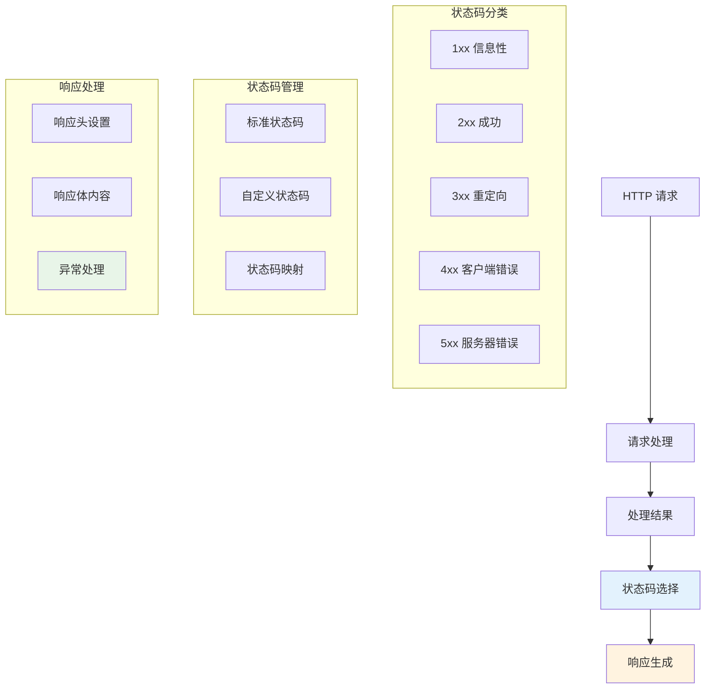

# HTTP状态码

Hi Framework 完全支持标准 HTTP 状态码，并提供便捷的状态码管理和自定义状态码功能。HTTP 状态码是 HTTP 协议的重要组成部分，用于向客户端传达请求处理的结果。

> **重要设计原则**：
> 1. **标准兼容**：完全遵循 RFC 7231 等 HTTP 标准
> 2. **语义清晰**：使用语义化的状态码，准确传达响应含义
> 3. **一致性**：在整个应用中保持状态码使用的一致性
> 4. **可扩展性**：支持自定义状态码和扩展状态码
> 5. **错误处理**：与异常处理系统紧密集成

## 核心架构



## 标准状态码

### 1. 信息性响应 (1xx)

```php
use Hi\Http\Message\Response;

class InformationalController
{
    #[Get(pattern: '/continue')]
    public function continueRequest(): Response
    {
        // 100 Continue - 服务器已收到请求头，客户端应继续发送请求体
        $response = new Response();
        $response = $response->withStatus(100);
        $response = $response->withHeader('Expect', '100-continue');
        
        return $response;
    }
    
    #[Get(pattern: '/switching-protocols')]
    public function switchProtocols(): Response
    {
        // 101 Switching Protocols - 服务器正在切换协议
        $response = new Response();
        $response = $response->withStatus(101);
        $response = $response->withHeader('Upgrade', 'websocket');
        $response = $response->withHeader('Connection', 'Upgrade');
        
        return $response;
    }
}
```

### 2. 成功响应 (2xx)

```php
use Hi\Attributes\Http\Get;
use Hi\Attributes\Http\Post;
use Hi\Http\Message\Response;

class SuccessController
{
    #[Get(pattern: '/users')]
    public function getUsers(): array
    {
        // 200 OK - 请求成功
        return [
            'status' => 'success',
            'data' => [
                ['id' => 1, 'name' => 'John Doe'],
                ['id' => 2, 'name' => 'Jane Smith']
            ]
        ];
    }
    
    #[Post(pattern: '/users')]
    public function createUser(CreateUserDTO $dto): Response
    {
        // 201 Created - 资源创建成功
        $user = $this->userService->create($dto);
        
        $response = new Response();
        $response = $response->withStatus(201);
        $response = $response->withHeader('Location', '/users/' . $user->getId());
        $response = $response->writeBody([
            'status' => 'success',
            'message' => 'User created successfully',
            'data' => $user
        ]);
        
        return $response;
    }
    
    #[Post(pattern: '/batch-process')]
    public function batchProcess(): Response
    {
        // 202 Accepted - 请求已接受，但处理尚未完成
        $this->queueService->addJob('batch-process');
        
        $response = new Response();
        $response = $response->withStatus(202);
        $response = $response->withHeader('X-Job-ID', uniqid());
        $response = $response->writeBody([
            'status' => 'accepted',
            'message' => 'Batch process queued for processing',
            'job_id' => uniqid()
        ]);
        
        return $response;
    }
    
    #[Get(pattern: '/users/1')]
    public function getUser(): Response
    {
        // 204 No Content - 请求成功，但响应体为空
        $response = new Response();
        $response = $response->withStatus(204);
        
        return $response;
    }
}
```

### 3. 重定向响应 (3xx)

```php
use Hi\Attributes\Http\Get;
use Hi\Http\Message\Response;

class RedirectionController
{
    #[Get(pattern: '/old-page')]
    public function redirectOldPage(): Response
    {
        // 301 Moved Permanently - 资源已永久移动到新位置
        $response = new Response();
        $response = $response->withStatus(301);
        $response = $response->withHeader('Location', '/new-page');
        
        return $response;
    }
    
    #[Get(pattern: '/temporary')]
    public function temporaryRedirect(): Response
    {
        // 302 Found - 资源临时移动到新位置
        $response = new Response();
        $response = $response->withStatus(302);
        $response = $response->withHeader('Location', '/temporary-location');
        
        return $response;
    }
    
    #[Get(pattern: '/see-other')]
    public function seeOther(): Response
    {
        // 303 See Other - 使用 GET 方法查看其他资源
        $response = new Response();
        $response = $response->withStatus(303);
        $response = $response->withHeader('Location', '/users');
        
        return $response;
    }
    
    #[Get(pattern: '/not-modified')]
    public function notModified(): Response
    {
        // 304 Not Modified - 资源未修改，可使用缓存版本
        $response = new Response();
        $response = $response->withStatus(304);
        $response = $response->withHeader('ETag', '"abc123"');
        $response = $response->withHeader('Cache-Control', 'max-age=3600');
        
        return $response;
    }
}
```

### 4. 客户端错误响应 (4xx)

```php
use Hi\Attributes\Http\Get;
use Hi\Attributes\Http\Post;
use Hi\Http\Message\Response;

class ClientErrorController
{
    #[Get(pattern: '/bad-request')]
    public function badRequest(): Response
    {
        // 400 Bad Request - 请求语法错误或参数无效
        $response = new Response();
        $response = $response->withStatus(400);
        $response = $response->withHeader('Content-Type', 'application/json');
        $response = $response->writeBody([
            'error' => 'Bad Request',
            'message' => 'Invalid request parameters',
            'details' => ['param1' => 'Required field missing']
        ]);
        
        return $response;
    }
    
    #[Post(pattern: '/unauthorized')]
    public function unauthorized(): Response
    {
        // 401 Unauthorized - 需要身份验证
        $response = new Response();
        $response = $response->withStatus(401);
        $response = $response->withHeader('WWW-Authenticate', 'Bearer realm="api"');
        $response = $response->withHeader('Content-Type', 'application/json');
        $response = $response->writeBody([
            'error' => 'Unauthorized',
            'message' => 'Authentication required',
            'code' => 'AUTH_REQUIRED'
        ]);
        
        return $response;
    }
    
    #[Get(pattern: '/forbidden')]
    public function forbidden(): Response
    {
        // 403 Forbidden - 服务器理解请求但拒绝授权
        $response = new Response();
        $response = $response->withStatus(403);
        $response = $response->withHeader('Content-Type', 'application/json');
        $response = $response->writeBody([
            'error' => 'Forbidden',
            'message' => 'Access denied',
            'code' => 'ACCESS_DENIED'
        ]);
        
        return $response;
    }
    
    #[Get(pattern: '/not-found')]
    public function notFound(): Response
    {
        // 404 Not Found - 请求的资源不存在
        $response = new Response();
        $response = $response->withStatus(404);
        $response = $response->withHeader('Content-Type', 'application/json');
        $response = $response->writeBody([
            'error' => 'Not Found',
            'message' => 'The requested resource was not found',
            'code' => 'RESOURCE_NOT_FOUND'
        ]);
        
        return $response;
    }
    
    #[Post(pattern: '/method-not-allowed')]
    public function methodNotAllowed(): Response
    {
        // 405 Method Not Allowed - 请求方法不被允许
        $response = new Response();
        $response = $response->withStatus(405);
        $response = $response->withHeader('Allow', 'GET, POST');
        $response = $response->withHeader('Content-Type', 'application/json');
        $response = $response->writeBody([
            'error' => 'Method Not Allowed',
            'message' => 'HTTP method not allowed for this resource',
            'allowed_methods' => ['GET', 'POST']
        ]);
        
        return $response;
    }
    
    #[Post(pattern: '/conflict')]
    public function conflict(): Response
    {
        // 409 Conflict - 请求与服务器当前状态冲突
        $response = new Response();
        $response = $response->withStatus(409);
        $response = $response->withHeader('Content-Type', 'application/json');
        $response = $response->writeBody([
            'error' => 'Conflict',
            'message' => 'Resource already exists',
            'code' => 'RESOURCE_EXISTS'
        ]);
        
        return $response;
    }
    
    #[Get(pattern: '/too-many-requests')]
    public function tooManyRequests(): Response
    {
        // 429 Too Many Requests - 请求频率超限
        $response = new Response();
        $response = $response->withStatus(429);
        $response = $response->withHeader('Retry-After', '60');
        $response = $response->withHeader('X-RateLimit-Limit', '100');
        $response = $response->withHeader('X-RateLimit-Remaining', '0');
        $response = $response->withHeader('X-RateLimit-Reset', time() + 60);
        $response = $response->withHeader('Content-Type', 'application/json');
        $response = $response->writeBody([
            'error' => 'Too Many Requests',
            'message' => 'Rate limit exceeded',
            'retry_after' => 60
        ]);
        
        return $response;
    }
}
```

### 5. 服务器错误响应 (5xx)

```php
use Hi\Attributes\Http\Get;
use Hi\Http\Message\Response;

class ServerErrorController
{
    #[Get(pattern: '/internal-error')]
    public function internalServerError(): Response
    {
        // 500 Internal Server Error - 服务器内部错误
        $response = new Response();
        $response = $response->withStatus(500);
        $response = $response->withHeader('Content-Type', 'application/json');
        $response = $response->writeBody([
            'error' => 'Internal Server Error',
            'message' => 'An unexpected error occurred',
            'code' => 'INTERNAL_ERROR',
            'request_id' => uniqid()
        ]);
        
        return $response;
    }
    
    #[Get(pattern: '/not-implemented')]
    public function notImplemented(): Response
    {
        // 501 Not Implemented - 服务器不支持请求的功能
        $response = new Response();
        $response = $response->withStatus(501);
        $response = $response->withHeader('Content-Type', 'application/json');
        $response = $response->writeBody([
            'error' => 'Not Implemented',
            'message' => 'This feature is not yet implemented',
            'code' => 'NOT_IMPLEMENTED'
        ]);
        
        return $response;
    }
    
    #[Get(pattern: '/bad-gateway')]
    public function badGateway(): Response
    {
        // 502 Bad Gateway - 网关或代理服务器收到无效响应
        $response = new Response();
        $response = $response->withStatus(502);
        $response = $response->withHeader('Content-Type', 'application/json');
        $response = $response->writeBody([
            'error' => 'Bad Gateway',
            'message' => 'Upstream server returned an invalid response',
            'code' => 'BAD_GATEWAY'
        ]);
        
        return $response;
    }
    
    #[Get(pattern: '/service-unavailable')]
    public function serviceUnavailable(): Response
    {
        // 503 Service Unavailable - 服务暂时不可用
        $response = new Response();
        $response = $response->withStatus(503);
        $response = $response->withHeader('Retry-After', '300');
        $response = $response->withHeader('Content-Type', 'application/json');
        $response = $response->writeBody([
            'error' => 'Service Unavailable',
            'message' => 'Service is temporarily unavailable',
            'code' => 'SERVICE_UNAVAILABLE',
            'retry_after' => 300
        ]);
        
        return $response;
    }
    
    #[Get(pattern: '/gateway-timeout')]
    public function gatewayTimeout(): Response
    {
        // 504 Gateway Timeout - 网关超时
        $response = new Response();
        $response = $response->withStatus(504);
        $response = $response->withHeader('Content-Type', 'application/json');
        $response = $response->writeBody([
            'error' => 'Gateway Timeout',
            'message' => 'Upstream server timeout',
            'code' => 'GATEWAY_TIMEOUT'
        ]);
        
        return $response;
    }
}
```

## 自定义状态码

### 1. 业务状态码定义

```php
class BusinessStatusCodes
{
    // 业务成功状态码
    public const BUSINESS_SUCCESS = 200;
    public const RESOURCE_CREATED = 201;
    public const OPERATION_ACCEPTED = 202;
    
    // 业务错误状态码
    public const BUSINESS_ERROR = 400;
    public const VALIDATION_ERROR = 422;
    public const BUSINESS_LOGIC_ERROR = 409;
    
    // 自定义状态码映射
    public const STATUS_MAP = [
        'BUSINESS_SUCCESS' => [
            'code' => 200,
            'message' => 'Operation completed successfully',
            'description' => '业务操作成功完成'
        ],
        'RESOURCE_CREATED' => [
            'code' => 201,
            'message' => 'Resource created successfully',
            'description' => '资源创建成功'
        ],
        'VALIDATION_ERROR' => [
            'code' => 422,
            'message' => 'Validation failed',
            'description' => '数据验证失败'
        ],
        'BUSINESS_LOGIC_ERROR' => [
            'code' => 409,
            'message' => 'Business logic conflict',
            'description' => '业务逻辑冲突'
        ]
    ];
    
    public static function getStatusInfo(string $statusKey): array
    {
        return self::STATUS_MAP[$statusKey] ?? [
            'code' => 500,
            'message' => 'Unknown status',
            'description' => '未知状态'
        ];
    }
}
```

### 2. 自定义状态码使用

```php
use Hi\Attributes\Http\Post;
use Hi\Http\Message\Response;

class BusinessController
{
    #[Post(pattern: '/business-operation')]
    public function businessOperation(BusinessDTO $dto): Response
    {
        try {
            // 执行业务逻辑
            $result = $this->businessService->execute($dto);
            
            $statusInfo = BusinessStatusCodes::getStatusInfo('BUSINESS_SUCCESS');
            
            $response = new Response();
            $response = $response->withStatus($statusInfo['code']);
            $response = $response->withHeader('Content-Type', 'application/json');
            $response = $response->writeBody([
                'status' => 'success',
                'code' => $statusInfo['code'],
                'message' => $statusInfo['message'],
                'description' => $statusInfo['description'],
                'data' => $result
            ]);
            
            return $response;
            
        } catch (ValidationException $e) {
            $statusInfo = BusinessStatusCodes::getStatusInfo('VALIDATION_ERROR');
            
            $response = new Response();
            $response = $response->withStatus($statusInfo['code']);
            $response = $response->withHeader('Content-Type', 'application/json');
            $response = $response->writeBody([
                'status' => 'error',
                'code' => $statusInfo['code'],
                'message' => $statusInfo['message'],
                'description' => $statusInfo['description'],
                'errors' => $e->getErrors()
            ]);
            
            return $response;
        }
    }
}
```

## 总结

Hi Framework 的 HTTP 状态码系统提供了完整而灵活的状态码管理功能：

1. **标准支持**：完全支持 RFC 标准 HTTP 状态码
2. **自定义扩展**：支持自定义业务状态码和扩展状态码
3. **语义清晰**：使用语义化的状态码，准确传达响应含义
5. **最佳实践**：内置状态码使用指南和选择建议
6. **测试支持**：完整的单元测试支持

通过合理使用这些功能，可以构建标准、一致的 HTTP API 服务。
