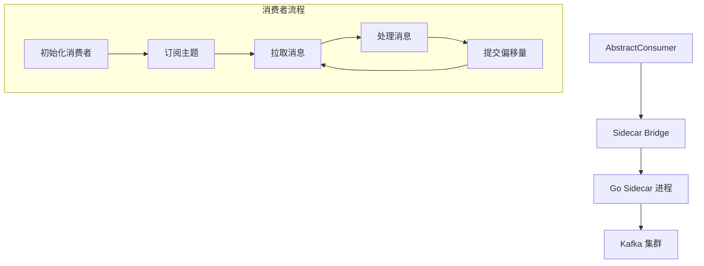

# Kafka 消费者

Kafka 消费者是 Hi Framework 中用于从 Kafka 集群接收和处理消息的核心组件。它基于 Sidecar 架构，通过 Go 语言实现的高性能客户端，支持多种消费模式和配置选项。

## 核心架构



## 使用示例

### 基础消费者

```php
use Hi\Kafka\AbstractConsumer;
use Hi\Kafka\ConsumerConfig;
use Hi\Kafka\ConsumeOffsetType;

class OrderEventConsumer extends AbstractConsumer
{
    protected string $connection = 'default';
    protected string $topic = Topic::ConsumeEvent;
    
    public function consume(): void
    {
        while (true) {
            $messages = $this->receiveMessages(10);
            
            foreach ($messages as $message) {
                $this->processMessage($message);
            }
            
            // 避免空轮询
            if (empty($messages)) {
                usleep(100000); // 100ms
            }
        }
    }
    
    private function processMessage($message): void
    {
        $data = json_decode($message->value, true);
        
        switch ($data['event_type']) {
            case 'order_created':
                $this->handleOrderCreated($data);
                break;
            case 'order_cancelled':
                $this->handleOrderCancelled($data);
                break;
        }
    }
}
```
