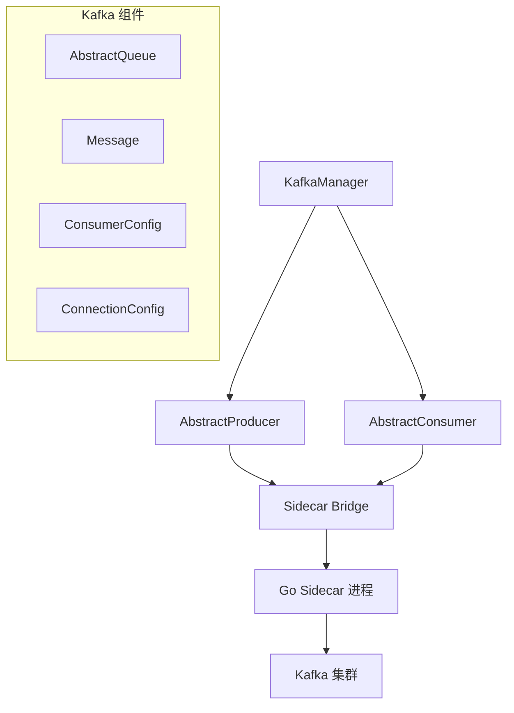

# Kafka 集成

Hi Framework 的 Kafka 组件提供了基于 Sidecar 架构的消息队列集成支持。本文档基于框架源码分析，详细介绍 Kafka 组件的实际功能和用法。

## 核心架构



## 核心组件

### KafkaManager

`Hi\Kafka\KafkaManager` 是 Kafka 组件的核心管理器：

```php
class KafkaManager
{
    public function __construct(protected BridgeInterface $sideCarBridge) {}
    
    /**
     * 为命令行增加手动投递消息的能力
     */
    public function produce(AbstractProducer $producer): void
    {
        $producer->send($this->sideCarBridge);
    }
    
    /**
     * 启动消费者
     */
    public function consume(?string $className = null): void
    {
        $consumer = \construct($className);
        $consumer->getConnection();

        $consumer->execute($this->sideCarBridge);
    }
}
```

### AbstractQueue

`Hi\Kafka\AbstractQueue` 是生产者和消费者的共同基类：

```php
abstract class AbstractQueue
{
    /**
     * 队列连接名称
     */
    protected string $connection;
    
    /**
     * Topic 枚举，必须继承自 TopicInterface
     */
    protected TopicInterface $topic;
    
    /**
     * 返回连接名称
     */
    public function getConnection(): string
    {
        return $this->connection;
    }
    
    /**
     * 返回 Topic 名称
     */
    public function getTopic(): string
    {
        return $this->topic->value;
    }
    
    /**
     * 消费者/生产者启动前置操作
     */
    protected function bootstrap(): void
    {
        // 进行其他服务的初始化或更改配置
    }
}
```

### AbstractProducer

`Hi\Kafka\AbstractProducer` 是生产者的抽象基类：

```php
abstract class AbstractProducer extends AbstractQueue
{
    protected string $key = '';
    protected array $headers = [];
    protected bool $syncMode = false;
    
    /**
     * 生产者构造方法
     */
    public function __construct(protected mixed $data) {}
    
    /**
     * 连接消息队列并发送消息
     */
    public function send(BridgeInterface $sideCarBridge): void
    {
        $this->bootstrap();
        
        $sideCarBridge->produceMessage(
            connection: $this->getConnection(),
            topic: $this->getTopic(),
            value: \json_encode($this->data),
            key: $this->key,
            headers: $this->headers,
            syncMode: $this->syncMode,
        );
    }
}
```

### AbstractConsumer

`Hi\Kafka\AbstractConsumer` 是消费者的抽象基类：

```php
abstract class AbstractConsumer extends AbstractQueue
{
    protected ConsumerConfig $config;
    protected bool $closed = false;
    
    /**
     * 消息批量获取数量
     */
    protected int $fetchSize = 1024;
    
    /**
     * 消费者名称(为空取服务名+类名)
     */
    protected string $groupId = '';
    
    /**
     * 创建消费者实例并执行消费
     */
    public function execute(BridgeInterface $sideCarBridge): void
    {
        $this->initConfig();
        $this->bootstrap();
        
        $sideCarBridge->consumerInit($this->config->toArray());
        
        for (;;) {
            try {
                $records = $sideCarBridge->consumerReceive(
                    $this->connection, 
                    $this->topic->value, 
                    $this->fetchSize
                );
            } catch (SidecarClosedException) {
                $this->close();
                break;
            }
            
            if (!$records) {
                $this->consume(null);
            } else {
                foreach ($records as $record) {
                    $this->consume(new Message(
                        topic: $record['Topic'],
                        partition: $record['Partition'],
                        key: $record['Key'],
                        value: \base64_decode($record['Value']),
                        headers: $record['Headers'],
                        offset: $record['Offset'],
                        attrs: $record['Attrs'],
                    ));
                }
            }
            
            if ($this->closed) {
                $this->flush();
                break;
            }
        }
    }
    
    /**
     * 关闭消费者
     */
    public function close(): void
    {
        $this->closed = true;
    }
    
    /**
     * 消费消息的抽象方法
     */
    abstract public function consume(?Message $message): void;
    
    /**
     * 消费者关闭时刷新待处理数据
     */
    protected function flush(): void
    {
        // 子类实现具体逻辑
    }
}
```

### Message

`Hi\Kafka\Message` 封装了 Kafka 消息的完整信息：

```php
class Message
{
    /**
     * @param RecordHeader[]      $headers
     * @param array<string,mixed> $attrs
     */
    public function __construct(
        public readonly string $topic,
        public readonly int $partition,
        public readonly ?string $key,
        public readonly ?string $value,
        public readonly array $headers,
        public readonly int $offset,
        public readonly array $attrs,
    ) {}
    
    public function getTopic(): string
    {
        return $this->topic;
    }
    
    public function getPartition(): int
    {
        return $this->partition;
    }
    
    public function getKey(): ?string
    {
        return $this->key;
    }
    
    public function getValue(): ?string
    {
        return $this->value;
    }
    
    /**
     * @return RecordHeader[]
     */
    public function getHeaders(): array
    {
        return $this->headers;
    }
    
    public function getOffset(): int
    {
        return $this->offset;
    }
    
    /**
     * @return array<string,mixed>
     */
    public function getAttrs(): array
    {
        return $this->attrs;
    }
}
```

Message 对象包含以下属性：
- **topic**: 消息所属的主题名称
- **partition**: 消息所在的分区编号
- **key**: 消息的键（可为 null）
- **value**: 消息的值（可为 null）
- **headers**: 消息头数组，类型为 `RecordHeader[]`
- **offset**: 消息在分区中的偏移量
- **attrs**: 消息的属性数组，类型为 `array<string,mixed>`

### ConsumerConfig

`Hi\Kafka\ConsumerConfig` 定义了消费者的配置选项：

```php
class ConsumerConfig
{
    protected string $connection;
    protected array $topics = [];
    protected bool $autoCreateTopic = true;
    protected string $groupId;
    protected bool $blockRebalanceOnPoll = false;
    protected bool $consumeRegexp = false;
    protected ConsumeOffsetType $offsetType = ConsumeOffsetType::AtEnd;
    protected int $offsetValue = 0;
    
    public function setConnection(string $connection): void
    {
        $this->connection = $connection;
    }
    
    public function setTopic(string $topic): void
    {
        $this->topics[] = $topic;
    }
    
    public function setGroupId(string $groupId): void
    {
        $this->groupId = $groupId;
    }
    
    public function setOffset(ConsumeOffsetType $type, int $value = 0): void
    {
        $this->offsetType = $type;
        $this->offsetValue = $value;
    }
    
    public function toArray(): array
    {
        return [
            'connection' => $this->connection,
            'group_options' => [
                'group_id' => $this->groupId,
                'block_rebalance_on_poll' => $this->blockRebalanceOnPoll,
            ],
            'consume_options' => [
                'topics' => $this->topics,
                'consume_regexp' => $this->consumeRegexp,
                'consumer_offset' => [
                    'type' => $this->offsetType->value,
                    'value' => $this->offsetValue,
                ],
            ],
        ];
    }
}
```

### ConsumeOffsetType

`Hi\Kafka\ConsumeOffsetType` 枚举定义了消费偏移量类型：

```php
enum ConsumeOffsetType: string
{
    case At = 'At';                    // 从指定偏移量开始
    case AfterMilli = 'AfterMilli';    // 从指定时间后开始
    case AtEnd = 'AtEnd';              // 从最新偏移量开始
    case AtStart = 'AtStart';          // 从最早偏移量开始
    case Relative = 'Relative';         // 相对偏移量
    case WithEpoch = 'WithEpoch';      // 带纪元信息的偏移量
}
```

### ConnectionConfig

`Hi\Kafka\ConnectionConfig` 定义了 Kafka 连接的基本参数：

```php
class ConnectionConfig
{
    public function __construct(
        public readonly array $brokers,
        public readonly ?array $sasl = null,
        public readonly ?array $ssl = null,
    ) {}
}
```

### TopicInterface

`Hi\Kafka\TopicInterface` 是主题的标记接口：

```php
interface TopicInterface
{
    // 标记接口，用于类型安全
}
```

## 使用示例

### 基础生产者

```php
use Hi\Kafka\AbstractProducer;
use Hi\Kafka\TopicInterface;

class OrderEventProducer extends AbstractProducer
{
    protected string $connection = 'kafka-common';
    protected TopicInterface $topic = Topic::OrderEvents;
    
    public function __construct(array $orderData)
    {
        parent::__construct($orderData);
    }
    
    protected function bootstrap(): void
    {
        // 初始化其他服务或更改配置
    }
}

// 使用方式
$producer = new OrderEventProducer([
    'event_type' => 'order_created',
    'order_id' => '12345',
    'user_id' => 'user123'
]);

$kafkaManager = \construct(KafkaManager::class);
$kafkaManager->produce($producer);
```

### 基础消费者

```php
use Hi\Kafka\AbstractConsumer;
use Hi\Kafka\Message;

class OrderEventConsumer extends AbstractConsumer
{
    protected string $connection = 'kafka-common';
    protected TopicInterface $topic = Topic::OrderEvents;
    protected int $fetchSize = 100;
    protected string $groupId = 'order-consumer-group';
    
    protected function bootstrap(): void
    {
        // 初始化其他服务或更改配置
    }
    
    public function consume(?Message $message): void
    {
        if (null === $message) {
            // 没有消息时的处理逻辑
            return;
        }
        
        $data = json_decode($message->getValue() ?? '', true);
        if (!$data) {
            return;
        }
        
        // 处理消息
        $this->handleOrderEvent($data);
    }
    
    private function handleOrderEvent(array $data): void
    {
        // 实现具体的业务逻辑
        switch ($data['event_type']) {
            case 'order_created':
                $this->processOrderCreated($data);
                break;
            case 'order_cancelled':
                $this->processOrderCancelled($data);
                break;
        }
    }
}

// 使用方式
$kafkaManager = \construct(KafkaManager::class);
$kafkaManager->consume(OrderEventConsumer::class);
```

### 自定义偏移量消费者

```php
use Hi\Kafka\AbstractConsumer;
use Hi\Kafka\ConsumeOffsetType;

class HistoricalDataConsumer extends AbstractConsumer
{
    protected string $connection = 'kafka-common';
    protected TopicInterface $topic = Topic::HistoricalData;
    protected string $groupId = 'historical-consumer';
    
    protected function bootstrap(): void
    {
        // 从指定偏移量开始消费
        $this->config->setOffset(ConsumeOffsetType::AtStart);
    }
    
    public function consume(?Message $message): void
    {
        if (null === $message) {
            return;
        }
        
        // 处理历史数据
        $this->processHistoricalData($message);
    }
}
```

### 批量处理消费者

```php
use Hi\Kafka\AbstractConsumer;
use Hi\Kafka\Message;

class BatchDataConsumer extends AbstractConsumer
{
    protected string $connection = 'kafka-common';
    protected TopicInterface $topic = Topic::BatchData;
    protected int $fetchSize = 1000; // 大批量获取
    protected string $groupId = 'batch-consumer';
    
    private array $batch = [];
    private const BATCH_SIZE = 100;
    
    public function consume(?Message $message): void
    {
        if (null === $message) {
            // 没有消息时处理批次
            $this->processBatch();
            return;
        }
        
        $this->batch[] = $message;
        
        if (count($this->batch) >= self::BATCH_SIZE) {
            $this->processBatch();
        }
    }
    
    private function processBatch(): void
    {
        if (empty($this->batch)) {
            return;
        }
        
        // 批量处理逻辑
        $this->batchProcess($this->batch);
        $this->batch = [];
    }
    
    protected function flush(): void
    {
        // 消费者关闭时处理剩余批次
        $this->processBatch();
    }
}
```

## 配置管理

### 应用配置

在 `application.yaml` 中配置 Kafka 连接，参考 `typing-jupiter` 项目的实际配置：

```yaml
# Sidecar 配置
sidecar:
  enable: false  # 本地开发环境禁用
  host: tcp://host.docker.internal:6001

# Kafka 配置
kafka:
  # 本地开发环境
  kafka-common:
    auto_create_topics_enable: true
    brokers:
      - 'host.docker.internal:9094'
  
  # 阿里云生产环境
  aliyun-kafka-public:
    auto_create_topics_enable: true
    brokers:
      - 'your-cluster-endpoint:9092'
    tls:
      enabled: true
      cert: "/path/to/cert.pem"
      key: "/path/to/key.pem"
      root_ca: "/path/to/ca.pem"
    sasl:
      type: "scram_sha_256"
      username: "your-username"
      password: "your-password"
```

### 配置参数说明

| 配置项 | 类型 | 默认值 | 说明 |
|--------|------|--------|------|
| `sidecar.enable` | boolean | false | 是否启用 Sidecar 服务 |
| `sidecar.host` | string | - | Sidecar 服务地址，格式：`tcp://host:port` |
| `kafka.{connection}.auto_create_topics_enable` | boolean | true | 是否自动创建主题 |
| `kafka.{connection}.brokers` | array | - | Kafka 集群 Broker 地址列表 |
| `kafka.{connection}.tls.enabled` | boolean | false | 是否启用 TLS 加密 |
| `kafka.{connection}.tls.cert` | string | - | TLS 证书文件路径 |
| `kafka.{connection}.tls.key` | string | - | TLS 私钥文件路径 |
| `kafka.{connection}.tls.root_ca` | string | - | TLS 根证书文件路径 |
| `kafka.{connection}.sasl.type` | string | - | SASL 认证类型（如：scram_sha_256） |
| `kafka.{connection}.sasl.username` | string | - | SASL 用户名 |
| `kafka.{connection}.sasl.password` | string | - | SASL 密码 |


## 最佳实践

### 生产者设计

- **数据封装**: 在构造函数中传入要发送的数据
- **配置设置**: 在 `bootstrap()` 方法中进行必要的初始化
- **错误处理**: 确保数据格式正确，避免序列化错误

### 消费者设计

- **消息验证**: 在 `consume()` 方法中验证消息格式
- **批量处理**: 合理设置 `fetchSize` 和批次大小
- **优雅关闭**: 实现 `flush()` 方法处理待处理数据
- **偏移量管理**: 根据业务需求选择合适的偏移量策略
