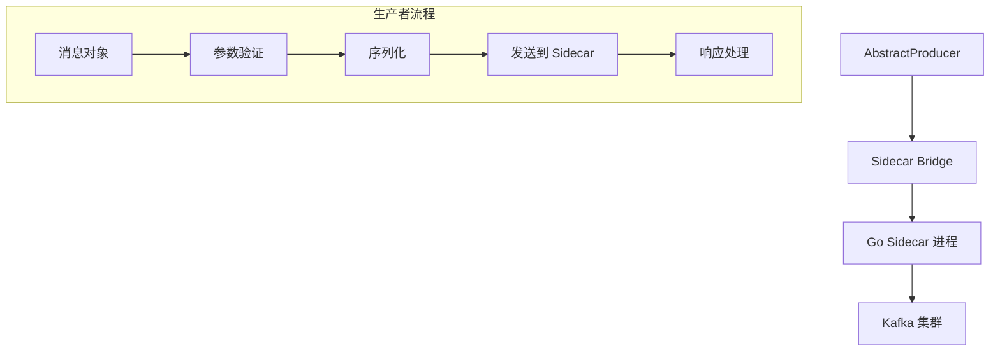

# Kafka 生产者

Kafka 生产者是 Hi Framework 中用于向 Kafka 集群发送消息的核心组件。它基于 Sidecar 架构，通过 Go 语言实现的高性能客户端，支持同步和异步两种消息发送模式。

## 核心架构



## 使用示例

### 基础生产者

```php
use Hi\Kafka\AbstractProducer;

class OrderEventProducer extends AbstractProducer
{
    protected string $connection = 'default';
    protected string $topic = 'order-events';
}

// 使用方式
$producer = new OrderEventProducer([
    'event_type' => 'order_created',
    'order_id' => '12345',
    'user_id' => 'user123',
    'amount' => 99.99,
    'timestamp' => time()
]);

$kafkaManager = \construct(KafkaManager::class);
$kafkaManager->produce($producer);
```

### 同步生产者

```php
class SyncOrderProducer extends AbstractProducer
{
    protected string $connection = 'sync-kafka';
    protected string $topic = 'critical-orders';

    public function sendCriticalOrder(Order $order): bool
    {
        $message = new Message(
            topic: $this->topic,
            value: json_encode($order->toArray()),
            headers: ['priority' => 'high'],
            attributes: ['sync' => true] // 同步模式
        );

        return $this->send($message);
    }
}
```
