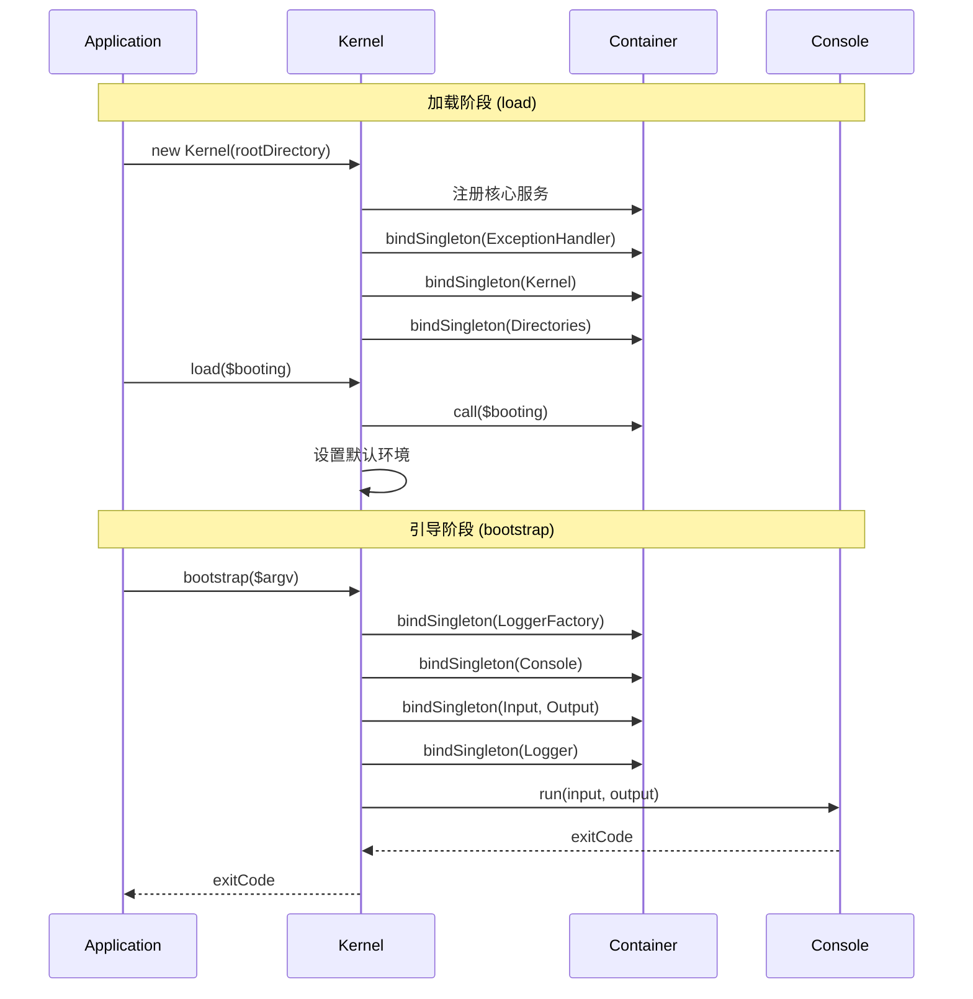

# 启动引导

Hi Framework 的启动引导系统负责应用程序的初始化和启动过程，通过两个阶段完成应用程序的启动：加载阶段和引导阶段。

## 启动流程概览



## Kernel 构造函数

### 核心服务注册

Kernel 在构造函数中自动注册核心服务：

```php
interface KernelInterface
{
    public function __construct(
        string $rootDirectory,
        bool $handleErrors = true,
        ?ExceptionHandlerInterface $exceptionHandler = null,
        ?ContainerInterface $container = null,
    );

    public function load(?callable $booting = null): self;
    public function bootstrap(array $argv = []): int;
}
```

### 目录初始化

`Directories` 类管理应用程序目录结构：

```php
interface DirectoriesInterface
{
    public function __construct(array $directories = []);
    public function set(string $name, string $path): self;
    public function get(string $name): string;
    public function has(string $name): bool;
    public function join(string $name, string $path): string;
}
```

## 加载阶段 (load)

### 启动回调执行

```php
interface KernelInterface
{
    /**
     * 加载阶段 - 执行启动回调并设置默认环境
     */
    public function load(?callable $booting = null): self;
}
```

### 启动回调示例

```php
$kernel->load(function (
    ConfigInterface $config,
    DirectoriesInterface $directories
) {
    // 设置应用程序配置
    $config->merge([
        'app' => [
            'name' => 'My Application',
            'version' => '1.0.0',
            'debug' => true,
        ]
    ]);
    
    // 设置额外目录
    $directories->set('config', $directories->get('root') . '/config');
    $directories->set('storage', $directories->get('root') . '/storage');
    $directories->set('logs', $directories->get('storage') . '/logs');
});
```

### 环境设置

如果没有显式设置环境，系统会自动设置为 `Local` 环境：

```php
interface EnvironmentInterface
{
    public function isLocal(): bool;
    public function isDevelopment(): bool;
    public function isTesting(): bool;
    public function isStaging(): bool;
    public function isProduction(): bool;
    public function isBuild(): bool;
}
```

## 引导阶段 (bootstrap)

### 服务注册序列

```php
interface KernelInterface
{
    /**
     * 引导阶段 - 注册运行时服务并启动控制台
     */
    public function bootstrap(array $argv = []): int;
}
```

### 日志工厂初始化

`LoggerFactory` 基于 Monolog 实现：

```php
interface LoggerFactoryInterface
{
    public function get(?string $channel = null, string $level = 'debug', bool $newLogger = true): LoggerInterface;
    public function set(string $channel, LoggerInterface $logger): void;
    public function has(string $channel): bool;
}
```

### 输入输出初始化

#### Input 系统

```php
interface InputInterface
{
    public function __construct(array $argv);
    public function getCommand(): string;
    public function getAction(): string;
    public function getOption(string $key): mixed;
    public function has(string $key): bool;
    public function getBoolean(string $key, bool $default = false): bool;
}
```

#### Output 系统

```php
interface OutputInterface
{
    public function writeln(string $text = ''): OutputInterface;
    public function writeError(string $text): OutputInterface;
    public function writeWarning(string $text): OutputInterface;
    public function displayTable(array $data, string $color = 'blue'): OutputInterface;
}
```

## 实际使用示例

### 基本启动脚本

```php
#!/usr/bin/env php
<?php
declare(strict_types=1);

require_once __DIR__ . '/vendor/autoload.php';

use Hi\Framework\KernelInterface;
use Hi\Framework\Exception\ExceptionHandlerInterface;
use Hi\Framework\Kernel\EnvironmentInterface;

// 创建内核
$kernel = $container->get(KernelInterface::class);

// 加载阶段 - 配置应用
$kernel->load(function (ConfigInterface $config, DirectoriesInterface $directories) {
    // 设置基本目录
    $directories->set('config', $directories->get('root') . '/config');
    $directories->set('commands', $directories->get('root') . '/src/Commands');
    
    // 加载配置文件
    $configFile = $directories->get('config') . '/app.php';
    if (file_exists($configFile)) {
        $appConfig = require $configFile;
        $config->merge($appConfig);
    }
    
    // 设置环境
    $environment = AppEnvironment::from($_ENV['APP_ENV'] ?? 'local');
    $container = $this->container;
    $container->bindSingleton(EnvironmentInterface::class, $environment);
});

// 引导阶段 - 启动应用
$exitCode = $kernel->bootstrap($_SERVER['argv']);
exit($exitCode);
```

### 高级配置示例

```php
$kernel->load(function (
    ConfigInterface $config,
    DirectoriesInterface $directories,
    Container $container
) {
    // 配置目录结构
    $root = $directories->get('root');
    $directories->set('storage', $root . '/storage');
    $directories->set('logs', $root . '/storage/logs');
    $directories->set('cache', $root . '/storage/cache');
    
    // 环境检测和配置加载
    $environment = $_ENV['APP_ENV'] ?? 'local';
    $config->merge(['app' => ['env' => $environment]]);
    
    // 根据环境加载不同配置
    $envConfigFile = $directories->get('config') . "/{$environment}.php";
    if (file_exists($envConfigFile)) {
        $config->merge(require $envConfigFile);
    }
    
    // 注册命令加载器
    $container->bindSingleton(CommandLoaderInterface::class, function () use ($directories) {
        $loader = new ConsoleAttributeLoader();
        return $loader->withDirectories([
            $directories->get('root') . '/src/Commands',
            $directories->get('root') . '/app/Console/Commands',
        ]);
    });
    
    // 根据环境注册不同的服务
    if ($environment === 'production') {
        $container->bind(CacheInterface::class, RedisCache::class);
    } else {
        $container->bind(CacheInterface::class, ArrayCache::class);
    }
});
```

## 最佳实践

### 1. 配置管理

- 将配置文件按环境分离
- 使用环境变量存储敏感信息
- 在 load 阶段完成所有配置加载

### 2. 服务注册

- 在 load 阶段注册应用特定的服务
- 使用接口绑定提高可测试性
- 考虑使用工厂模式创建复杂服务

### 3. 目录管理

- 统一管理所有应用目录
- 确保必要目录存在且可写
- 使用相对路径提高可移植性

### 4. 异常处理

- 根据环境配置不同的异常处理策略
- 实现详细的异常日志记录
- 为用户提供友好的错误信息

通过合理配置启动引导系统，可以确保应用程序在各种环境下都能稳定启动和运行。