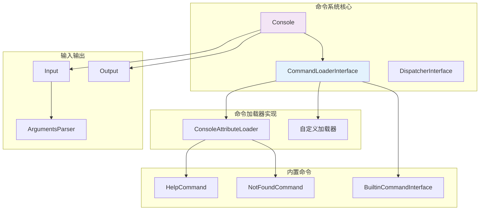

# 命令行应用

Hi Framework 提供了灵活的命令系统，支持多种命令加载方式，包括基于注解的命令定义和手动命令注册。核心架构基于 `CommandLoaderInterface`，允许开发者选择最适合的命令管理方式。

## 核心架构



## CommandLoaderInterface

命令加载器是命令系统的核心接口：

```php
interface CommandLoaderInterface
{
    /**
     * 设置命令搜索目录
     */
    public function withDirectories(array $directories): self;

    /**
     * 查找所有命令
     */
    public function findCommands(): iterable;

    /**
     * 根据名称查找命令
     */
    public function findCommand(string $name): Command|HelpCommand|NotFoundCommand;

    /**
     * 查找命令的所有动作
     */
    public function findActions(Command $command): iterable;

    /**
     * 查找特定的命令动作
     */
    public function findAction(Command $command, string $name): ?DispatcherInterface;
}
```

## 实际使用示例

### 1. 注册注解命令加载器

```php
#!/usr/bin/env php
<?php

use Hi\Framework\KernelInterface;
use Hi\Attributes\ConsoleAttributeLoaderInterface;
use Hi\Kernel\Console\CommandLoaderInterface;

$kernel = $container->get(KernelInterface::class);

$kernel->load(function (ContainerInterface $container, DirectoriesInterface $directories) {
    // 必须手动注册命令加载器
    $container->bindSingleton(CommandLoaderInterface::class, function () use ($directories, $container) {
        return $container->get(CommandLoaderInterface::class)->withDirectories([
            $directories->get('root') . '/src/Commands',
            $directories->get('root') . '/app/Console/Commands',
        ]);
    });
});

$exitCode = $kernel->bootstrap($_SERVER['argv']);
exit($exitCode);
```

### 2. 使用注解定义命令

```php
<?php

namespace App\Commands;

use Hi\Attributes\Console\Command;
use Hi\Attributes\Console\Action;
use Hi\Kernel\Console\InputInterface;
use Hi\Kernel\Console\OutputInterface;

#[Command(name: 'user', desc: '用户管理命令')]
class UserCommand
{
    #[Action(name: 'create', desc: '创建用户', coroutine: false)]
    public function create(
        InputInterface $input,
        OutputInterface $output,
        UserService $userService // 支持依赖注入
    ): int {
        $name = $input->getOption('name');
        $email = $input->getOption('email');
        
        if (!$name || !$email) {
            $output->writeError('缺少必需参数: --name 和 --email');
            return 1;
        }
        
        $user = $userService->create($name, $email);
        $output->writeln("用户创建成功: {$user->getName()}");
        
        return 0;
    }

    #[Action(name: 'list', desc: '列出用户', coroutine: false)]
    public function list(OutputInterface $output, UserService $userService): int
    {
        $users = $userService->findAll();
        
        $data = [];
        foreach ($users as $user) {
            $data[] = [
                'ID' => $user->getId(),
                'Name' => $user->getName(),
                'Email' => $user->getEmail(),
            ];
        }

        $output->displayTable($data);
        return 0;
    }
}
```

### 3. 自定义命令加载器

```php
interface SimpleCommandLoaderInterface extends CommandLoaderInterface
{
    public function __construct();
    public function registerCommand(string $name, string $class): void;
    public function getCommands(): array;
}
```

```php
// 在 Kernel 中使用
$kernel->load(function (ContainerInterface $container) {
    $container->bindSingleton(CommandLoaderInterface::class, $container->get(SimpleCommandLoaderInterface::class));
});
```

### 4. 内置命令

框架提供了几个内置命令：

```php
interface BuiltinCommandInterface
{
    public function handle(InputInterface $input, OutputInterface $output): int;
}

interface HelpCommandInterface extends BuiltinCommandInterface
{
    public function showCommandList(OutputInterface $output): void;
    public function showCommandHelp(string $command, OutputInterface $output): void;
}

interface NotFoundCommandInterface extends BuiltinCommandInterface
{
    public function showNotFoundMessage(string $command, OutputInterface $output): void;
}
```

## 最佳实践

### 1. 命令加载器选择

- **注解方式**：适合大型项目，命令较多时
- **手动注册**：适合小型项目，命令较少时
- **混合方式**：结合两种方式的优势

### 2. 参数处理

- 使用 `Input` 类的方法获取参数
- 对必需参数进行验证
- 提供合理的默认值

### 3. 错误处理

- 使用适当的退出码（0=成功，1=失败）
- 提供清晰的错误信息
- 记录详细的异常日志

### 4. 协程使用

- 对长时间运行的任务启用协程
- 注意协程间的数据共享问题
- 合理使用 `AppRuntime::wait()`

## 关键要点

1. **必须手动注册 CommandLoaderInterface** - Kernel 不提供默认实现
2. **注解系统是可选的** - 可以选择其他命令注册方式
3. **参数解析器功能完整** - 支持多种参数格式
4. **支持协程执行** - 通过 Action 注解的 coroutine 属性控制
5. **完整的生命周期管理** - 包括启动、执行、关闭回调

Hi Framework 的命令系统设计灵活，允许开发者根据项目需求选择最合适的命令管理方式。