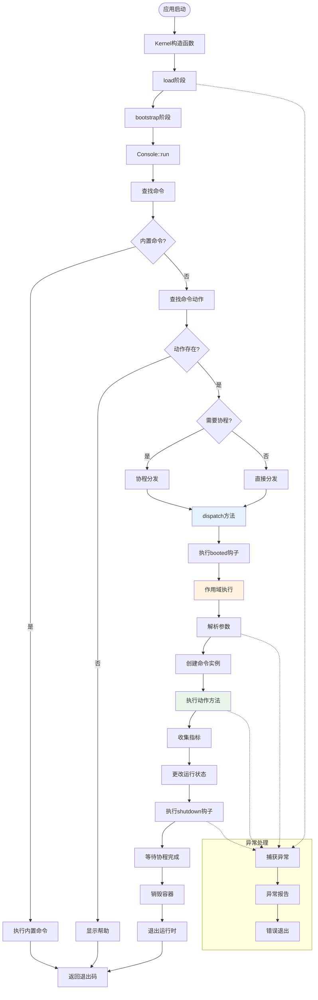

# 应用生命周期

Hi Framework 通过 Kernel 和 Console 组件管理应用程序的完整生命周期，包括初始化、启动、命令执行、作用域管理和优雅关闭等关键环节。

## 生命周期总览



## Kernel 生命周期阶段

### 1. 构造阶段 (Constructor)

Kernel 在构造函数中完成核心服务的注册：

```php
interface KernelInterface
{
    public function __construct(
        string $rootDirectory,
        bool $handleErrors = true,
        ExceptionHandlerInterface $exceptionHandler = new ExceptionHandler,
        Container $container = new Container,
    );
}
```

**核心服务注册顺序：**
1. **异常处理器** - 注册全局异常处理，绑定 `ExceptionHandlerInterface`
2. **Kernel 自身** - 绑定 `KernelInterface`, `self::class`, `static::class`
3. **目录管理** - 绑定 `DirectoriesInterface`，包含根目录
4. **配置管理** - 绑定 `ConfigInterface`

### 2. 加载阶段 (Load)

执行用户定义的应用启动逻辑：

```php
interface KernelInterface
{
    public function load(?callable $booting = null): self;
}
```

**执行流程：**
1. **解析启动回调参数** - 使用容器的 `resolveArguments` 进行依赖注入
2. **执行启动回调** - 调用用户提供的 booting 函数
3. **异常处理** - 捕获异常并通过 ExceptionHandler 报告，失败时退出
4. **默认环境设置** - 如未设置环境，默认绑定 `AppEnvironment::Production`

### 3. 引导阶段 (Bootstrap)

注册运行时必需的服务并启动控制台：

```php
interface KernelInterface
{
    public function bootstrap(array $argv = []): int;
}
```

**服务注册序列：**
1. **LoggerFactory** - 条件性注册日志工厂
2. **Console** - 条件性注册控制台接口
3. **Input/Output** - 创建输入输出对象，支持依赖注入覆盖
4. **Logger** - 基于作用域名称创建默认日志器
5. **启动控制台** - 调用 `Console::run`

## Console 执行生命周期

### 1. 命令查找与路由 (Console::run)

```php
interface ConsoleInterface
{
    public function run(InputInterface $input, OutputInterface $output): int;
}
```

**执行流程：**
1. **查找命令** - 通过 `CommandLoader::findCommand` 查找命令
2. **内置命令处理** - 如果是 `BuiltinCommandInterface`，直接执行
3. **查找动作** - 通过 `CommandLoader::findAction` 查找具体动作
4. **帮助处理** - 动作不存在时显示帮助信息
5. **协程分发** - 根据动作的 `coroutine` 属性选择执行方式

### 2. 协程管理

```php
// 协程执行
if ($action->attribute->coroutine) {
    AppRuntime::coroutine()->space(fn () => $this->dispatch($action, $input, $output));
} else {
    $this->dispatch($action, $input, $output);
}
```

**协程特性：**
- 支持 Swoole、Swow 等不同运行时
- 通过 `APP_RUNTIME_TYPE` 环境变量配置
- 自动管理协程生命周期

### 3. 命令分发 (Console::dispatch)

这是应用生命周期的核心阶段：

```php
interface ConsoleInterface
{
    public function dispatch(DispatcherInterface $action, InputInterface $input, OutputInterface $output): void;
}
```

**完整执行流程：**

#### 3.1 应用启动钩子
```php
// 执行 booted 回调（如果存在）
if ($this->container->has('booted')) {
    $this->container->make('booted');
}
```

#### 3.2 作用域执行
```php
$this->exitCode = $this->container->runScope(
    scope: function (Container $container) use ($action, $input, $output): int {
        $start = microtime(true);
        $exitCode = ConsoleException::OK;
        
        try {
            $exitCode = $action->dispatch($container, $input, $output);
        } catch (\Throwable $th) {
            $exitCode = ConsoleException::ERROR;
            $this->exceptionHandler?->report($th);
        } finally {
            $this->collector?->collect($this->logger->getName(), $exitCode, $start, $input);
        }
        
        return $exitCode;
    },
    bindings: new Scope,
);
```

**作用域执行特性：**
- **隔离性** - 每个命令在独立作用域中运行
- **性能监控** - 记录执行时间和指标
- **异常安全** - 保证异常被正确处理
- **资源清理** - finally 块确保资源释放

#### 3.3 命令动作执行 (Dispatcher::dispatch)

```php
interface DispatcherInterface
{
    public function dispatch(ContainerInterface $container, InputInterface $input, OutputInterface $output): int;
}
```

**执行步骤：**
1. **参数解析** - 使用 `ResolverInterface` 解析方法参数
2. **依赖注入** - 自动注入 Input、Output、业务服务等
3. **实例创建** - 通过反射创建命令类实例
4. **方法调用** - 执行具体的动作方法
5. **结果返回** - 返回整型退出码

#### 3.4 生命周期清理

```php
// 1. 更改运行状态
self::$running = false;

// 2. 执行关闭钩子
if ($this->container->has('shutdown')) {
    try {
        $this->container->make('shutdown');
    } catch (\Throwable $th) {
        $this->logger->alert('Shutdown error, because: ' . $th->getMessage());
    }
}

// 3. 等待协程完成
AppRuntime::wait();

// 4. 销毁容器
$this->container->__destruct();

// 5. 退出运行时
AppRuntime::exit();
```

## 作用域管理

Hi Framework 使用 Spiral Core 的作用域系统来管理命令执行：

### 作用域隔离

```php
$this->container->runScope(
    scope: function (Container $container): int {
        // 每个命令在独立作用域中执行
        // 作用域内的绑定不会影响全局容器
    },
    bindings: new Scope,
);
```

**隔离优势：**
- **依赖隔离** - 命令间的依赖不会相互影响
- **状态隔离** - 每个命令有独立的执行环境
- **内存管理** - 作用域结束后自动清理临时绑定

### 参数解析与依赖注入

```php
protected function resolveArguments(ContainerInterface $container, \ReflectionMethod $method): array
{
    return $container->get(ResolverInterface::class)
        ->resolveArguments($method, $parameters, validate: true);
}
```

**支持的参数类型：**
- **接口注入** - 自动注入 InputInterface、OutputInterface 等
- **业务服务** - 注入业务逻辑服务
- **基础类型** - 支持默认值的标量参数

## 异常处理机制

### 多层异常捕获

1. **加载阶段异常** - Kernel::load 中捕获启动回调异常
2. **执行阶段异常** - Console::dispatch 中捕获命令执行异常
3. **关闭阶段异常** - shutdown 钩子执行异常

### 异常处理流程

```php
try {
    $exitCode = $action->dispatch($container, $input, $output);
} catch (\Throwable $th) {
    $exitCode = ConsoleException::ERROR;
    $this->exceptionHandler?->report($th);
}
```

**异常处理特性：**
- **异常报告** - 通过 ExceptionHandler 统一报告
- **优雅降级** - 异常时返回错误退出码
- **日志记录** - 记录详细的异常信息

## 协程与运行时管理

### 运行时类型

```php
enum AppRuntimeTypeEnum: string 
{
    case Builtin = 'builtin';    // 标准 PHP
    case Swoole = 'swoole';      // Swoole 扩展
    case Swow = 'swow';          // Swow 扩展
}
```

### 协程生命周期

```php
// 1. 启动协程
AppRuntime::coroutine()->space(fn () => $this->dispatch($action, $input, $output));

// 2. 等待协程完成
AppRuntime::wait();

// 3. 退出运行时
AppRuntime::exit();
```

## 性能监控与指标收集

### MetricCollector 接口

```php
interface MetricCollectorInterface
{
    public function collect(string $scope, int $exitCode, float $startTime, InputInterface $input): void;
}
```

**收集的指标：**
- **执行时间** - 命令执行耗时
- **退出状态** - 成功/失败状态
- **作用域信息** - 命令和动作名称
- **输入参数** - 命令参数信息

## 最佳实践

### 1. 生命周期钩子使用

```php
$kernel->load(function (ContainerInterface $container) {
    // 注册启动钩子
    $container->bind('booted', function () {
        // 应用启动时执行
        echo "Application started\n";
    });
    
    // 注册关闭钩子
    $container->bind('shutdown', function () {
        // 应用关闭时执行
        echo "Application shutting down\n";
    });
});
```

### 2. 异常处理配置

```php
class CustomExceptionHandler implements ExceptionHandlerInterface
{
    public function report(\Throwable $th, mixed $context = null): void
    {
        // 自定义异常报告逻辑
        if ($th instanceof ValidationException) {
            // 处理验证异常
        }
    }
}

$kernel = new Kernel(
    rootDirectory: __DIR__,
    exceptionHandler: new CustomExceptionHandler()
);
```

### 3. 性能监控集成

```php
class AppMetricCollector implements MetricCollectorInterface
{
    public function collect(string $scope, int $exitCode, float $startTime, InputInterface $input): void
    {
        $duration = microtime(true) - $startTime;
        
        // 发送到监控系统
        MetricsClient::timing('command.execution', $duration, [
            'command' => $input->getCommand(),
            'action' => $input->getAction(),
            'status' => $exitCode === 0 ? 'success' : 'failure',
        ]);
    }
}
```

### 4. 协程安全编程

```php
#[Action(name: 'process', coroutine: true)]
public function processData(InputInterface $input, OutputInterface $output): int
{
    // 在协程中安全执行
    $tasks = [];
    for ($i = 0; $i < 10; $i++) {
        $tasks[] = AppRuntime::coroutine()->create(function() use ($i) {
            return $this->processItem($i);
        });
    }
    
    // 等待所有任务完成
    $results = AppRuntime::coroutine()->waitAll($tasks);
    
    return ConsoleException::OK;
}
```

Hi Framework 的生命周期管理系统提供了完整的应用执行环境，确保命令在隔离、安全、高性能的环境中稳定运行，同时支持现代 PHP 的协程特性和完善的异常处理机制。