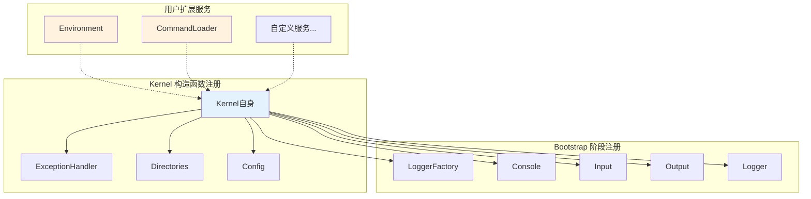
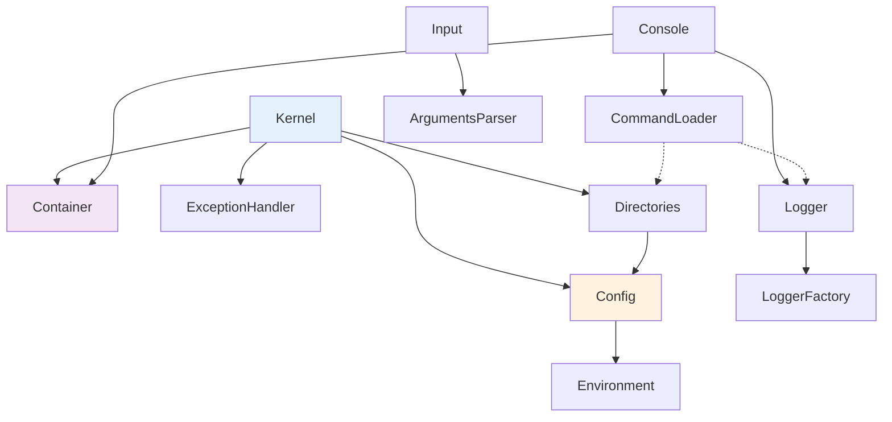

# 核心服务

Hi Framework 内核提供了一套精简而完整的核心服务体系，包括依赖注入容器、配置管理、目录管理、异常处理、日志系统和环境管理等基础设施。

## 核心服务架构



## Kernel 核心接口

### KernelInterface

```php
interface KernelInterface
{
    /**
     * Load application boot dependencies.
     *
     * @param ?callable $booting
     * @param ?callable $booted
     */
    public function load(?callable $booting = null): self;

    /**
     * Bootstrap application.
     *
     * @param array<int,string> $argv
     *
     * @return int Application exit code
     */
    public function bootstrap(array $argv = []): int;
}
```

### ConsoleInterface

```php
interface ConsoleInterface
{
    /**
     * Run console.
     */
    public function run(InputInterface $input, OutputInterface $output): int;
}
```

## 异常处理服务

### ExceptionHandlerInterface

```php
interface ExceptionHandlerInterface extends ExceptionReporterInterface
{
    /**
     * Enable global exception handling.
     */
    public function register(): void;

    /**
     * Handle global exception outside (a Dispatcher) and output error to the user.
     *
     * @internal
     */
    public function handleGlobalException(\Throwable $e): void;

    /**
     * Handle exception, report or logging etc...
     */
    public function handle(\Throwable $th, mixed $context = null): mixed;
}
```

### ExceptionReporterInterface

```php
interface ExceptionReporterInterface
{
    /**
     * Report an exception.
     * Must not throw exception
     */
    public function report(\Throwable $th, mixed $context = null): void;
}
```

## 目录管理服务

### DirectoriesInterface

```php
interface DirectoriesInterface
{
    public function has(string $name): bool;

    /**
     * @param string $name Directory alias, ie. "framework".
     * @param string $path directory path without ending slash
     *
     * @throws DirectoryException
     */
    public function set(string $name, string $path): self;

    /**
     * Get directory value.
     *
     * @throws DirectoryException when no directory found
     */
    public function get(string $name): string;

    /**
     * List all registered directories.
     *
     * @return array<string, string>
     */
    public function getAll(): array;

    /**
     * Join name and path with directory.
     */
    public function join(string $name, string $path): string;
}
```

## 配置管理服务

### ConfigInterface

```php
interface ConfigInterface
{
    /**
     * @param array<array-key,mixed> $config
     */
    public function merge(array $config): self;

    /**
     * Return config value by key.
     *
     * @param string $key Config key, like "application.name"
     */
    public function get(string $key, mixed $defaultValue = null): mixed;

    /**
     * Return all config.
     *
     * @return array<array-key,mixed>
     */
    public function toArray(): array;
}
```

## 日志服务

### LoggerFactoryInterface

```php
interface LoggerFactoryInterface
{
    public function has(string $channel): bool;

    /**
     * Get a logger instance for the specified channel.
     * If no channel is specified, the default channel will be used.
     */
    public function get(?string $channel = null, string $level = 'debug', bool $newLogger = true): LoggerInterface;

    /**
     * Set a logger instance for the specified channel.
     */
    public function set(string $channel, LoggerInterface $logger): void;
}
```

## 环境管理服务

### EnvironmentInterface

```php
/**
 * App running environment
 * Must implement the interface through an enum
 */
interface EnvironmentInterface
{
    public function get(): string;

    public function isLocal(): bool;

    public function isDevelopment(): bool;

    public function isTesting(): bool;

    public function isStaging(): bool;

    public function isProduction(): bool;

    public function isBuild(): bool;
}
```

### 环境自动设置

在 `load()` 阶段，如果未设置环境，Kernel 会自动设置为生产环境：

```php
interface KernelInterface
{
    /**
     * 加载阶段 - 执行启动回调并设置默认环境
     */
    public function load(?callable $booting = null): self;
}
```

## 输入输出服务

### InputInterface

```php
interface InputInterface
{
    /**
     * Return command name
     * If command is not found - return 'help'.
     */
    public function getCommand(): string;

    /**
     * Return action name.
     */
    public function getAction(): string;

    /**
     * Get value from parsed parameters by key.
     */
    public function getOption(string $key): mixed;
}
```

### OutputInterface

```php
interface OutputInterface
{
    /**
     * Display text.
     */
    public function writeln(string $text): self;

    /**
     * Add new line.
     */
    public function newLine(int $count = 1): self;

    /**
     * Display error.
     */
    public function writeError(string $text): self;

    /**
     * Display warning.
     */
    public function writeWarning(string $text): self;

    /**
     * Display text in red.
     */
    public function writeInRed(string $text): self;

    /**
     * Display text in gray.
     */
    public function writeInGray(string $text): self;

    /**
     * Display text in blue.
     */
    public function writeInBlue(string $text): self;

    /**
     * Display text in bold.
     */
    public function writeInBold(string $text): self;

    /**
     * Display error tips.
     */
    public function displayErrorTips(string $text): self;

    /**
     * Display command header.
     */
    public function displayHead(string $description): self;

    /**
     * Display command usage.
     */
    public function displayUsage(string $command): self;

    /**
     * @param array<int,string[]> $data
     */
    public function displayAvailable(string $scope, array $data): self;

    /**
     * Display table(multi column).
     *
     * @param array<int, string[]> $data
     */
    public function displayTable(array $data): self;
}
```

## 服务绑定时机表

| 服务接口 | 实现类 | 绑定时机 | 说明 |
|---------|--------|----------|------|
| `ExceptionHandlerInterface` | `ExceptionHandler` | 构造函数 | 用户可自定义 |
| `KernelInterface` | `Kernel` | 构造函数 | 自身引用 |
| `DirectoriesInterface` | `Directories` | 构造函数 | 包含根目录 |
| `ConfigInterface` | `Config` | 构造函数 | 空配置对象 |
| `EnvironmentInterface` | `AppEnvironment::Production` | load() | 默认生产环境 |
| `LoggerFactoryInterface` | `LoggerFactory` | bootstrap() | 条件性注册 |
| `ConsoleInterface` | `Console` | bootstrap() | 条件性注册 |
| `InputInterface` | `Input` | bootstrap() | 基于 $argv |
| `OutputInterface` | `Output` | bootstrap() | 默认输出 |
| `LoggerInterface` | Factory 创建 | bootstrap() | 条件性注册 |

## 扩展服务

### 基本服务扩展

```php
$kernel->load(function (ContainerInterface $container, DirectoriesInterface $directories, ConfigInterface $config) {
    // 设置更多目录
    $directories->set('config', $directories->get('root') . '/config');
    $directories->set('storage', $directories->get('root') . '/storage');
    $directories->set('logs', $directories->get('storage') . '/logs');
    
    // 加载配置文件
    $configFile = $directories->get('config') . '/app.php';
    if (file_exists($configFile)) {
        $config->merge(require $configFile);
    }
    
    // 设置环境
    $environment = $container->get(EnvironmentInterface::class);
    $container->bindSingleton(EnvironmentInterface::class, $environment);
    
    // 注册命令加载器（必需！）
    $container->bindSingleton(CommandLoaderInterface::class, function () use ($directories) {
        return $container->get(CommandLoaderInterface::class)->withDirectories([
            $directories->get('root') . '/src/Commands'
        ]);
    });
});
```

### 环境特定服务

```php
$kernel->load(function (ContainerInterface $container, ConfigInterface $config) {
    $environment = $container->get(EnvironmentInterface::class);
    
    if ($environment->isDevelopment()) {
        // 开发环境特定服务
        $container->bind(CacheInterface::class, $container->get(ArrayCacheInterface::class));
        $container->bind(DatabaseInterface::class, $container->get(SQLiteDatabaseInterface::class));
    } elseif ($environment->isProduction()) {
        // 生产环境特定服务
        $container->bind(CacheInterface::class, $container->get(RedisCacheInterface::class));
        $container->bind(DatabaseInterface::class, $container->get(MySQLDatabaseInterface::class));
    }
});
```

### 自定义日志配置

```php
$kernel->load(function (Container $container, DirectoriesInterface $directories, EnvironmentInterface $environment) {
    // 自定义日志工厂
    $container->bindSingleton(LoggerFactoryInterface::class, function () use ($directories, $environment) {
        return new CustomLoggerFactory($directories, $environment);
    });
});
```

```php
interface CustomLoggerFactoryInterface extends LoggerFactoryInterface
{
    public function __construct(
        DirectoriesInterface $directories,
        EnvironmentInterface $environment
    );
    
    public function createWithEnvironment(string $channel, string $level): LoggerInterface;
}
```

## 服务依赖图



## 最佳实践

### 1. 服务注册时机

- **构造函数依赖**：在 Kernel 构造函数中提供
- **配置相关服务**：在 load() 阶段注册
- **运行时服务**：让 Kernel 在 bootstrap() 阶段自动处理

### 2. 依赖注入原则

- 优先使用接口绑定
- 使用单例模式避免重复创建
- 通过工厂模式创建复杂对象

### 3. 配置管理

- 使用点语法访问嵌套配置
- 按环境分离配置文件
- 提供合理的默认值

### 4. 异常处理

- 根据环境配置不同的处理策略
- 使用多个报告器记录异常
- 过滤不需要报告的异常类型

### 5. 必需服务

**重要：** 以下服务必须在 load() 阶段手动注册：
- `CommandLoaderInterface` - Kernel 不提供默认实现
- `EnvironmentInterface` - 如果需要非生产环境
- 应用特定的业务服务

Hi Framework 的核心服务设计精简而完整，为构建稳定的命令行应用程序提供了坚实的基础。