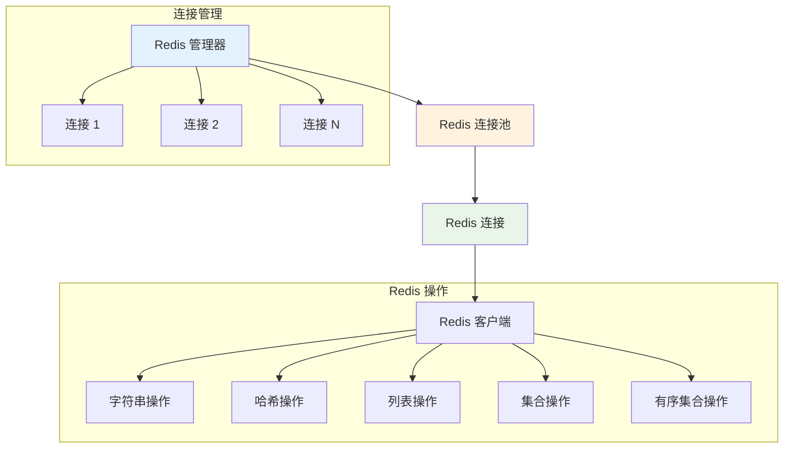

# Redis 连接配置

Hi Framework 提供了基于连接池的 Redis 服务支持，通过 `RedisManager` 和 `RedisProviderInterface` 实现高效的 Redis 连接管理。本文档基于生产环境项目 `typing-jupiter` 的实际使用经验编写。

## 核心架构



## 连接配置

### 1. 配置参数说明

| 参数名 | 类型 | 默认值 | 说明 |
|--------|------|--------|------|
| **host** | string | 127.0.0.1 | Redis 服务器主机地址 |
| **port** | int | 6379 | Redis 服务器端口 |
| **password** | string | '' | Redis 认证密码 |
| **db** | int | 0 | Redis 数据库编号 |
| **timeout** | int | 1 | 连接超时时间（秒） |
| **options** | array | [Redis::OPT_SCAN => Redis::SCAN_RETRY] | Redis 连接选项 |

### 2. 基础配置

```yaml
# application.yaml
redis:
  default:
    host: 127.0.0.1
    port: 6379
    password: ''
    db: 0
    timeout: 1
    options:
      Redis::OPT_SCAN: Redis::SCAN_RETRY
```

### 3. 多 Redis 实例配置

```yaml
redis:
  # 主 Redis 实例
  jupiter:
    host: redis-master.local
    port: 6379
    password: 'jupiter_password'
    db: 0
    timeout: 1
  
  # 缓存 Redis 实例
  cache:
    host: redis-cache.local
    port: 6379
    password: 'cache_password'
    db: 1
    timeout: 1
  
  # 会话 Redis 实例
  session:
    host: redis-session.local
    port: 6379
    password: 'session_password'
    db: 2
    timeout: 1
```

## 连接池配置

### 1. 连接池管理参数

除了基础连接参数，还可以配置连接池管理参数：

```yaml
redis:
  default:
    # ... 基础连接配置 ...
    
    # 连接池管理配置
    max_open: 32                 # 最大连接数
    max_idle: 8                  # 最大空闲连接数
    idle_timeout: 30             # 空闲连接超时时间（秒）
    max_lifetime: 300            # 连接最大生命周期（秒）
    max_get_retries: 100         # 获取连接最大重试次数
    disable_predicting: false    # 是否禁用连接预测
    demand_history: [1, 1, 1, 1, 1] # 需求历史数据
```

### 2. 连接池配置说明

| 参数名 | 类型 | 默认值 | 说明 |
|--------|------|--------|------|
| **max_open** | int | 32 | 最大连接数 |
| **max_idle** | int | 8 | 最大空闲连接数 |
| **idle_timeout** | int | 30 | 空闲连接超时时间（秒） |
| **max_lifetime** | int | 300 | 连接最大生命周期（秒） |
| **max_get_retries** | int | 100 | 获取连接最大重试次数 |
| **disable_predicting** | bool | false | 是否禁用连接预测 |
| **demand_history** | array | [1,1,1,1,1] | 需求历史数据 |

## 服务绑定

### 1. 服务提供者配置

```php
// redis.php
use Hi\Redis\MetricCollectorInterface;
use Hi\Redis\RedisInterface;
use Hi\Redis\RedisManager;
use Hi\Redis\RedisProviderInterface;
use Hi\Kernel\ConfigInterface;
use Spiral\Core\Config\Inflector;
use Spiral\Core\Container;

/**
 * Redis 配置及绑定
 */
$di->bindSingleton(RedisProviderInterface::class, static fn (ConfigInterface $config) => $di->make(RedisManager::class, [
    'configs' => $config->get('redis'),
]));

// Redis autowire
$di->bind(RedisInterface::class, new Inflector(
    static function (RedisInterface $redis, RedisProviderInterface $redisProvider, MetricCollectorInterface $collector) {
        $redis->autowirePool($redisProvider, $collector);
        return $redis;
    },
));
```

## 基础使用

### 1. 获取 Redis 连接

```php
use Hi\Redis\RedisProviderInterface;

class RedisExample
{
    public function __construct(
        private readonly RedisProviderInterface $redisProvider
    ) {}
    
    /**
     * 获取 Redis 连接
     */
    public function getRedisConnection(): ConnectionInterface
    {
        return $this->redisProvider->getConnection('jupiter');
    }
    
    /**
     * 获取 Redis 连接池
     */
    public function getRedisPool(): PoolInterface
    {
        return $this->redisProvider->getPool('jupiter');
    }
}
```

### 2. 使用 Redis 基类

```php
use Hi\Redis\Redis;

class UserRedisService extends Redis
{
    protected string $connection = 'jupiter';
    
    /**
     * 设置用户缓存
     */
    public function setUserCache(int $userId, array $userData, int $ttl = 3600): bool
    {
        $key = "user:{$userId}";
        return $this->redis->setex($key, $ttl, json_encode($userData));
    }
    
    /**
     * 获取用户缓存
     */
    public function getUserCache(int $userId): ?array
    {
        $key = "user:{$userId}";
        $data = $this->redis->get($key);
        
        if ($data === false) {
            return null;
        }
        
        return json_decode($data, true);
    }
}
```

### 3. 性能优化

- 使用批量操作减少网络往返
- 合理设置 TTL，避免内存泄漏
- 使用 Pipeline 或 Multi 执行批量命令
- 监控 Redis 性能指标，优化慢查询

## 总结

Hi Framework 的 Redis 连接配置提供了：

1. **连接池管理**：高效的连接复用和自动管理
2. **多实例支持**：支持多个 Redis 实例的配置和管理
3. **指标收集**：内置的性能监控和指标收集
4. **错误处理**：完善的异常处理和重试机制
5. **配置驱动**：基于配置文件的灵活配置管理
6. **监控支持**：连接池状态监控和性能分析

通过合理使用这些功能，可以构建高性能、可靠的 Redis 应用，特别适合高并发场景下的缓存和会话管理需求。
