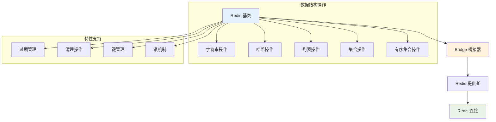

# Redis 数据操作

Hi Framework 提供了基于 `Hi\Redis\Redis` 基类的 Redis 数据操作支持，通过继承基类可以轻松实现各种 Redis 数据结构操作。本文档基于生产环境项目 `typing-jupiter` 的实际使用经验编写。

## 核心架构



## 基础数据操作

### 1. 字符串操作

```php
use Hi\Redis\Redis;

class StringRedisService extends Redis
{
    protected string $connection = 'jupiter';
    protected const Key = 'string:user:%d';
    protected const Expire = 3600;
    
    public function __construct(int $userId)
    {
        $this->key = sprintf(self::Key, $userId);
        parent::__construct();
    }
    
    /**
     * 设置字符串值
     */
    public function set(string $value, int $ttl = null): bool
    {
        $ttl = $ttl ?? self::Expire;
        $result = $this->redis->setex($this->key, $ttl, $value);
        return $result;
    }
    
    /**
     * 获取字符串值
     */
    public function get(): ?string
    {
        $result = $this->redis->get($this->key);
        return $result === false ? null : $result;
    }
    
    /**
     * 设置过期时间
     */
    public function expire(int $ttl = null): bool
    {
        $ttl = $ttl ?? self::Expire;
        return $this->redis->expire($this->key, $ttl);
    }
}
```

### 2. 哈希操作

```php
use Hi\Redis\Redis;

class HashRedisService extends Redis
{
    protected string $connection = 'jupiter';
    protected const Key = 'hash:user:%d';
    protected const Expire = 7200;
    
    public function __construct(int $userId)
    {
        $this->key = sprintf(self::Key, $userId);
        parent::__construct();
    }
    
    /**
     * 设置哈希字段
     */
    public function hSet(string $field, string $value): bool
    {
        $result = $this->redis->hSet($this->key, $field, $value);
        $this->redis->expire($this->key, self::Expire);
        return $result;
    }
    
    /**
     * 获取哈希字段
     */
    public function hGet(string $field): ?string
    {
        $result = $this->redis->hGet($this->key, $field);
        return $result === false ? null : $result;
    }
    
    /**
     * 获取所有哈希字段
     */
    public function hGetAll(): array
    {
        return $this->redis->hGetAll($this->key);
    }
    
    /**
     * 删除哈希字段
     */
    public function hDel(string $field): int
    {
        return $this->redis->hDel($this->key, $field);
    }
}
```

### 3. 列表操作

```php
use Hi\Redis\Redis;

class ListRedisService extends Redis
{
    protected string $connection = 'jupiter';
    protected const Key = 'list:ai-sentence:%s:%s';
    protected const Expire = 86400;
    
    public function getKey(string $language, string $gender): string
    {
        return sprintf(self::Key, $language, $gender);
    }
    
    /**
     * 从列表左侧弹出元素
     */
    public function lPop(string $language, string $gender): ?string
    {
        $key = $this->getKey($language, $gender);
        $result = $this->redis->lPop($key);
        return $result === false ? null : $result;
    }
    
    /**
     * 获取列表长度
     */
    public function lLen(string $language, string $gender): int
    {
        $key = $this->getKey($language, $gender);
        return $this->redis->lLen($key);
    }
    
    /**
     * 向列表右侧添加元素
     */
    public function rPush(string $language, string $gender, array $elements): bool
    {
        $key = $this->getKey($language, $gender);
        $this->redis->rPush($key, ...$elements);
        $this->redis->expire($key, self::Expire);
        return true;
    }
}
```

### 4. 集合操作

```php
use Hi\Redis\Redis;

class SetRedisService extends Redis
{
    protected string $connection = 'jupiter';
    protected const Key = 'set:user:%d';
    protected const Expire = 1800;
    
    public function __construct(int $userId)
    {
        $this->key = sprintf(self::Key, $userId);
        parent::__construct();
    }
    
    /**
     * 添加集合元素
     */
    public function sAdd(string $member): bool
    {
        $result = $this->redis->sAdd($this->key, $member);
        $this->redis->expire($this->key, self::Expire);
        return $result;
    }
    
    /**
     * 移除集合元素
     */
    public function sRem(string $member): bool
    {
        $result = $this->redis->sRem($this->key, $member);
        return $result;
    }
    
    /**
     * 检查元素是否存在
     */
    public function sIsMember(string $member): bool
    {
        return $this->redis->sIsMember($this->key, $member);
    }
    
    /**
     * 获取集合大小
     */
    public function sCard(): int
    {
        return $this->redis->sCard($this->key);
    }
}
```

### 5. 有序集合操作

```php
use Hi\Redis\Redis;

class SortedSetRedisService extends Redis
{
    protected string $connection = 'jupiter';
    protected const Key = 'zset:user:%d';
    protected const Expire = 3600;
    
    public function __construct(int $userId)
    {
        $this->key = sprintf(self::Key, $userId);
        parent::__construct();
    }
    
    /**
     * 添加有序集合元素
     */
    public function zAdd(string $member, float $score): bool
    {
        $result = $this->redis->zAdd($this->key, $score, $member);
        $this->redis->expire($this->key, self::Expire);
        return $result;
    }
    
    /**
     * 获取元素分数
     */
    public function zScore(string $member): ?float
    {
        $result = $this->redis->zScore($this->key, $member);
        return $result === false ? null : $result;
    }
    
    /**
     * 获取排名范围内的元素
     */
    public function zRange(int $start, int $stop, bool $withScores = false): array
    {
        return $this->redis->zRange($this->key, $start, $stop, $withScores);
    }
    
    /**
     * 移除元素
     */
    public function zRem(string $member): int
    {
        return $this->redis->zRem($this->key, $member);
    }
}
```

## 高级操作

### 1. Lua 脚本执行

```php
use Hi\Redis\Redis;

class LuaRedisService extends Redis
{
    protected string $connection = 'jupiter';
    protected const Key = 'lua:user:%d';
    
    public function __construct(int $userId)
    {
        $this->key = sprintf(self::Key, $userId);
        parent::__construct();
    }
    
    /**
     * 执行 Lua 脚本清理过期数据
     */
    public function cleanExpiredData(): array
    {
        $luaScript = <<<'EOD'
local expire_time = tonumber(ARGV[1])
local hash_key = KEYS[1]
local to_delete = {}

for _, field in ipairs(redis.call('HKEYS', hash_key)) do
    local timestamp = tonumber(field)
    if timestamp < expire_time then
        table.insert(to_delete, field)
    end
end

if #to_delete > 0 then
    redis.call('HDEL', hash_key, unpack(to_delete))
end

return redis.call('HGETALL', hash_key)
EOD;

        $expireTime = time() - 600; // 10分钟前
        return $this->redis->eval($luaScript, [$this->key, $expireTime], 1);
    }
}
```

### 2. 批量操作

```php
use Hi\Redis\Redis;

class BatchRedisService extends Redis
{
    protected string $connection = 'jupiter';
    
    /**
     * 批量设置多个键值对
     */
    public function mSet(array $keyValues): bool
    {
        return $this->redis->mSet($keyValues);
    }
    
    /**
     * 批量获取多个键值
     */
    public function mGet(array $keys): array
    {
        return $this->redis->mGet($keys);
    }
    
    /**
     * 批量删除多个键
     */
    public function del(array $keys): int
    {
        return $this->redis->del(...$keys);
    }
}
```

## 最佳实践

### 1. 键命名规范

- 使用冒号分隔的层次结构：`type:category:id:field`
- 保持键名简洁但具有描述性
- 避免过长的键名，影响性能

### 2. 过期时间管理

```php
use Infrastructure\Persistence\Redis\Trait\ExpireTrait;

class ExpireRedisService extends Redis
{
    use ExpireTrait;
    
    protected const Expire = 3600; // 1小时
    
    /**
     * 智能过期时间设置
     */
    public function setSmartExpire(): self
    {
        // 根据业务逻辑设置不同的过期时间
        if ($this->isHighPriority()) {
            $this->expireByTime(7200); // 2小时
        } else {
            $this->expire(); // 使用默认过期时间
        }
        
        return $this;
    }
}
```

## 总结

Hi Framework 的 Redis 数据操作提供了：

1. **基础数据结构**：完整的字符串、哈希、列表、集合、有序集合操作
2. **Trait 特性**：过期管理、清理操作、键管理、锁机制等可复用特性
3. **Lua 脚本支持**：支持复杂的原子操作和业务逻辑
4. **批量操作**：高效的批量数据处理能力
5. **错误处理**：完善的异常处理和重试机制
6. **性能优化**：连接池管理、指标收集、监控支持

通过合理使用这些功能，可以构建高性能、可靠的 Redis 应用，特别适合高并发场景下的缓存、会话管理和实时数据处理需求。
