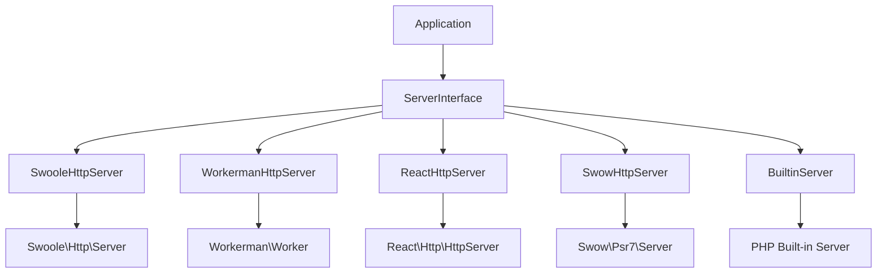

# 服务器组件

Hi Framework 的服务器组件是框架的核心抽象层，它提供了统一的接口来支持多种 PHP 运行时环境。通过这个抽象层，您可以在不修改应用代码的情况下，在不同的运行时环境之间自由切换。

## 设计理念

### 运行时抽象

服务器组件采用**策略模式**和**适配器模式**，实现了"编写一次，随处运行"的理念：



### 核心接口

`Hi\Server\ServerInterface` 定义了所有服务器实现必须遵循的契约：

```php
<?php

namespace Hi\Server;

use Hi\Http\Router\RouterInterface;

interface ServerInterface
{
    /**
     * 设置服务器监听主机
     */
    public function withHost(string $host): self;

    /**
     * 设置服务器监听端口
     */
    public function withPort(int $port): self;

    /**
     * 启动服务器并处理请求
     */
    public function start(RouterInterface $router): void;

    /**
     * 添加自定义进程（可选）
     */
    public function addCustomProcess(mixed $process): void;

    /**
     * 分发异步任务（可选）
     */
    public function task(string $taskClass, mixed $data = null): int|false;
}
```

## 支持的运行时

### 1. Swoole HTTP Server

**特点**：
- 高性能协程服务器
- 支持异步任务处理
- 支持自定义进程
- 支持 WebSocket 和 TCP 服务器

**配置示例**：

```yaml
server:
  runtime: swoole
  host: 0.0.0.0
  port: 9530
  options:
    worker_num: 4
    task_worker_num: 2
    max_request: 10000
```

**使用示例**：

```php
<?php

use Hi\Server\Swoole\SwooleHttpServer;
use Hi\Http\Router\Router;

// 创建服务器实例
$server = new SwooleHttpServer();
$server->withHost('0.0.0.0')
       ->withPort(9530);

// 添加自定义进程
$server->addCustomProcess(new CustomWorkerProcess());

// 启动服务器
$router = construct(Router::class);
$server->start($router);
```

### 2. Workerman HTTP Server

**特点**：
- 事件驱动的 PHP 框架
- 多进程架构
- 良好的稳定性
- 支持定时器和自定义协议

**配置示例**：

```yaml
server:
  runtime: workerman
  host: 0.0.0.0
  port: 9530
  options:
    count: 4
    reuse_port: true
```

**使用示例**：

```php
<?php

use Hi\Server\Workerman\WorkermanHttpServer;

$server = new WorkermanHttpServer();
$server->withHost('0.0.0.0')
       ->withPort(9530);

$router = construct(Router::class);
$server->start($router);
```

### 3. ReactPHP HTTP Server

**特点**：
- 异步非阻塞 I/O
- 完全 PSR-7 兼容
- 丰富的生态系统
- 支持流处理

**配置示例**：

```yaml
server:
  runtime: react
  host: 0.0.0.0
  port: 9530
  options:
    max_size: 2097152  # 2MB
```

**使用示例**：

```php
<?php

use Hi\Server\React\ReactHttpServer;

$server = new ReactHttpServer();
$server->withHost('0.0.0.0')
       ->withPort(9530);

$router = construct(Router::class);
$server->start($router);
```

### 4. Swow HTTP Server

**特点**：
- 基于协程的高性能服务器
- 完全 PSR-7 兼容
- 内置调试工具
- 支持 HTTP/2

**配置示例**：

```yaml
server:
  runtime: swow
  host: 0.0.0.0
  port: 9530
  options:
    backlog: 8192
```

**使用示例**：

```php
<?php

use Hi\Server\Swow\SwowHttpServer;

$server = new SwowHttpServer();
$server->withHost('0.0.0.0')
       ->withPort(9530);

$router = construct(Router::class);
$server->start($router);
```

### 5. PHP 内置服务器

**特点**：
- 开发环境理想选择
- 无需额外扩展
- 自动检测运行环境
- 支持热重载

**配置示例**：

```yaml
server:
  runtime: builtin
  host: 127.0.0.1
  port: 8080
```

**使用示例**：

```php
<?php

use Hi\Server\Builtin\BuiltinServer;

$server = new BuiltinServer();
$server->withHost('127.0.0.1')
       ->withPort(8080);

$router = construct(Router::class);
$server->start($router);
```

## 服务器配置

### 配置管理

服务器配置通过 `Hi\Server\Config` 类进行管理：

```php
<?php

use Hi\Server\Config;

$config = new Config([
    'host' => '0.0.0.0',
    'port' => 9530,
    'runtime' => 'swoole',
    'options' => [
        'worker_num' => 4,
        'task_worker_num' => 2,
        'daemonize' => false,
        'pid_file' => '/var/run/hi-server.pid',
        'log_file' => '/var/log/hi-server.log',
    ],
]);
```

### 环境检测

框架提供自动运行时检测功能：

```php
<?php

use Hi\Server\ServerFactory;

// 自动检测最佳可用运行时
$server = ServerFactory::create();

// 或指定特定运行时
$server = ServerFactory::create('swoole');
```

### 配置文件示例

`application.yaml`:

```yaml
server:
  host: 0.0.0.0
  port: 9530
  runtime: swoole  # swoole | workerman | react | swow | builtin
  
  # Swoole 配置
  swoole:
    worker_num: 4
    task_worker_num: 2
    max_request: 10000
    daemonize: false
    pid_file: /var/run/swoole.pid
    log_file: /var/log/swoole.log
    
    # SSL 配置
    ssl:
      ssl_cert_file: /path/to/cert.pem
      ssl_key_file: /path/to/key.pem
  
  # Workerman 配置  
  workerman:
    count: 4
    reuse_port: true
    
  # ReactPHP 配置
  react:
    max_size: 2097152
    
  # Swow 配置
  swow:
    backlog: 8192
```

## 事件处理

### 事件处理器

每个运行时都有对应的事件处理器，负责将特定运行时的请求对象适配为 PSR-7 标准：

```php
<?php

namespace Hi\Http\Runtime\Swoole;

use Hi\Http\Context;
use Hi\Http\Router\RouterInterface;
use Swoole\Http\Request;
use Swoole\Http\Response;

class EventHandler
{
    public function __construct(
        private RouterInterface $router
    ) {}

    public function onRequest(Request $request, Response $response): void
    {
        try {
            // 适配 Swoole 请求为 PSR-7 请求
            $serverRequest = ServerRequest::createFromSwooleRequest($request);
            $context = new Context($serverRequest);
            
            // 路由分发
            $result = $this->router->dispatch($context);
            
            // 发送响应
            $this->sendResponse($response, $result);
            
        } catch (\Throwable $e) {
            $this->handleException($response, $e);
        }
    }
}
```

### 请求适配器

框架为每个运行时提供了请求适配器：

```php
<?php

namespace Hi\Http\Runtime\Swoole;

use Psr\Http\Message\ServerRequestInterface;
use Swoole\Http\Request as SwooleRequest;

class ServerRequest
{
    public static function createFromSwooleRequest(SwooleRequest $swooleRequest): ServerRequestInterface
    {
        // 适配 Swoole 请求头
        $headers = [];
        foreach ($swooleRequest->header ?? [] as $name => $value) {
            $headers[$name] = [$value];
        }
        
        // 适配请求体
        $body = $swooleRequest->rawContent() ?: '';
        
        // 适配查询参数
        $queryParams = $swooleRequest->get ?? [];
        
        // 适配 POST 数据
        $parsedBody = $swooleRequest->post ?? [];
        
        // 适配上传文件
        $uploadedFiles = self::createUploadedFiles($swooleRequest->files ?? []);
        
        // 创建 PSR-7 请求对象
        return new \Hi\Http\Message\ServerRequest(
            method: $swooleRequest->server['request_method'],
            uri: $swooleRequest->server['request_uri'],
            headers: $headers,
            body: $body,
            version: '1.1',
            serverParams: $swooleRequest->server ?? [],
            cookieParams: $swooleRequest->cookie ?? [],
            queryParams: $queryParams,
            uploadedFiles: $uploadedFiles,
            parsedBody: $parsedBody
        );
    }
}
```

## 自定义进程

### Swoole 自定义进程

在 Swoole 环境中，您可以添加自定义进程来处理特定任务：

```php
<?php

namespace App\Process;

use Swoole\Process;

class LogCleanupProcess
{
    public function __invoke(Process $process): void
    {
        while (true) {
            $this->cleanupOldLogs();
            $process->sleep(3600); // 每小时执行一次
        }
    }
    
    private function cleanupOldLogs(): void
    {
        // 清理过期日志文件
        $logDir = '/var/log/app/';
        $files = glob($logDir . '*.log');
        
        foreach ($files as $file) {
            if (filemtime($file) < strtotime('-7 days')) {
                unlink($file);
            }
        }
    }
}

// 在服务器启动时添加自定义进程
$server->addCustomProcess(new LogCleanupProcess());
```

### 任务系统

Swoole 支持异步任务处理：

```php
<?php

namespace App\Task;

class EmailTask
{
    public function handle(array $data): void
    {
        $to = $data['to'];
        $subject = $data['subject'];
        $body = $data['body'];
        
        // 发送邮件逻辑
        mail($to, $subject, $body);
    }
}

// 在控制器中分发任务
#[Post('/send-email')]
public function sendEmail(Context $ctx): array
{
    $data = $ctx->getRequest()->getParsedBody();
    
    // 异步发送邮件
    $taskId = $this->server->task(EmailTask::class, [
        'to' => $data['email'],
        'subject' => 'Welcome',
        'body' => 'Welcome to Hi Framework!'
    ]);
    
    return [
        'success' => true,
        'task_id' => $taskId
    ];
}
```

## 性能优化

### 连接池集成

服务器组件与连接池无缝集成，确保高并发环境下的资源利用效率：

```php
<?php

// 在服务器启动时初始化连接池
class ServerBootstrap
{
    public function boot(): void
    {
        // 初始化数据库连接池
        $dbPool = construct(DatabasePoolInterface::class);
        $dbPool->init([
            'min_connections' => 10,
            'max_connections' => 100,
            'wait_timeout' => 3.0,
        ]);
        
        // 初始化 Redis 连接池
        $redisPool = construct(RedisPoolInterface::class);
        $redisPool->init([
            'min_connections' => 5,
            'max_connections' => 50,
        ]);
    }
}
```

### 内存管理

在长期运行的服务器环境中，内存管理至关重要：

```php
<?php

// 在 Swoole Worker 启动时设置内存监控
$server = new SwooleHttpServer();
$server->on('WorkerStart', function ($server, $workerId) {
    // 设置内存使用限制
    ini_set('memory_limit', '256M');
    
    // 定期检查内存使用
    swoole_timer_tick(30000, function () {
        $memoryUsage = memory_get_usage(true);
        $memoryLimit = ini_get('memory_limit');
        
        if ($memoryUsage > $memoryLimit * 0.8) {
            // 触发内存清理或重启 Worker
            trigger_error('Memory usage high', E_USER_WARNING);
        }
    });
});
```

## 生产环境部署

### 进程管理

使用 Supervisor 管理服务器进程：

```ini
; /etc/supervisor/conf.d/hi-framework.conf
[program:hi-framework]
command=php /var/www/bootstrap.php http start
directory=/var/www
user=www-data
autostart=true
autorestart=true
startretries=3
stderr_logfile=/var/log/supervisor/hi-framework.err.log
stdout_logfile=/var/log/supervisor/hi-framework.out.log
```

### 健康检查

实现健康检查端点：

```php
<?php

#[Get('/health')]
class HealthController
{
    public function check(): array
    {
        return [
            'status' => 'healthy',
            'timestamp' => time(),
            'version' => '1.0.0',
            'memory_usage' => memory_get_usage(true),
            'connections' => [
                'database' => $this->checkDatabase(),
                'redis' => $this->checkRedis(),
            ]
        ];
    }
    
    private function checkDatabase(): bool
    {
        try {
            $db = construct(DatabaseProviderInterface::class);
            $db->connection()->query('SELECT 1');
            return true;
        } catch (\Throwable) {
            return false;
        }
    }
}
```

### Docker 部署

Dockerfile 示例：

```dockerfile
FROM php:8.2-cli

# 安装 Swoole 扩展
RUN pecl install swoole-5.1.7 && docker-php-ext-enable swoole

# 复制应用代码
COPY . /var/www
WORKDIR /var/www

# 安装依赖
RUN composer install --no-dev --optimize-autoloader

# 暴露端口
EXPOSE 9530

# 启动服务
CMD ["php", "bootstrap.php", "http", "start"]
```

## 最佳实践

### 1. 运行时选择

- **开发环境**：使用 `builtin` 服务器，支持热重载
- **测试环境**：使用 `swoole` 或 `workerman`，性能接近生产环境
- **生产环境**：根据场景选择：
  - **高并发场景**：选择 `swoole` 或 `swow`
  - **稳定性优先**：选择 `workerman`
  - **与 Node.js 生态集成**：选择 `react`

### 2. 配置管理

```php
<?php

// 根据环境动态配置
$runtime = match (getenv('APP_ENV')) {
    'development' => 'builtin',
    'testing' => 'swoole',
    'production' => 'swoole',
    default => 'builtin'
};

$config = [
    'runtime' => $runtime,
    'host' => getenv('SERVER_HOST') ?: '0.0.0.0',
    'port' => (int) (getenv('SERVER_PORT') ?: 9530),
];
```

### 3. 错误处理

```php
<?php

// 全局异常处理
set_exception_handler(function (\Throwable $e) {
    error_log($e->getMessage() . "\n" . $e->getTraceAsString());
    
    if (extension_loaded('swoole')) {
        // 在 Swoole 环境中优雅处理异常
        if (!Swoole\Coroutine::getCid()) {
            exit(1);
        }
    }
});
```

通过服务器组件的抽象设计，Hi Framework 实现了真正的"一次编写，随处运行"，让您可以根据实际需求选择最适合的运行时环境，而无需修改应用代码。