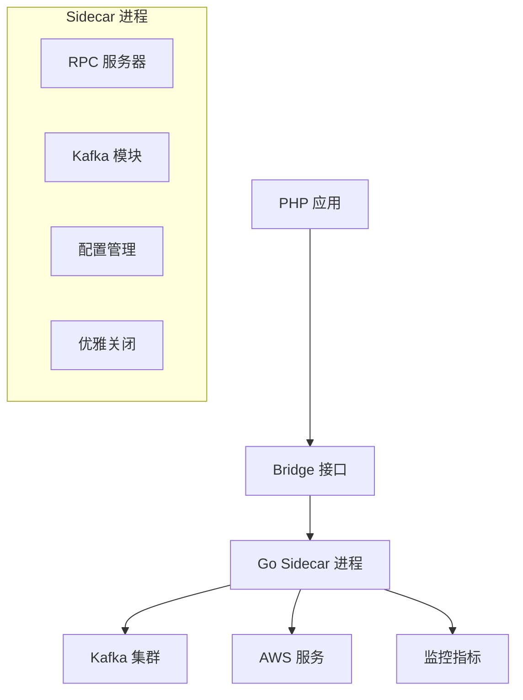

# Sidecar 架构

Sidecar 是 Hi Framework 中用于处理跨语言、跨进程通信的核心组件。它通过 Go 语言实现的高性能服务进程，为 PHP 应用提供 Kafka 消息队列、监控数据收集等能力。

## 核心架构



## 核心组件

### Bridge 接口

`Hi\Sidecar\BridgeInterface` 定义了与 Sidecar 进程通信的标准接口：

```php
interface BridgeInterface
{
    public function appInit(array $configs): bool;
    public function appShutdown(): bool;
    public function produceMessage(string $connection, string $topic, string $value, array $headers = [], bool $sync = false): bool;
    public function kafkaConsumeInit(string $connection, array $groupOptions, array $consumeOptions): bool;
    public function kafkaConsumeReceive(string $connection, string $topic, int $size = 1): array;
    public function kafkaConsumeAck(string $connection, string $topic): bool;
    public function kafkaConsumeClose(string $connection): bool;
}
```

### Bridge 实现

`Hi\Sidecar\Bridge` 是主要的实现类，使用 Goridge RPC 协议与 Go Sidecar 进程通信：

```php
class Bridge implements BridgeInterface
{
    private BridgePool $pool;
    
    public function produceMessage(string $connection, string $topic, string $value, array $headers = [], bool $sync = false): bool
    {
        $payload = [
            'action' => 'produce',
            'produce_message' => [
                'connection' => $connection,
                'topic' => $topic,
                'value' => $value,
                'headers' => $headers,
                'sync_mode' => $sync
            ]
        ];
        
        return $this->call('Kafka', json_encode($payload));
    }
}
```

### NullBridge

`Hi\Sidecar\NullBridge` 提供开发环境下的空实现，避免依赖外部服务：

```php
class NullBridge implements BridgeInterface
{
    public function produceMessage(string $connection, string $topic, string $value, array $headers = [], bool $sync = false): bool
    {
        // 开发环境下直接返回成功
        return true;
    }
}
```

## Go Sidecar 进程

### 主要特性

- **RPC 服务器**: 基于 Goridge 协议的高性能 RPC 服务
- **模块化设计**: 支持 Kafka、监控等模块的插件化扩展
- **优雅关闭**: 支持信号处理和资源清理
- **配置热更新**: 运行时动态加载配置

### 核心结构

```go
type App struct {
    config       *appConfig
    kafka        *kafka.Kafka
    shutdownChan chan struct{}
    isClosed     bool
}

func (s *App) Init(payload string, r *interface{}) error {
    // 解析配置并初始化各个模块
}

func (s *App) Kafka(payload string, r *interface{}) error {
    // 处理 Kafka 相关操作
}

func (s *App) Shutdown(payload string, r *interface{}) error {
    // 优雅关闭服务
}
```

### Kafka 模块

Go Sidecar 的 Kafka 模块提供完整的消息队列功能：

#### 生产者功能

```go
func (p *producer) produce(produce *produceMessage, r *interface{}) error {
    // 支持同步和异步生产
    if produce.SyncMode {
        res := client.ProduceSync(context.Background(), record)
        return res.FirstErr()
    }
    
    // 异步生产
    client.Produce(context.Background(), record, callback)
    return nil
}
```

#### 消费者功能

```go
func (c *consumer) receive(consume *consumeMessage, r *interface{}) error {
    // 拉取消息并自动提交偏移量
    fetches := client.PollRecords(ctx, consume.Size)
    // 处理消息记录
}
```

## 配置管理

### 应用配置

在 `application.yaml` 中配置 Sidecar 服务：

```yaml
application:
  name: typing
  module: jupiter
  env: local
  debug: true
  runtime: swoole

# Sidecar 配置
sidecar:
  enable: false  # 本地开发环境禁用
  host: tcp://host.docker.internal:6001

# Kafka 配置
kafka:
  kafka-common:
    auto_create_topics_enable: true
    brokers:
      - 'host.docker.internal:9094'
  
  aliyun-kafka-public:
    auto_create_topics_enable: true
    brokers:
      - 'your-aliyun-kafka-endpoint:9092'
    tls:
      enabled: true
      cert: "/path/to/cert.pem"
      key: "/path/to/key.pem"
      root_ca: "/path/to/ca.pem"
    sasl:
      type: "scram_sha_256"
      username: "your-username"
      password: "your-password"
```

### 连接配置

支持多种 Kafka 连接配置：

```yaml
kafka:
  # 本地开发环境
  kafka-common:
    brokers: ["localhost:9092"]
    auto_create_topics_enable: true
  
  # 阿里云生产环境
  aliyun-kafka-public:
    brokers: ["your-cluster-endpoint:9092"]
    tls:
      enabled: true
      cert: "/path/to/cert.pem"
      key: "/path/to/key.pem"
      root_ca: "/path/to/ca.pem"
    sasl:
      type: "scram_sha_256"
      username: "your-username"
      password: "your-password"
    ping:
      timeout: 10s
```

## 服务绑定

在 `database.php` 中配置 Sidecar 服务：

```php
<?php

use Hi\Sidecar\Bridge;
use Hi\Sidecar\NullBridge;

return [
    'sidecar' => [
        'default' => [
            'class' => Bridge::class,
            'config' => [
                'host' => '127.0.0.1',
                'port' => 6001,
                'timeout' => 5.0,
                'retries' => 3,
            ]
        ],
        'null' => [
            'class' => NullBridge::class,
        ]
    ]
];
```

## 使用示例

### 初始化应用

```php
use Hi\Sidecar\BridgeInterface;

class ApplicationService
{
    public function __construct(
        private BridgeInterface $sidecar
    ) {}
    
    public function init(): bool
    {
        $configs = [
            'application' => [
                'name' => 'typing-jupiter',
                'module' => 'jupiter',
                'env' => 'production'
            ],
            'kafka' => [
                'kafka-common' => [
                    'brokers' => ['localhost:9092'],
                    'auto_create_topics_enable' => true
                ],
                'aliyun-kafka-public' => [
                    'brokers' => ['your-cluster:9092'],
                    'tls' => ['enabled' => true],
                    'sasl' => [
                        'type' => 'scram_sha_256',
                        'username' => 'user',
                        'password' => 'pass'
                    ]
                ]
            ]
        ];
        
        return $this->sidecar->appInit($configs);
    }
}
```

### Kafka 操作

```php
class KafkaService
{
    public function __construct(
        private BridgeInterface $sidecar
    ) {}
    
    public function produceMessage(string $connection, string $topic, string $value): bool
    {
        return $this->sidecar->produceMessage(
            $connection,
            $topic,
            $value,
            ['source' => 'php-app'],
            true // 同步模式
        );
    }
    
    public function consumeMessages(string $connection, string $topic): array
    {
        // 初始化消费者
        $this->sidecar->kafkaConsumeInit($connection, [
            'group_id' => 'php-consumer'
        ], [
            'topics' => [$topic]
        ]);
        
        // 接收消息
        return $this->sidecar->kafkaConsumeReceive($connection, $topic, 10);
    }
}
```

## 实际应用场景

### 消费者配置示例

基于 `typing-jupiter` 项目的实际使用：

```php
// 用户召回消费者
class UserRecallConsumer extends AbstractConsumer
{
    protected string $connection = 'kafka-common';  // 使用本地 Kafka
    protected TopicInterface $topic = Topic::UserRecallActionTest;
    protected int $concurrency = 64;  // 最大并发数
}

// 云信事件消费者
class YunxinEventConsumer extends AbstractConsumer
{
    protected string $connection = 'kafka-common';  // 使用本地 Kafka
    protected TopicInterface $topic = Topic::YunxinEvent;
    protected int $fetchSize = 1024;  // 批量获取数量
}

// 阿里云 Kafka 消费者
class HumenWhitelistLabelConsumer extends AbstractOnceConsumer
{
    protected string $connection = 'aliyun-kafka-public';  // 使用阿里云 Kafka
    protected TopicInterface $topic = Topic::DWFemaleWhitelist;
    
    protected function bootstrep(): void
    {
        $this->config->setOffset(ConsumeOffsetType::AtStart);
    }
}
```

### 连接配置策略

- **本地开发**: 使用 `kafka-common` 连接，指向本地 Docker 环境
- **生产环境**: 使用 `aliyun-kafka-public` 连接，配置 TLS 和 SASL 认证
- **环境隔离**: 通过 `sidecar.enable` 配置控制是否启用 Sidecar

## 部署和运维

### Docker 构建

```dockerfile
FROM golang:1.23-alpine AS builder
WORKDIR /app
COPY go.mod go.sum ./
RUN go mod download
COPY . .
RUN CGO_ENABLED=0 GOOS=linux go build -o sidecar main.go

FROM alpine:latest
RUN apk --no-cache add ca-certificates
WORKDIR /root/
COPY --from=builder /app/sidecar .
EXPOSE 6001
CMD ["./sidecar"]
```

### 环境变量配置

```bash
# 端口配置
export PORT=6001

# 环境配置
export ENV=production
```

### 健康检查

Sidecar 进程提供优雅关闭机制：

1. 监听系统信号 (SIGINT, SIGTERM)
2. 等待 PHP 应用发送关闭信号
3. 清理资源并关闭连接
4. 支持 30 秒超时强制退出

## 最佳实践

### 性能优化

- 使用连接池管理 RPC 连接
- 合理配置超时和重试参数
- 异步生产消息减少延迟

### 可靠性保障

- 实现优雅关闭机制
- 配置监控和告警
- 使用 TLS 加密通信

### 开发调试

- 开发环境使用 `NullBridge`
- 生产环境启用详细日志
- 监控 RPC 调用性能

### 配置管理

- 根据环境动态启用/禁用 Sidecar
- 支持多种 Kafka 集群配置
- 使用环境变量覆盖敏感配置

通过合理使用这些功能，可以构建高可用、高性能的分布式应用，特别适合需要与外部服务（如 Kafka、监控系统等）集成的场景。
